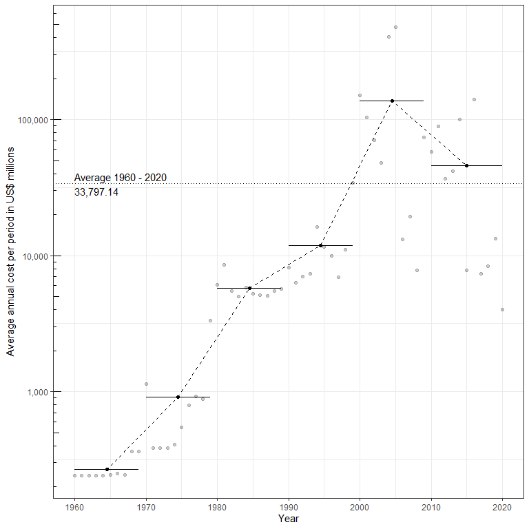
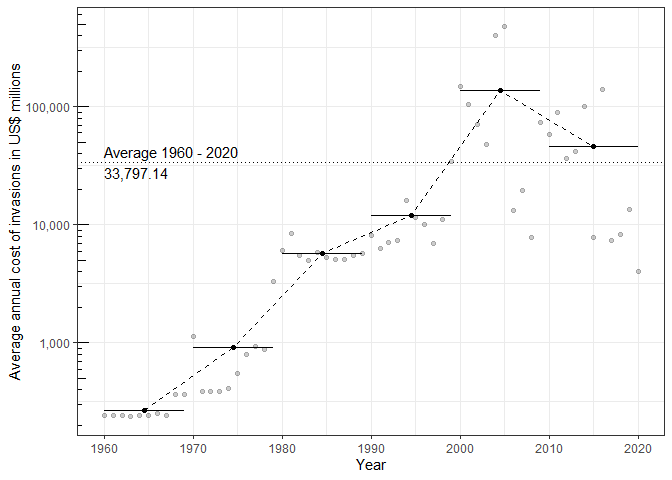
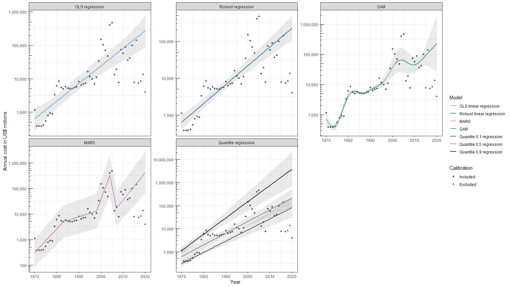
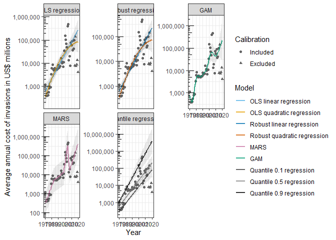
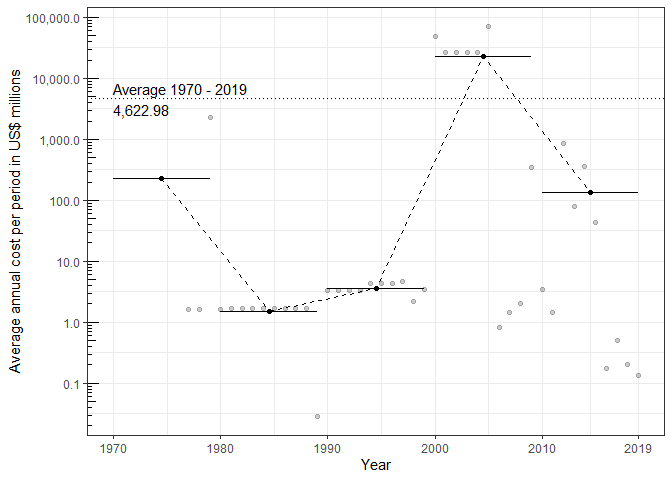

The INVACOST R Package: Global Costs of Biological Invasions
================
Leroy B, Kramer A, Vaissière AC & Diagne C
20/04/2020

  - [WARNING](#warning)
  - [Introduction](#introduction)
  - [Installation](#installation)
  - [Changes to the package](#changes-to-the-package)
      - [August 2020](#august-2020)
      - [April 2020](#april-2020)
  - [Basic steps to get started](#basic-steps-to-get-started)
      - [How to load the data in R?](#how-to-load-the-data-in-r)
      - [How to distinguish between invacost v1 and subsequent
        versions?](#how-to-distinguish-between-invacost-v1-and-subsequent-versions)
      - [Where are the economic values I should
        use?](#where-are-the-economic-values-i-should-use)
      - [How do we filter out unreliable
        costs?](#how-do-we-filter-out-unreliable-costs)
      - [How do I know when costs
        occurred?](#how-do-i-know-when-costs-occurred)
      - [How complete is our economic
        data?](#how-complete-is-our-economic-data)
  - [Calculate raw/observed costs of
    invasions](#calculate-rawobserved-costs-of-invasions)
      - [Basic usage](#basic-usage)
      - [Customising parameters](#customising-parameters)
      - [Customising graphs](#customising-graphs)
  - [Estimate the average annual cost of
    invasions](#estimate-the-average-annual-cost-of-invasions)
      - [Correction for data incompleteness due to publication
        lag](#correction-for-data-incompleteness-due-to-publication-lag)
      - [Assumptions](#assumptions)
      - [Models included in the ensemble
        modelling](#models-included-in-the-ensemble-modelling)
      - [Model fitting](#model-fitting)
      - [Model plotting](#model-plotting)
      - [Inspecting model outputs](#inspecting-model-outputs)
      - [How to evaluate models?](#how-to-evaluate-models)
      - [Including model summary in your
        paper](#including-model-summary-in-your-paper)
      - [Customising graphs](#customising-graphs-1)
  - [Simple customisation](#simple-customisation)
  - [Complex customisation](#complex-customisation)
  - [Example on a specific subset: mammals of North
    America](#example-on-a-specific-subset-mammals-of-north-america)
  - [Example on many subsets: all taxons/species in the
    database](#example-on-many-subsets-all-taxonsspecies-in-the-database)
  - [Improving the package](#improving-the-package)
  - [Citation](#citation)

# WARNING

This page represents work in progress and no third parties are allowed
to use it under any circumstances. For more information, please write to
<leroy.boris@gmail.com>, <christophe.diagne@u-psud.fr> and
<franck.courchamp@u-psud.fr>

# Introduction

The INVACOST R package provides the INVACOST database in R with several
functions to analyse economic costs of invasive species.

There are two main methods developed in this package to estimate the
costs associated to biological invasions.

  - The first approach consists in calculating the *raw costs* (i.e.,
    observed costs) that occurred over specific intervals of time. From
    this approach you can obtain the *observed* cumulated and average
    annual costs of biological invasions for different time intervals.  
    This approach is generalisable to any subset of the INVACOST
    database, regardless of data quantity. However, it does not account
    for the temporal dynamics of costs, and may thus underestimate the
    costs of invasions, especially for recent years for which we likely
    have incomplete data.

  - The second approach consists in **estimating** the long-term trend
    in annual cost values with an ensemble modelling approach. Because
    it includes the dynamic nature of cost values, it is probably the
    most robust approach to estimate average annual costs. However, it
    requires more data and for data-poor cases it will not work or
    provide inadequate results. We fit several models because the trend
    of costs over time is not necessarily linear. This approach requires
    decisions about models to keep or remove, on the basis of the
    quality of model fit, and/or of our *a priori* assumptions. Note
    that this modelling approach is not designed for extrapolations
    because there is no certainty that the underlying factors of costs
    will have similar trends in the future.

# Installation

The easiest method to install the package for now is to install it
directly from github with the following command line (requires the
package devtools).

**DOES NOT WORK UNTIL THE PACKAGE IS RELEASED PUBLICLY ON GITHUB**

``` r
install.packages("devtools")
devtools::install_github("Farewe/invacost")
```

However, for as long as the package is in embargo, you have to install
it manually from the .tar.gz file. Before you do that, install the
following packages:

``` r
install.packages(c("dplyr", "earth", "mgcv", "quantreg", "scales"))
```

Then, install the package from the .tar.gz file (do not extract it,
install from the raw .tar.gz).

# Changes to the package

## August 2020

  - Andrew Kramer joined the dev team

  - Updated all statistical methods in `costTrendOverTime` to better
    address statistical issues with the data, and notably
    heteroskedasticity.

  - **Important**: new versions of the stats should no longer require
    you to tweak model parameters. Please consider recalibrating models
    **WITHOUT** GAM and MARS arguments.

  - Added a new model to model the trend of costs over time, namely
    robust regressions (addition by Andrew Kramer). Robust regression
    handle natively data heteroskedasticity & reduce the weight of
    outliers on the regression.

  - Some new features have been added in `calculateRawAvgCosts()`,
    e.g. a table in the output list with all values per individual
    years, with number of estimates.

  - Added plotting features/capabilities

  - Updated invacost data to v2.1. Added a column in invacost to filter
    out versions of the database.

## April 2020

For those of you who tried the earlier versions of the package:

  - Many bugs arose when working on small subsets of INVACOST. Most of
    them have been corrected.

  - Graphics are no longer included in the functions. They are not
    provided as stand-alone generic function (i.e. type
    `plot(your.object)` and you will get the same graphs as before).
    They are easier to customise if you are familiar with ggplot2.

  - New information has been added in outputs of functions, e.g. the
    number of unique estimates used to compute values.

  - Lots of minor changes / quality of life improvement.

  - Minor corrections to the database (mainly typos)

# Basic steps to get started

## How to load the data in R?

``` r
library(invacost)
data(invacost)
```

The database is now loaded in R memory under a very original name:
`invacost`.

``` r
# Number of rows (cost estimates)
nrow(invacost)
```

    ## [1] 10003

``` r
# Number of columns (database fields)
ncol(invacost)
```

    ## [1] 62

There are 62 fields in the INVACOST database, and I strongly recommend
you get familiarised with them by inspecting them individually and
reading the paper describing the database (and its fields) available
here: `link to be added when available ¯\_(ツ)_/¯`.

## How to distinguish between invacost v1 and subsequent versions?

INVACOST v1 only includes the original data we had back in November
2019. Later additions to INVACOST have versions such as V2 and V2-1.
Later versions are supposed to include all data from V1 to V2-1. If you
want to roll back to earlier versions of INVACOST, use the column
`version` to **remove** recent entries.

*NOTE*: YOU SHOULD NOT REMOVE OLDER ENTRIES\! They are also part of
recent versions. e.g. if you want to use version v2-1, use all entries
of the database, not those only with “V2-1”\!

Here is an example on how to roll back to V1 or V2:

``` r
# Versions
unique(invacost$Version)
```

    ## [1] "V1"   "V2"   "V2-1"

``` r
# Rollback to V1
invacost_V1 <- invacost[-which(invacost$Version %in% c("V2", "V2-1")), ]
nrow(invacost_V1)
```

    ## [1] 2417

``` r
# Rollback to V2
invacost_V2 <- invacost[-which(invacost$Version %in% "V2-1"), ]
nrow(invacost_V2)
```

    ## [1] 7629

## Where are the economic values I should use?

There are several fields that contain economic values (they generally
contain `cost` in their names), but you probably won’t need most of
them. Indeed, we stored raw information from the papers, but this raw
information is often difficult to compare because of different
currencies, different years (inflation) and different periods of time
(e.g. 1 year vs 10 years). Therefore, we standardised economic values
into annual cost values in 2017 US$ with two different methods. We
recommend you use one of these two standardised cost columns:

  - `Cost_estimate_per_year_2017_USD_exchange_rate`: Annual cost
    estimate in US$ 2017 based on exchange rate
  - `Cost_estimate_per_year_2017_USD_PPP`: Annual cost estimate in US$
    2017 based on purchasing power parity (PPP)

The second method is probably more robust to provide equitable
estimations between countries, but PPP was not available for all
countries and all years, so oftentimes it could not be estimated.
Therefore, to avoid data exclusion, we generally tend to focus on
exchange rate since it is available for most country after 1960.

Therefore, in the following sections we will always use the same column
for cost values: `Cost_estimate_per_year_2017_USD_exchange_rate`.

There is a small number of costs for which we could not derive these
estimates (e.g. studies that lacked useful information of the periods
over which costs occurred), so we have to exclude them of our analyses.

``` r
if(any(is.na(invacost$Cost_estimate_per_year_2017_USD_exchange_rate)))
{
  invacost <- invacost[-which(is.na(invacost$Cost_estimate_per_year_2017_USD_exchange_rate)), ]
}

# Number of rows (cost estimates)
nrow(invacost)
```

    ## [1] 9818

## How do we filter out unreliable costs?

You have to be aware of the limitations of such a database. This
database is the most up-to-date and comprehensive compilation of both
the published and grey literature on the economic costs of biological
invasions. Therefore, it includes sound estimations of economic costs of
invasive species, with detailed sources and reproducible methodology;
but it also includes unsourced and irreproducible “*guestimates*”.
Therefore, we want to apply filters on the database to avoid as much as
possible the unreliable economic cost estimates. Furthermore, the
database includes both observed and predicted costs, so depending on our
objectives we may or may not want to filter out potential costs.

  - **Reliability**: There is a standard field in the database called
    `Method_reliability`, which provides a simple yet objective
    evaluation of the reliability of cost estimates. It uses the
    following decision tree:
    
    Red means categorised as unreliable, green means categorised as
    reliable. This `Method_reliability` descriptor has some limitations.
    The most important one is that we decided to not evaluate the
    methodology for peer-reviewed articles and official reports. This
    choice was based on experiments where we identified strong
    divergence in reliability decisions between different members of the
    INVACOST team. We also identified that depending on the study
    objective, different decisions about reliability could be made.
    Therefore, this `Method_reliability` descriptor should be considered
    as a first approximation of cost reliability, and you should decide
    whether or not you want to eliminate papers on the basis of the lack
    of reproducibility of their methodologies. To do that, take time to
    investigate the `Details` field (especially for cost values that you
    deem suspiciously high) and potentially go back to the source to
    make your decision. For an example on how to do that, take a look at
    the “Determining cost estimate reproducibility” section in [Bradshaw
    et al. 2016](https://www.nature.com/articles/ncomms12986#Sec8).

<!-- end list -->

``` r
unique(invacost$Method_reliability)
```

    ## [1] "High" "Low"

  - **Observed vs. Potential costs**: The `Implementation` field in the
    database documents whether the costs correspond to *Observed* or
    *Potential* costs. Choosing to keep one or both of them depends on
    your study objectives. In addition, costs can also be based on
    direct observations or estimations, or can be based on
    extrapolations: this is documented in the `Acquisition_method`
    field. Extrapolation does not necessarily mean *Potential*: some
    Observed costs may have been extrapolated from a reduced spatial
    extent. Below is a table showing the number of cases of
    extrapolations and reports/estimation for *Observed* and *Potential*
    costs. As you can see, the majority of Observed costs are based on
    reports / estimations; yet a few are based on extrapolations.

<!-- end list -->

``` r
table(invacost$Acquisition_method, invacost$Implementation)
```

    ##                    
    ##                     Observed Potential
    ##   Extrapolation          256       759
    ##   Report/Estimation     8024       779

For the rest of this tutorial, we will be working only on costs
categorised as “High” in `Method_reliability` and “Observed” in
`Implementation`:

``` r
invacost <- invacost[which(invacost$Method_reliability == "High"), ]
invacost <- invacost[which(invacost$Implementation == "Observed"), ]

# Number of rows after filtering
nrow(invacost)
```

    ## [1] 7567

  - **Inadequate time period information**: Some studies omitted to
    provide time periods, which can cause tremendous biases when
    analysing the temporal trends of costs. Sometimes, this is not
    problematic as we can safely guess when costs occurred (see next
    section). However, other times, costs spread over 10+ and sometimes
    100+ years can be presented as occurring over a single year or
    require highly speculative guesses about when they occurred. As a
    general rule, it is much easier and safer to estimate the ending
    year than the starting year. Therefore, we recommend to remove all
    estimates that are known to occur over more than 1 year with no
    information on the starting date whatsoever, and also remove the
    remaining estimates for which it is not possible to safely estimate
    if they occurred over a single or multiple years.

<!-- end list -->

``` r
# Uncertain starting periods
uncertain.starts <- invacost[which(invacost$Time_range == "Period" &
                                     is.na(invacost$Probable_starting_year)), ]
# Number of estimates without adequate information about starting year
nrow(uncertain.starts)
```

    ## [1] 14

``` r
# No info about whether cost was annual or over a period
unknown.periods <- invacost[which(is.na(invacost$Time_range)), ]
# Number of estimates without adequate information about starting year
nrow(uncertain.starts)
```

    ## [1] 14

``` r
# Applying the filter
invacost <- invacost[-which(invacost$Cost_ID %in% c(uncertain.starts$Cost_ID,
                                                    unknown.periods$Cost_ID)), ]
# Number of rows after filtering
nrow(invacost)
```

    ## [1] 7553

## How do I know when costs occurred?

A crucial aspect in analysing cost values is to know the periods of time
over which costs have occurred. Indeed, knowing the period over which a
cost occurred allows to derive cumulative costs and to estimate average
annual costs; it also enables temporal analyses of costs.  
We have stored information on the periods of time over which cost
occurred in two fields: `Probable_starting_year` and
`Probable_ending_year`.

However, this information was not readily available in a substantial
portion of the papers we compiled in the database: for 1238 out of 7553
papers (16.4 % of papers), this information was not available for at
least one of the two columns.

Therefore, for papers for which it was not available, we made educated
guesses on the probable starting and ending years, on the basis of a set
of rules we decided for our main paper (*link to be added when the paper
is published*). These educated guesses were based on conservative rules
(e.g., if no duration information was provided, then the impact was
reported of one year only). These estimated starting and ending years
are available in two new fields in the database called
`Probable_starting_year_low_margin` and
`Probable_ending_year_low_margin`.

As it stands now, each cost has a starting and an ending year, and
schematically it looks like this:

| Cost ID | Species | Annual Cost | Starting year | Ending year |
| ------- | :------ | ----------: | ------------: | ----------: |
| 1       | Sp 1    |         100 |          1998 |        2001 |
| 2       | Sp 2    |          15 |          2005 |        2007 |
| 3       | Sp 3    |           3 |          1981 |        1981 |

However, to properly analyse the temporal trends of costs, we need to
*expand* it, to make it look like this:

| Cost ID | Species | Annual Cost | Year |
| ------- | :------ | ----------: | ---: |
| 1       | Sp 1    |         100 | 1998 |
| 1       | Sp 1    |         100 | 1999 |
| 1       | Sp 1    |         100 | 2000 |
| 1       | Sp 1    |         100 | 2001 |
| 2       | Sp 2    |          15 | 2005 |
| 2       | Sp 2    |          15 | 2006 |
| 2       | Sp 2    |          15 | 2007 |
| 3       | Sp 3    |           3 | 1981 |

To do this, we use the function `expandYearlyCosts`, to which we provide
the starting and ending year columns. It will store the years over which
economic costs have occurred in a column named `Impact_year`.

``` r
# Expanding and formating the database
db.over.time <- expandYearlyCosts(invacost,
                                  startcolumn = "Probable_starting_year_low_margin",
                                  endcolumn = "Probable_ending_year_low_margin")
# Let's see some columns
head(db.over.time[, c("Cost_ID", "Species",
                      "Cost_estimate_per_year_2017_USD_exchange_rate",
                      "Impact_year")])
```

    ##      Cost_ID               Species
    ## ...1       1         Vulpes vulpes
    ## ...2       2         Vulpes vulpes
    ## ...3       3         Vulpes vulpes
    ## ...4      11 Oryctolagus cuniculus
    ## ...5      17 Oryctolagus cuniculus
    ## ...6      24      Canis lupus spp.
    ##      Cost_estimate_per_year_2017_USD_exchange_rate Impact_year
    ## ...1                                      16701772        2004
    ## ...2                                     181333526        2004
    ## ...3                                      15270192        2000
    ## ...4                                      21855462        2004
    ## ...5                                      84091037        2004
    ## ...6                                      46096891        2004

## How complete is our economic data?

It is impossible to evaluate the absolute degree of completeness of our
INVACOST - we know that we lack data for many taxonomic groups
(e.g. plants are currently underrepresented) and many places around the
earth (most cost data is located in North America and Europe). You have
to be aware of these potential biases and remember them when
interpreting data/analyses.

There is, however, a temporal bias that we can at least evaluate.
Indeed, we can expect that there is delay between the economic impact of
an invasive species, and the time at which people will start estimating
the value of the impact, and then publish it in a report or journal.

We can grasp an idea of this delay by looking at the difference between
`Impact_year` and `Publication_year` in the expanded database,
`db.over.time`.

``` r
# Calculating time lag
db.over.time$Publication_lag <- db.over.time$Publication_year - db.over.time$Impact_year

# Make a nice boxplot of the time lag
ggplot(db.over.time,
       aes(y = Publication_lag)) +
  geom_boxplot(outlier.alpha = .2) +
  ylab("Publication lag (in years)") + 
  theme_minimal() +
  theme(panel.grid.major.y = element_blank(),
        panel.grid.minor.y = element_blank(),
        axis.text.y = element_blank(),
        axis.text = element_text(size = 16),
        axis.title = element_text(size = 18)) +
  scale_y_continuous(breaks = c(-25, 0, 25, 50, 75, 100),
                     labels = c(-25, 0, 25, 50, 75, 100)) +
  xlab("") +
  coord_flip()
```

<!-- -->

*Note that the few occurrences of publications before economic impacts
(negative lag) corresponded to planned budgets over specific periods
expanding beyond the publication year.*

Our suggestion is to use the quartiles of publication lag as an
indication of cost data completeness.

The first quartile indicates the delay to reach 25% completeness; the
median indicates the delay to reach 50% completeness; and the third
quartile indicates the delay to reach 75% completeness.

Let’s see these delays in practice:

``` r
quantiles <- quantile(db.over.time$Publication_lag, probs = c(.25, .5, .75))
quantiles
```

    ## 25% 50% 75% 
    ##   1   3   8

The median delay between impact and publication of impact was **3
years**. In other words, **for the last 3 years, we can expect to have
less than 50% of the economic impacts**.

Likewise, we can say it takes approximately 1 years to have 25% of the
economic data for any year, and 8 years to reach at least 75% of
economic data.

Hence, any analysis on recent years will be based on incomplete data and
is highly likely to provide an underestimation of actual costs.

It is up to you to determine how you desire to include this information
in your analyses; here, we will provide examples of how we suggest doing
that.

One question that may arise for people working on specific subsets of
the database (e.g., only one taxon or one country) is whether you should
evaluate the time lag on your subset. *I would recommend to avoid that,
because your subset may be too incomplete to provide a decent estimation
of the time lag. **Therefore, I would suggest to evaluate the time lag
only on the global dataset, as we did here.***

# Calculate raw/observed costs of invasions

## Basic usage

The first method to analyse economic costs of invasive species consists
in calculating the observed cumulative and average costs over a specific
period of time, or at different time intervals.

We implemented this method in the function `calculateRawAvgCosts`. It
will calculate the cumulative and average costs for the entire period,
as well as for different time intervals (by default, 10-year intervals).

``` r
raw.costs <- calculateRawAvgCosts(db.over.time,
                                   maximum.year = 2020)
```

    ## Warning in calculateRawAvgCosts(db.over.time, maximum.year = 2020): There are 10 cost values for periods earlier than 1960, which will be removed.

    ## Warning in calculateRawAvgCosts(db.over.time, maximum.year = 2020): There are 6 cost values for periods later than 2020 which will be removed.

We can get a summary of the results by typing the name of the object in
the console

``` r
raw.costs
```

    ## Average annual cost of invasive species over time periods
    ## 
    ## - Temporal interval of data : [1960, 2020]
    ## - Values transformed in US$ million: Yes
    ## - Number of cost estimates: 7547 (number of individual year values: 14793)
    ## - Cost values in US$ millions:
    ##     o Total cost over the entire period 2,028,768.41
    ##     o Average annual cost over the entire period 33,258.50
    ##     o Average annual cost over each period
    ## 
    ##   initial_year final_year time_span   total_cost annual_cost number_estimates
    ## 1         1960       1969        10    21,347.98    2,134.80               11
    ## 2         1970       1979        10    25,791.54    2,579.15               46
    ## 3         1980       1989        10    33,244.01    3,324.40              176
    ## 4         1990       1999        10   225,330.15   22,533.01              671
    ## 5         2000       2009        10 1,003,894.16  100,389.42             1990
    ## 6         2010       2020        11   719,160.58   65,378.23             5294
    ##   number_year_values
    ## 1                 64
    ## 2                161
    ## 3                511
    ## 4               1753
    ## 5               5277
    ## 6               7027

And we can have a graphical output with:

``` r
plot(raw.costs)
```

<!-- -->

This graph represents the observed annual costs of biological invasions
over time. Points are total annual costs for every year (i.e., all
individual costs for a specific year are summed). Horizontal bars
represent the average annual cost for a specific interval of time (here,
10-year intervals). Notice how average annual costs can sometimes be
driven by a limited number of high-cost years. The dashed line connects
average annual cost of each time interval at mid-years (black dots). The
horizontal dotted line represents the average cost over the entire
period.

The average annual cost seems to suspiciously drop for the most recent
years - most likely because of the time lag between the occurrence of a
cost and its reporting. Therefore, caution would be required in
interpreting the values of most recent years.

A good way to illustrate this issue would be to look at the number of
estimates per year.

``` r
ggplot(raw.costs$cost.per.year,
       aes(x = year, y = number_estimates)) +
  geom_point() +
  ylab("Number of estimates") +
  xlab("Year") +
  theme_minimal()
```

<!-- -->

We can see that the number of estimates increases exponentially, but
this increase seems to drops after 2013.

We can refine this graph to add the relationship with annual costs:

``` r
ggplot(raw.costs$cost.per.year,
       aes(x = year, y = number_estimates,
           size = cost)) +
  geom_point() +
  ylab("Number of estimates") +
  xlab("Year") +
  theme_minimal()
```

<!-- -->

Use this information, in combination with the quantiles of completeness
calculated above, to decide how you want to interpret the last years,
and whether or not you want to omit them in further analyses. Remember
that no choice will be objective here, but also that objectivity does
not emerge from the absence of choice (keeping biased data is a choice
in itself). I would recommend a transparently explained choice, along
with e.g. a sensitivity analysis.

We can access the content of the output object with

``` r
str(raw.costs)
```

    ## List of 6
    ##  $ cost.data              :'data.frame': 14793 obs. of  64 variables:
    ##   ..$ Impact_year                                  : int [1:14793] 2004 2004 2000 2004 2004 2004 2004 2004 1996 1993 ...
    ##   ..$ Cost_ID                                      : chr [1:14793] "1" "2" "3" "11" ...
    ##   ..$ Repository                                   : chr [1:14793] "TC" "TC" "TC" "TC" ...
    ##   ..$ Reference_ID                                 : chr [1:14793] "2" "2" "2" "559" ...
    ##   ..$ Reference_title                              : chr [1:14793] "Counting the Cost: Impact of Invasive Animals in Australia" "Counting the Cost: Impact of Invasive Animals in Australia" "Counting the Cost: Impact of Invasive Animals in Australia" "The economic benefits of rabbit control in Australian temperate pastures by the introduction of rabbit haemorrhagic disease" ...
    ##   ..$ Authors                                      : chr [1:14793] "McLeod" "McLeod" "McLeod" "Vere et al" ...
    ##   ..$ Publication_year                             : num [1:14793] 2004 2004 2004 2004 2004 ...
    ##   ..$ Type_of_material                             : chr [1:14793] "Official report" "Official report" "Official report" "Peer-reviewed article" ...
    ##   ..$ Previous_materials                           : chr [1:14793] "Rolfe, J., & Windle, J. (2014). Public preferences for controlling an invasive species in public and private sp"| __truncated__ "Rolfe, J., & Windle, J. (2014). Public preferences for controlling an invasive species in public and private sp"| __truncated__ "Rolfe, J., & Windle, J. (2014). Public preferences for controlling an invasive species in public and private sp"| __truncated__ "McLeod, R. (2004). Counting the Cost: Impact of Invasive Animals in Australia, 2004. Canberra. Retrieved from h"| __truncated__ ...
    ##   ..$ Availability                                 : chr [1:14793] "Yes" "Yes" "Yes" "Yes" ...
    ##   ..$ Kingdom                                      : chr [1:14793] "Animalia" "Animalia" "Animalia" "Animalia" ...
    ##   ..$ Phylum                                       : chr [1:14793] "Chordata" "Chordata" "Chordata" "Chordata" ...
    ##   ..$ Class                                        : chr [1:14793] "Mammalia" "Mammalia" "Mammalia" "Mammalia" ...
    ##   ..$ Order                                        : chr [1:14793] "Carnivora" "Carnivora" "Carnivora" "Lagomorpha" ...
    ##   ..$ Family                                       : chr [1:14793] "Canidae" "Canidae" "Canidae" "Leporidae" ...
    ##   ..$ Genus                                        : chr [1:14793] "Vulpes" "Vulpes" "Vulpes" "Oryctolagus" ...
    ##   ..$ Species                                      : chr [1:14793] "Vulpes vulpes" "Vulpes vulpes" "Vulpes vulpes" "Oryctolagus cuniculus" ...
    ##   ..$ Common_name                                  : chr [1:14793] "Red fox" "Red fox" "Red fox" "European (common) rabbit" ...
    ##   ..$ Environment                                  : chr [1:14793] "Terrestrial" "Terrestrial" "Terrestrial" "Terrestrial" ...
    ##   ..$ Geographic_region                            : chr [1:14793] "Oceania" "Oceania" "Oceania" "Oceania" ...
    ##   ..$ Official_country                             : chr [1:14793] "Australia" "Australia" "Australia" "Australia" ...
    ##   ..$ State.Province                               : chr [1:14793] NA NA NA NA ...
    ##   ..$ Location                                     : chr [1:14793] NA NA "Tasmania" NA ...
    ##   ..$ Spatial_scale                                : chr [1:14793] "Country" "Country" "Site" "Country" ...
    ##   ..$ Period_of_estimation                         : chr [1:14793] "2004" "2004" "2000" "2004" ...
    ##   ..$ Time_range                                   : chr [1:14793] "Year" "Year" "Year" "Year" ...
    ##   ..$ Probable_starting_year                       : num [1:14793] 2004 2004 2000 2004 2004 ...
    ##   ..$ Probable_ending_year                         : num [1:14793] NA NA NA NA NA NA NA NA NA NA ...
    ##   ..$ Occurrence                                   : chr [1:14793] "Potentially ongoing" "Potentially ongoing" "Potentially ongoing" "Potentially ongoing" ...
    ##   ..$ Raw_cost_estimate_local_currency             : num [1:14793] 1.75e+07 1.90e+08 1.60e+07 2.29e+07 8.81e+07 ...
    ##   ..$ Min_Raw_cost_estimate_local_currency         : chr [1:14793] NA NA NA "7100000" ...
    ##   ..$ Max_Raw_cost_estimate_local_currency         : chr [1:14793] NA NA NA "38700000" ...
    ##   ..$ Raw_cost_estimate_2017_USD_exchange_rate     : num [1:14793] 1.67e+07 1.81e+08 1.53e+07 2.19e+07 8.41e+07 ...
    ##   ..$ Raw_cost_estimate_2017_USD_PPP               : num [1:14793] 1.66e+07 1.81e+08 1.52e+07 2.18e+07 8.38e+07 ...
    ##   ..$ Cost_estimate_per_year_local_currency        : num [1:14793] 1.75e+07 1.90e+08 1.60e+07 2.29e+07 8.81e+07 ...
    ##   ..$ Cost_estimate_per_year_2017_USD_exchange_rate: num [1:14793] 16.7 181.3 15.3 21.9 84.1 ...
    ##   ..$ Cost_estimate_per_year_2017_USD_PPP          : num [1:14793] 1.66e+07 1.81e+08 1.52e+07 2.18e+07 8.38e+07 ...
    ##   ..$ Currency                                     : chr [1:14793] "AUD" "AUD" "AUD" "AUD" ...
    ##   ..$ Applicable_year                              : num [1:14793] 2004 2004 2004 2004 2004 ...
    ##   ..$ Type_of_applicable_year                      : chr [1:14793] "Publication year" "Publication year" "Publication year" "Publication year" ...
    ##   ..$ Implementation                               : chr [1:14793] "Observed" "Observed" "Observed" "Observed" ...
    ##   ..$ Acquisition_method                           : chr [1:14793] "Report/Estimation" "Report/Estimation" "Report/Estimation" "Report/Estimation" ...
    ##   ..$ Impacted_sector                              : chr [1:14793] "Agriculture" "Environment" "Authorities-Stakeholders" "Agriculture" ...
    ##   ..$ Type_of_cost                                 : chr [1:14793] "Damage-Loss" "Damage-Loss" "Control" "Damage-Loss" ...
    ##   ..$ Method_reliability                           : chr [1:14793] "High" "High" "High" "High" ...
    ##   ..$ Details                                      : chr [1:14793] "Key loss is lamb predation. ABARE (2003) estimate 35 million lambs marked per year. Assumed 2% of all lambs mar"| __truncated__ "Following the methodology in Pimentel et al. (2000), the impact of fox predation on the bird population in Aust"| __truncated__ "Fox control expenditure in Tasmania of $9 million per year is also included (Tasmanian Dept. of Primary Industr"| __truncated__ "Prior to the release of RHDV : Rabbits impose annual costs on wool producers in the temperate pasture areas of "| __truncated__ ...
    ##   ..$ Benefit_value.s.                             : chr [1:14793] "no" "no" "no" "no" ...
    ##   ..$ Contributors                                 : chr [1:14793] "C.D, C.A., L.N." "C.D, C.A., L.N." "C.D, C.A., L.N." "C.D, C.A., L.N." ...
    ##   ..$ Island                                       : chr [1:14793] NA NA NA NA ...
    ##   ..$ verbatimHabitat                              : chr [1:14793] NA NA NA NA ...
    ##   ..$ Habitat                                      : chr [1:14793] NA NA NA NA ...
    ##   ..$ protectedArea                                : chr [1:14793] NA NA NA NA ...
    ##   ..$ Abstract                                     : chr [1:14793] NA NA NA NA ...
    ##   ..$ Language                                     : chr [1:14793] "EN" "EN" "EN" "EN" ...
    ##   ..$ Probable_starting_year_high_margin           : num [1:14793] 2004 2004 2000 2004 2004 ...
    ##   ..$ Probable_ending_year_high_margin             : num [1:14793] 2017 2017 2017 2017 2017 ...
    ##   ..$ Probable_starting_year_low_margin            : num [1:14793] 2004 2004 2000 2004 2004 ...
    ##   ..$ Probable_ending_year_low_margin              : num [1:14793] 2004 2004 2000 2004 2004 ...
    ##   ..$ Impacted_sector_2                            : chr [1:14793] "Agriculture" "Environment" "Mixed" "Agriculture" ...
    ##   ..$ Type_2                                       : chr [1:14793] "Damage_costs" "Damage_costs" "Management_costs" "Damage_costs" ...
    ##   ..$ To.removeNew                                 : chr [1:14793] "no" "no" "no" "no" ...
    ##   ..$ Spatial_scale2                               : chr [1:14793] "Country" "Country" "Site" "Country" ...
    ##   ..$ Version                                      : chr [1:14793] "V1" "V1" "V1" "V1" ...
    ##   ..$ Publication_lag                              : num [1:14793] 0 0 4 0 0 0 0 0 0 3 ...
    ##  $ parameters             :List of 7
    ##   ..$ cost.column          : chr "Cost_estimate_per_year_2017_USD_exchange_rate"
    ##   ..$ year.column          : chr "Impact_year"
    ##   ..$ in.millions          : logi TRUE
    ##   ..$ minimum.year         : num 1960
    ##   ..$ maximum.year         : num 2020
    ##   ..$ number.of.estimates  : int 7547
    ##   ..$ number.of.year.values: int 14793
    ##  $ year.breaks            : num [1:7] 1960 1970 1980 1990 2000 2010 2020
    ##  $ cost.per.year          :'data.frame': 61 obs. of  3 variables:
    ##   ..$ year            : int [1:61] 1960 1961 1962 1963 1964 1965 1966 1967 1968 1969 ...
    ##   ..$ cost            : num [1:61] 2099 2100 2100 2115 2115 ...
    ##   ..$ number_estimates: int [1:61] 4 5 5 6 6 7 8 6 9 8 ...
    ##  $ average.total.cost     :'data.frame': 1 obs. of  7 variables:
    ##   ..$ initial_year      : num 1960
    ##   ..$ final_year        : num 2020
    ##   ..$ time_span         : int 61
    ##   ..$ total_cost        : num 2028768
    ##   ..$ annual_cost       : num 33258
    ##   ..$ number_estimates  : int 7547
    ##   ..$ number_year_values: int 14793
    ##  $ average.cost.per.period:'data.frame': 6 obs. of  7 variables:
    ##   ..$ initial_year      : num [1:6] 1960 1970 1980 1990 2000 2010
    ##   ..$ final_year        : num [1:6] 1969 1979 1989 1999 2009 ...
    ##   ..$ time_span         : int [1:6] 10 10 10 10 10 11
    ##   ..$ total_cost        : num [1:6] 21348 25792 33244 225330 1003894 ...
    ##   ..$ annual_cost       : num [1:6] 2135 2579 3324 22533 100389 ...
    ##   ..$ number_estimates  : int [1:6] 11 46 176 671 1990 5294
    ##   ..$ number_year_values: int [1:6] 64 161 511 1753 5277 7027
    ##  - attr(*, "class")= chr [1:2] "invacost.rawcost" "list"

Notice that the expanded database used to calculate costs has been
stored in the object, in a slot called `cost.data`. This is especially
important for reproducibility: in case you decide to publish your work,
you can provide this R object which has the exact copy of your specific
version/filters of the database.

There are also some other important elements in this object:

  - `parameters`: provides arguments you chose and basic information
    about your dataset
  - `year.breaks`: your time intervals
  - `cost.per.year`: costs for every year in the data with number of
    estimates
  - `average.total.cost`: contains cumulative and average annual costs
    for the entire time period
  - `average.cost.per.period`: contains cumulative and average annual
    costs for each time interval

You can access each element with the `$` sign; for example for the costs
for all time intervals:

``` r
raw.costs$average.cost.per.period
```

    ##   initial_year final_year time_span total_cost annual_cost number_estimates
    ## 1         1960       1969        10   21347.98    2134.798               11
    ## 2         1970       1979        10   25791.54    2579.154               46
    ## 3         1980       1989        10   33244.01    3324.401              176
    ## 4         1990       1999        10  225330.15   22533.015              671
    ## 5         2000       2009        10 1003894.16  100389.416             1990
    ## 6         2010       2020        11  719160.58   65378.234             5294
    ##   number_year_values
    ## 1                 64
    ## 2                161
    ## 3                511
    ## 4               1753
    ## 5               5277
    ## 6               7027

## Customising parameters

There are two main parameters to customize:

  - **beginning** (`minimum.year`) and **ending year** (`maximum.year`)
    of the entire time period. For example in our analyses for the main
    paper we chose to start at 1970, because data for the 1960s are
    scarce and uncertain.

<!-- end list -->

``` r
raw.costs2 <- calculateRawAvgCosts(db.over.time,
                                  minimum.year = 1970,
                                  maximum.year = 2017)
```

    ## Warning in calculateRawAvgCosts(db.over.time, minimum.year = 1970, maximum.year = 2017): There are 17 cost values for periods earlier than 1970, which will be removed.

    ## Warning in calculateRawAvgCosts(db.over.time, minimum.year = 1970, maximum.year = 2017): There are 805 cost values for periods later than 2017 which will be removed.

``` r
raw.costs2
```

    ## Average annual cost of invasive species over time periods
    ## 
    ## - Temporal interval of data : [1970, 2017]
    ## - Values transformed in US$ million: Yes
    ## - Number of cost estimates: 6888 (number of individual year values: 13797)
    ## - Cost values in US$ millions:
    ##     o Total cost over the entire period 2,002,565.38
    ##     o Average annual cost over the entire period 41,720.11
    ##     o Average annual cost over each period
    ## 
    ##   initial_year final_year time_span   total_cost annual_cost number_estimates
    ## 1         1970       1979        10    25,791.54    2,579.15               46
    ## 2         1980       1989        10    33,244.01    3,324.40              176
    ## 3         1990       1999        10   225,330.15   22,533.01              671
    ## 4         2000       2009        10 1,003,894.16  100,389.42             1990
    ## 5         2010       2017         8   714,305.52   89,288.19             4638
    ##   number_year_values
    ## 1                161
    ## 2                511
    ## 3               1753
    ## 4               5277
    ## 5               6095

The function tells you how many values were removed from the dataset
because they were outside the 1970-2017 time periods. 2017 was chosen as
the default value as it was the last year for INVACOST V1.

  - **time intervals**: set them with the arguments `year.breaks`, where
    you specify the starting year of each interval. For example, if your
    specify `year.breaks = c(1970, 1980, 1990, 2000, 2010, 2017)`, then
    intervals will be \[1970-1979\], \[1980-1989\], \[1990-1999\],
    \[2000-2009\], \[2010-2017\]

<!-- end list -->

``` r
# let's plot 20-year intervals
raw.costs3 <- calculateRawAvgCosts(db.over.time,
                                  minimum.year = 1960,
                                  maximum.year = 2017,
                                  year.breaks = seq(1960, 2017, by = 20))
```

    ## Warning in calculateRawAvgCosts(db.over.time, minimum.year = 1960, maximum.year = 2017, : There are 10 cost values for periods earlier than 1960, which will be removed.

    ## Warning in calculateRawAvgCosts(db.over.time, minimum.year = 1960, maximum.year = 2017, : There are 805 cost values for periods later than 2017 which will be removed.

``` r
plot(raw.costs3)
```

<!-- -->

## Customising graphs

There are two methods to customise graphs.

  - The first one is to use the standard ggplot produced by the package
    and adding things or changing parameters. This method is easy to
    implement but you cannot change everything (e.g. adjust the
    colors/shapes of points is not possible). This is what we will see
    here. See the help here: `?plot.invacost.rawcost`

  - The second one is to make your own ggplot from the output object. It
    is more difficult to implement if you are not familiar with graphs
    in R - but it will be fully customisable. Take a look at the scripts
    from our main paper (`link to be added when available ¯\_(ツ)_/¯`) to
    see how to that.

There are two base plots provided with the package; you have already
seen the default, and here is another one:

``` r
plot(raw.costs,
     plot.type = "bars")
```

<!-- -->

You can also remove the log10 scale:

``` r
plot(raw.costs,
     plot.type = "bars",
     cost.transf = NULL)
```

<!-- -->

To customise parameters using the standard ggplot produced by the
package, you will have to set the argument `graphical.parameters =
"manual"`.

``` r
# Store the plot in object p1 to customize it afterwards
p1 <- plot(raw.costs,
           graphical.parameters = "manual")

# Show the graph in its initial state
p1
```

<!-- -->

You see that when we specify `graphical.parameters = "manual"`, all the
cosmetic choices we made in the function are removed. You can now choose
them by yourself; here is a starting point:

``` r
# Customize p1 now
p1 <- p1 +
  xlab("Year") + 
  ylab("Average annual cost of invasions in US$ millions") +
  scale_x_continuous(breaks = raw.costs$year.breaks) + # X axis breaks
  theme_bw() + # Minimal theme
  scale_y_log10(breaks = 10^(-15:15), # y axis in log 10 with pretty labels
                labels = scales::comma) +
  annotation_logticks(sides = "l") # log10 tick marks on y axis

# Let's see how it goes
p1
```

<!-- -->

Your turn to play with graphs now\!

# Estimate the average annual cost of invasions

The second method we provide in the package consists in estimating the
long-term trend in annual cost with different modelling techniques. In
other words, we fit a model to predict costs as a function of years.
Then, we can inspect the different models and the shapes of cost trends
over time, and grasp an idea of dynamics of invasion costs.

This approach requires more data than the raw approach and for data-poor
cases it will not work or provide inadequate results.

## Correction for data incompleteness due to publication lag

Because the average annual economic cost of invasive species will be
determined by the trend over time, we should consider applying a
correction to ‘incomplete’ years.

This is no simple decision and your choice will have to be justified.

There two different methods we can apply here, either independently or
in combination.

  - The first method consists in applying a threshold of incompleteness
    to remove the most incomplete years. For example, remove from
    calibration all years with \< 75% of data; threshold = 8 years.

  - Another possibility includes weighting incomplete years to reduce
    their importance in the estimation of average annual costs of
    invasions. This approach can be justified if we do not want to
    underestimate the average annual cost of invasions. However, be
    advised that reviewers may disagree with your choices of weights, so
    justify them carefully, and consider analysing the difference with /
    without weights.

### Example of a vector of incompleteness weights

An example to reduce the negative impact of the incompleteness of recent
years would be to apply weights proportional to their degree of
incompleteness. For example, apply the following set of rules: •
completeness ≤ 25%: exclusion • 25% \< completeness ≤ 50%: weight = 0.25
• 50% \< completeness ≤ 75%: weight = 0.50 • completeness \> 75%: weight
= 1

Remember that we stored quantiles in the beginning of this tutorial, so
we can access them now to know to what years they correspond:

``` r
quantiles
```

    ## 25% 50% 75% 
    ##   1   3   8

In the next lines of code we will create a vector of weights for each
year, which we can provide to the function later on.

``` r
# Creating the vector of weights
year_weights <- rep(1, length(1960:2017))
names(year_weights) <- 1960:2017

# Assigning weights
# Below 25% the weight does not matter because years will be removed
year_weights[names(year_weights) >= (2017 - quantiles["25%"])] <- 0
# Between 25 and 50%, assigning 0.25 weight
year_weights[names(year_weights) >= (2017 - quantiles["50%"]) &
               names(year_weights) < (2017 - quantiles["25%"])] <- .25
# Between 50 and 75%, assigning 0.5 weight
year_weights[names(year_weights) >= (2017 - quantiles["75%"]) &
               names(year_weights) < (2017 - quantiles["50%"])] <- .5

# Let's look at it
year_weights
```

    ## 1960 1961 1962 1963 1964 1965 1966 1967 1968 1969 1970 1971 1972 1973 1974 1975 
    ## 1.00 1.00 1.00 1.00 1.00 1.00 1.00 1.00 1.00 1.00 1.00 1.00 1.00 1.00 1.00 1.00 
    ## 1976 1977 1978 1979 1980 1981 1982 1983 1984 1985 1986 1987 1988 1989 1990 1991 
    ## 1.00 1.00 1.00 1.00 1.00 1.00 1.00 1.00 1.00 1.00 1.00 1.00 1.00 1.00 1.00 1.00 
    ## 1992 1993 1994 1995 1996 1997 1998 1999 2000 2001 2002 2003 2004 2005 2006 2007 
    ## 1.00 1.00 1.00 1.00 1.00 1.00 1.00 1.00 1.00 1.00 1.00 1.00 1.00 1.00 1.00 1.00 
    ## 2008 2009 2010 2011 2012 2013 2014 2015 2016 2017 
    ## 1.00 0.50 0.50 0.50 0.50 0.50 0.25 0.25 0.00 0.00

## Assumptions

As we fit several models based on different techniques, we suggest to
define rules for deciding which model(s) should be finally considered.

Here are examples of rules:

  - statistical information about the quality of the fit: adequate error
    estimations for models, sensitivity to outliers, the Root Mean
    Square Error (RMSE - lower is generally better but it may also be
    indicative of model overfitting), inspection of model terms and
    residuals

  - simplicity: for models with similar performance, we prefer the
    models with less assumptions

  - a qualitative rationale on the probable shape of trends over time:
    because of the exponential increase in the number of invasive
    species globally (Seebens et al. 2017), we expect the long-term
    temporal trend over time to be either increasing or stabilising, but
    not decreasing. Hence, we assume that a model describing a
    decreasing trend in recent years (i.e., for years lower than the 75%
    completeness threshold) would indicate an effect of the lack of data
    for recent years.

## Models included in the ensemble modelling

There are several models included in the function. All models are
calibrated with cost data as the response variable and time as
predictive variable. Note that the economic data have statistical issues
typical to *econometric* data: heteroskedasticity, temporal
autocorrelation and outliers. Therefore, our choice of modelling methods
was driven by methods relatively robust to such issues.

**Note: when using the package, please cite the individual model
packages. Update citations with your package versions\! To do that type
for example `citation(earth)` in R**

  - **Ordinary least square regressions** (hereafter called OLS, R
    package `stats`, function `lm`). OLS regressions are the classical
    regression methods used in statistics. Coefficient estimates should
    be relatively robust to heteroscedasticity & temporal
    autocorrelation but not to outliers. However, error estimates need
    to be corrected, so we used the Heteroskedasticity and
    Autocorrelation Consistent covariance matrix estimations from the R
    package `sandwich` (Andrews 1991, Zeileis 2004), and we used the
    function `coeftest` from package `lmtest` (Zeileis & Hothorn 2004)
    to test for the significance of estimates upon this corrected
    variance covariance matrix. We implemented two OLS methods:
      - **linear OLS regressions**
      - **quadratic OLS regressions**
  - **Robust regressions regression** (R package `robustbase`, function
    `lmrob`, Maechler et al. 2020). We implemented MM-type regressions
    (hereafter called robust regressions) based on iteratively
    reweighted least squares since these types of regressions are less
    sensitive to outliers than ordinary least square regressions (and we
    do have outliers in INVACOST\!) (Yohai 1987, Koller and Stahel
    2011). In addition, this method estimates standard errors robust to
    heteroskedasticity and autocorrelation as described in Croux et
    al. 2003. *Thanks Andrew Kramer for this addition*. Likewise to OLS
    regressions, we implemented two methods:
      - **Linear robust regressions**
      - **quadratic robust regressions**
  - **Multivariate adaptive regression splines** (Multivariate Adaptive
    Regression Splines, MARS, R package `earth`, function `earth`,
    Milborrow 2018). The MARS model is a non-parametric regression
    method which automatically models nonlinearities, using Generalized
    Cross-Validation to avoid overfitting (Friedman 1991, Hastie et
    al. 2009). The default parameters are implemented in order to
    follow Friedman’s default, as described in [Milborrow
    (2019a).](http://www.milbo.org/doc/earth-notes.pdf) We account for
    heteroskedasticity by fitting a linear model on the residuals. This
    linear model is fitted by Iteratively Reweighting Least Squares.
    Note, however, that we have enough data to only approximately model
    variance, as explained in [Milborrow
    (2019b)](http://www.milbo.org/doc/earth-varmod.pdf). Therefore, MARS
    models will have more uncertainty in the prediction intervals than
    in the predictions themselves.
  - **Generalized additive models** (Generalized Additive Models, GAM, R
    package `mgcv`, function `gam`, Wood et al. 2016). GAM models are
    automatic flexible statistical methods used to identify and
    characterize nonlinear regression effects (Hastie et al. 2009). The
    GAM model will also show non-linear patterns in cost trends over
    time. To account for heteroskedasticity, we used a location-scale
    method which consists in fitting two GAMs, one for the average trend
    and one for the standard deviation. We used a simple Gaussian
    location scale family because, likewise to GAMs, we have have enough
    data to only approximately model variance.
  - **Quantile regressions** (R package `quantreg`, Koenker et
    al. 2020). Contrary to previous models, quantile regressions do not
    try to estimate the average value, they estimate a specific
    quantile. In the package we chose quantiles 0.1 (lower boundary of
    annual costs), 0.5 (median cost value) and 0.9 (upper boundary of
    annual costs).

**References:**

Andrews DWK (1991), Heteroskedasticity and Autocorrelation Consistent
Covariance Matrix Estimation. *Econometrica*, *59*, 817–858.

Croux, C., Dhaene, G. and Hoorelbeke, D. (2003) Robust standard errors
for robust estimators, *Discussion Papers Series 03.16*, K.U. Leuven,
CES.

Friedman, J. H. (1991). “Multivariate Adaptive Regression Splines”. *The
Annals of Statistics.* *19* (1): 1–67.

Hastie T, Tibshirani R, Friedman J. (2009) The elements of statistical
learning: data mining, inference, and prediction. Springer, New York
City, USA

Koenker, R. quantreg: Quantile Regression. R package version 5.61.
Available at <http://CRAN.R-project.org/package=quantreg> (2020).

Koller, M. and Stahel, W.A. (2011) Sharpening Wald-type inference in
robust regression for small samples. Computational *Statistics & Data
Analysis* *55*(8), 2504–2515

Maechler M, Rousseeuw P, Croux C, Todorov V, Ruckstuhl A,
Salibian-Barrera M, Verbeke T, Koller M, Eduardo LT, Conceicao and di
Palma MA (2020). robustbase: Basic Robust Statistics R package version
0.93-6. URL <http://CRAN.R-project.org/package=robustbase>

Milborrow, S. earth: Multivariate Adaptive regression Splines, R package
version 4.6. 3 (2018).

Milborrow S. (2019a) Notes on earth package. Vignettes of the R package
‘earth’, <http://www.milbo.org/doc/earth-notes.pdf>

Milborrow S. (2019b) Variance models in earth. Vignettes of the R
package ‘earth’, <http://www.milbo.org/doc/earth-varmod.pdf>

Wood, S.N., N. Pya and B. Saefken (2016), Smoothing parameter and model
selection for general smooth models. *Journal of the American
Statistical Association* *111*, 1548-1575

Yohai, V., Stahel, W.A. and Zamar, R. (1991) A procedure for robust
estimation and inference in linear regression; in Stahel and Weisberg
(eds), *Directions in Robust Statistics and Diagnostics, Part II*,
Springer, New York, 365–374

Zeileis A (2004). “Econometric Computing with HC and HAC Covariance
Matrix Estimators.” *Journal of Statistical Software*, *11*(10), 1-17.

Zeileis A, Hothorn T (2002). Diagnostic Checking in Regression
Relationships. *R News* *2*(3), 7-10. URL
<https://CRAN.R-project.org/doc/Rnews/>

**A few remarks:**

Paying attention to the statistical robustness of the model is
important. However, remember that even if we had found a model that has
an ideal fit to the data, with no statistical violations whatsoever, we
should absolutely not consider the predictions as accurate values of the
annual costs of IAS, because of the assumption that there is a
substantial part of costs that have not been estimated or reported in
INVACOST. The usefulness of these models is to investigate whether the
costs are increasing, stabilizing, or decreasing, and how these trends
changed over time, and to have an idea of the order of magnitude of
annual IAS costs for different depending on time.

Therefore, remember that the major uncertainty we have on estimated cost
values does not necessarily come from statistical robustness but rather
from the unknown missing part of data.

It may not seem critical at this stage to have perfect statistics as
long as the different methods do converge in their results. This is the
general philosophy of fitting multiple models here, which is called an
ensemble modelling procedure: compare if different methods converge in
their results, so we have confidence that the result we observe is not a
statistical artifact.

Notwithstanding, we suggest to take time to carefully inspect your
models, as we illustrate in the following sections.

## Model fitting

The function called `costTrendOverTime` will fit all models
automatically. We can also provide several parameters such as

  - starting year (`minimum.year`): defaults to 1960
  - ending year (`maximum.year`): defaults to 2017
  - cost transformation (`cost.transf`): by default, a log10
    transformation will be applied
  - costs in millions (`in.millions`): by default, costs are transformed
    in millions so numbers are easier to read
  - threshold (`incomplete.year.threshold`) and/or weights
    (`incomplete.year.weights`) for incomplete years
  - number of parameters for GAM (dimension basis `gam.k`) and MARS
    (number of model terms `mars.nprune`). **We suggest you should not
    alter these parameters**
  - the function will conveniently print the annual cost value estimated
    by all models for a single year, usually the last year. You can
    change this by defining `final.year` (defaults to 2017). Do not
    worry, values are estimated for all years, this is mostly to provide
    a summary inspection in the console.

In following example we have decided to exclude the five most recent
years because they are likely to be the least complete years and they
also contain obvious outliers as you will see on the graphs. You could
also decide to manually exclude specific outliers by setting their
weights to zero.

Here is an example in action:

``` r
global.trend <- costTrendOverTime(
  db.over.time, # The EXPANDED database
  minimum.year = 1970, 
  maximum.year = 2020,
  incomplete.year.threshold = 2015, 
  incomplete.year.weights = NULL)
```

    ## Warning in costTrendOverTime(db.over.time, minimum.year = 1970, maximum.year = 2020, : There are 17 cost values for periods earlier than 1970, which will be removed.

    ## Warning in costTrendOverTime(db.over.time, minimum.year = 1970, maximum.year = 2020, : There are cost values for periods later than 2020: 6 different cost estimate(s).
    ## Their values later than 2020 will be removed.

    ## 6 years will not be included in model calibrations because
    ## they occurred later than incomplete.year.threshold (2015)

    ## Warning in summary.rq(object, cov = TRUE, ...): 10 non-positive fis

``` r
# Let's see the results in the console
global.trend
```

    ## Estimation of annual cost values of invasive alien species over time
    ## 
    ## - Temporal interval of data : [1970, 2020]
    ## - Temporal interval used for model calibration: [1970, 2015]
    ## - Cost transformation: log10
    ## - Values transformed in US$ million: Yes
    ## - Estimated average annual cost of invasive alien species in 2017:
    ## 
    ##    o Linear regression: 
    ##      . Linear: US$ million 78,297.33
    ##      . Quadratic: US$ million 116,111.70
    ##    o Robust regression: 
    ##      . Linear: US$ million 36,083.26
    ##      . Quadratic: US$ million 85,573.03
    ##    o Multiple Adapative Regression Splines: US$ million 114,511.72
    ##    o Generalized Additive Model: US$ million 77,621.40
    ##    o Quantile regression: 
    ##      . Quantile 0.1: US$ million 10,853.19
    ##      . Quantile 0.5: US$ million 36,632.92
    ##      . Quantile 0.9: US$ million 1,324,445.47
    ## 
    ## You can inspect the summary of each fitted model with object$model.summary

## Model plotting

We can now look at the shape of each model with the `plot` function,
which once again does ggplot2 stuff internally in INVACOST:

``` r
plot(global.trend)
```

    ## Note that MARS error bands are prediction intervals and not confidence interval (see ?plot.invacost.trendcost)

<!-- -->

We can see that all models generally converged in their predictions,
suggesting that the global costs of biological invasions have increased
over the past 50 years. Different models suggest different patterns, as
illustrated by the linear vs. quadratic models, the GAM and MARS models.
The trend illustrated by the MARS model is non-monotonous, suggesting a
decrease between 2000 and 2010. This apparent decrease provides insight
into our data. It may either indicate an actual decrease pattern in
global invasion costs, an illustration of the high dispersion of costs
after 2000, or the incompleteness of data after 2000. Given our prior
assumptions, we may hypothesise that the two latter hypotheses are more
probable than the former one.

**Important** Note that error bands for MARS are 95% prediction
intervals, whereas for all other models they are 95% confidence
intervals. Indeed, we cannot estimate confidence intervals for MARS
models.

Quantile regressions indicate a median (quantile 0.5) lower than the
linear regression, suggesting that most years have a lower-than-average
cost of invasions, and a few years have very high costs. The 0.1 and 0.9
quantiles have diverging trends, suggesting that the amplitude of costs
increases over time (more discrepancy between high-cost and low-cost
years).

Remember to check your model summaries before going into more
interpretations. Some models may not be significant.

## Inspecting model outputs

We can access the content of the output object with

``` r
str(global.trend)
```

    ## List of 9
    ##  $ cost.data             : tibble [51 x 4] (S3: tbl_df/tbl/data.frame)
    ##  $ parameters            :List of 8
    ##   ..$ cost.transformation      : chr "log10"
    ##   ..$ incomplete.year.threshold: num 2015
    ##   ..$ in.millions              : logi TRUE
    ##   ..$ confidence.interval      : num 0.95
    ##   ..$ minimum.year             : int 1970
    ##   ..$ maximum.year             : int 2020
    ##   ..$ final.year               : num 2017
    ##   ..$ gam.k                    : num -1
    ##  $ calibration.data      : tibble [45 x 4] (S3: tbl_df/tbl/data.frame)
    ##  $ fitted.models         :List of 7
    ##   ..$ ols.linear      :List of 12
    ##   .. ..- attr(*, "class")= chr "lm"
    ##   ..$ ols.quadratic   :List of 12
    ##   .. ..- attr(*, "class")= chr "lm"
    ##   ..$ robust.linear   :List of 22
    ##   .. ..- attr(*, "class")= chr "lmrob"
    ##   ..$ robust.quadratic:List of 22
    ##   .. ..- attr(*, "class")= chr "lmrob"
    ##   ..$ mars            :List of 39
    ##   .. ..- attr(*, "class")= chr "earth"
    ##   ..$ gam             :List of 53
    ##   .. ..- attr(*, "class")= chr [1:3] "gam" "glm" "lm"
    ##   ..$ quantile        :List of 3
    ##  $ estimated.annual.costs:'data.frame':  459 obs. of  6 variables:
    ##   ..$ model  : chr [1:459] "OLS regression" "OLS regression" "OLS regression" "OLS regression" ...
    ##   ..$ Year   : int [1:459] 1970 1971 1972 1973 1974 1975 1976 1977 1978 1979 ...
    ##   ..$ Details: chr [1:459] "Linear" "Linear" "Linear" "Linear" ...
    ##   ..$ fit    : num [1:459] 1323 1443 1574 1716 1872 ...
    ##   ..$ lwr    : num [1:459] 834 923 1022 1130 1247 ...
    ##   ..$ upr    : num [1:459] 2462 2458 2471 2504 2564 ...
    ##  $ gam.predicted.variance:'data.frame':  51 obs. of  3 variables:
    ##   ..$ fit: num [1:51] -3.86 -3.91 -3.94 -3.89 -3.75 ...
    ##   ..$ lwr: num [1:51] -5.16 -5 -4.92 -4.87 -4.75 ...
    ##   ..$ upr: num [1:51] -2.55 -2.83 -2.95 -2.91 -2.75 ...
    ##  $ model.summary         :List of 9
    ##   ..$ ols.linear      :List of 3
    ##   ..$ ols.quadratic   :List of 3
    ##   ..$ robust.linear   :List of 16
    ##   .. ..- attr(*, "class")= chr "summary.lmrob"
    ##   ..$ robust.quadratic:List of 16
    ##   .. ..- attr(*, "class")= chr "summary.lmrob"
    ##   ..$ mars            :List of 43
    ##   .. ..- attr(*, "class")= chr [1:2] "summary.earth" "earth"
    ##   ..$ gam             :List of 28
    ##   .. ..- attr(*, "class")= chr "summary.gam"
    ##   ..$ qt0.1           :List of 6
    ##   .. ..- attr(*, "class")= chr "summary.rq"
    ##   ..$ qt0.5           :List of 6
    ##   .. ..- attr(*, "class")= chr "summary.rq"
    ##   ..$ qt0.9           :List of 6
    ##   .. ..- attr(*, "class")= chr "summary.rq"
    ##   ..- attr(*, "class")= chr [1:2] "invacost.modelsummary" "list"
    ##  $ RMSE                  : num [1:9, 1:2] 0.421 0.417 0.454 0.462 0.3 ...
    ##   ..- attr(*, "dimnames")=List of 2
    ##  $ final.year.cost       : Named num [1:9] 78297 116112 36083 85573 114512 ...
    ##   ..- attr(*, "names")= chr [1:9] "ols.linear" "ols.quadratic" "robust.linear" "robust.quadratic" ...
    ##  - attr(*, "class")= chr [1:2] "invacost.trendcost" "list"

There are several elements in the output object:

  - `cost.data` contains total annual costs per year, upon which models
    were fitted
  - `parameters` contains the parameters used to run the function
  - `fitted.models` contains all the objects of the fitted models. You
    can access models individually from here, look at the parameters,
    etc.
  - `estimated.annual.costs` contains cost values predicted by all
    models for each year, with confidence intervals
  - `gam.predicted.variance` contains the predicted variance values for
    the location-scale GAM model
  - `model.summary` contains useful statistical information about
    models: r-squared, adjusted r-squared, terms, significance, errors,
    etc.
  - `RMSE` contains the root mean square error of all models, both for
    the calibration data only and for all data points
  - `final.year.cost` is the cost value predicted by models for
    `final.year`

## How to evaluate models?

We provide an example here where we rely on the different assumptions
stated above.

First, we can look at model RMSE:

``` r
global.trend$RMSE
```

    ##                  RMSE.calibration RMSE.alldata
    ## ols.linear              0.4212195    0.8499584
    ## ols.quadratic           0.4174087    0.8959201
    ## robust.linear           0.4544546    0.7906647
    ## robust.quadratic        0.4616605    0.8901768
    ## mars                    0.2998602    0.8620957
    ## gam                     0.4194876    0.8515805
    ## qt0.1                   0.6254589    0.8077442
    ## qt0.5                   0.4517151    0.7905001
    ## qt0.9                   0.8403412    1.3654590

Overall, both MARS models provide a closer fit to data points than other
models. **Remember that RMSE is irrelevant for quantile regression
because it does not seek to fit the average trend.**

Hence, purely from a statistical point of view, we would tend to
prioritize MARS models over models. However, remember that the MARS
model illustrated the uncertain behaviour of our data after 2000, and we
may decide that, based on our a-priori assumptions, this is not the most
adequate model, and we will also include the other models (who all have
similar RMSE) in our predictions.

Now, some models may seem to have good fit but may not be significant.
This is highly critical especially for data-poor subsets of INVACOST. To
verify this, inspect the model summaries:

``` r
global.trend$model.summary
```

    ## ~~~~~~~~~~~~~~~~~~~~~~~~~~~~~~~~~~~~~~~~~~ Summary of model fits ~~~~~~~~~~~~~~~~~~~~~~~~~~~~~~~~~~~~~~~~~~
    ## 
    ## 
    ## ______________________________     Ordinary Least Square regression models  _______________________________
    ## 
    ## 
    ## >>>>>>>>       Linear regression
    ## 
    ## R squared:  0.5747686  - Adjusted R squared:  0.5747686
    ## t test of coefficients:
    ## 
    ##                Estimate  Std. Error t value  Pr(>|t|)    
    ## (Intercept) -71.1622753  10.4321717 -6.8214 2.335e-08 ***
    ## Year          0.0377075   0.0052631  7.1645 7.441e-09 ***
    ## ---
    ## Signif. codes:  0 '***' 0.001 '**' 0.01 '*' 0.05 '.' 0.1 ' ' 1
    ## 
    ## ------------------------------------------------------------------------------------------------------------
    ## 
    ## 
    ## 
    ## >>>>>>>>       Quadratic regression
    ## 
    ## R squared:  0.582428  - Adjusted R squared:  0.582428
    ## t test of coefficients:
    ## 
    ##                Estimate  Std. Error t value Pr(>|t|)
    ## (Intercept)  1.4168e+03  1.7374e+03  0.8155   0.4194
    ## Year        -1.4563e+00  1.7431e+00 -0.8355   0.4082
    ## I(Year^2)    3.7501e-04  4.3717e-04  0.8578   0.3959
    ## 
    ## ------------------------------------------------------------------------------------------------------------
    ## 
    ## ______________________________           Robust regression models           _______________________________
    ## 
    ## 
    ## >>>>>>>>       Linear regression
    ## 
    ## 
    ## Call:
    ## robustbase::lmrob(formula = transf.cost ~ Year, data = yearly.cost.calibration, 
    ##     weights = incomplete.year.weights)
    ##  \--> method = "MM"
    ## Residuals:
    ##       Min        1Q    Median        3Q       Max 
    ## -0.545679 -0.163749  0.009598  0.262959  1.398365 
    ## 
    ## Coefficients:
    ##               Estimate Std. Error t value Pr(>|t|)    
    ## (Intercept) -55.209912  11.007424  -5.016 9.62e-06 ***
    ## Year          0.029632   0.005556   5.333 3.38e-06 ***
    ## ---
    ## Signif. codes:  0 '***' 0.001 '**' 0.01 '*' 0.05 '.' 0.1 ' ' 1
    ## 
    ## Robust residual standard error: 0.2265 
    ## Multiple R-squared:  0.7141, Adjusted R-squared:  0.7074 
    ## Convergence in 19 IRWLS iterations
    ## 
    ## Robustness weights: 
    ##  4 observations c(30,31,32,35) are outliers with |weight| = 0 ( < 0.0022); 
    ##  7 weights are ~= 1. The remaining 34 ones are summarized as
    ##    Min. 1st Qu.  Median    Mean 3rd Qu.    Max. 
    ##  0.2045  0.8601  0.9317  0.8633  0.9702  0.9975 
    ## Algorithmic parameters: 
    ##        tuning.chi                bb        tuning.psi        refine.tol 
    ##         1.548e+00         5.000e-01         4.685e+00         1.000e-07 
    ##           rel.tol         scale.tol         solve.tol       eps.outlier 
    ##         1.000e-07         1.000e-10         1.000e-07         2.222e-03 
    ##             eps.x warn.limit.reject warn.limit.meanrw 
    ##         3.663e-09         5.000e-01         5.000e-01 
    ##      nResample         max.it       best.r.s       k.fast.s          k.max 
    ##            500             50              2              1            200 
    ##    maxit.scale      trace.lev            mts     compute.rd fast.s.large.n 
    ##            200              0           1000              0           2000 
    ##                   psi           subsampling                   cov 
    ##            "bisquare"         "nonsingular"         ".vcov.avar1" 
    ## compute.outlier.stats 
    ##                  "SM" 
    ## seed : int(0) 
    ## ------------------------------------------------------------------------------------------------------------
    ## 
    ## 
    ## 
    ## >>>>>>>>       Quadratic regression
    ## 
    ## 
    ## Call:
    ## robustbase::lmrob(formula = transf.cost ~ Year + I(Year^2), data = yearly.cost.calibration, 
    ##     weights = incomplete.year.weights, cov = ".vcov.w")
    ##  \--> method = "MM"
    ## Residuals:
    ##      Min       1Q   Median       3Q      Max 
    ## -0.48712 -0.04327 -0.01391  0.15286  1.43492 
    ## 
    ## Coefficients:
    ##               Estimate Std. Error t value Pr(>|t|)    
    ## (Intercept)  3.311e+03  6.566e+02   5.043 9.24e-06 ***
    ## Year        -3.351e+00  6.593e-01  -5.082 8.14e-06 ***
    ## I(Year^2)    8.486e-04  1.655e-04   5.127 7.04e-06 ***
    ## ---
    ## Signif. codes:  0 '***' 0.001 '**' 0.01 '*' 0.05 '.' 0.1 ' ' 1
    ## 
    ## Robust residual standard error: 0.1378 
    ## Multiple R-squared:  0.8786, Adjusted R-squared:  0.8728 
    ## Convergence in 28 IRWLS iterations
    ## 
    ## Robustness weights: 
    ##  6 observations c(30,31,32,33,35,36)
    ##   are outliers with |weight| <= 0.00033 ( < 0.0022); 
    ##  3 weights are ~= 1. The remaining 36 ones are summarized as
    ##    Min. 1st Qu.  Median    Mean 3rd Qu.    Max. 
    ##  0.1856  0.8706  0.9770  0.8523  0.9916  0.9985 
    ## Algorithmic parameters: 
    ##        tuning.chi                bb        tuning.psi        refine.tol 
    ##         1.548e+00         5.000e-01         4.685e+00         1.000e-07 
    ##           rel.tol         scale.tol         solve.tol       eps.outlier 
    ##         1.000e-07         1.000e-10         1.000e-07         2.222e-03 
    ##             eps.x warn.limit.reject warn.limit.meanrw 
    ##         7.378e-06         5.000e-01         5.000e-01 
    ##      nResample         max.it       best.r.s       k.fast.s          k.max 
    ##            500             50              2              1            200 
    ##    maxit.scale      trace.lev            mts     compute.rd fast.s.large.n 
    ##            200              0           1000              0           2000 
    ##                   psi           subsampling                   cov 
    ##            "bisquare"         "nonsingular"             ".vcov.w" 
    ## compute.outlier.stats 
    ##                  "SM" 
    ## seed : int(0) 
    ## ------------------------------------------------------------------------------------------------------------
    ## 
    ## ______________________________          Generalized Additive Models          _______________________________
    ## 
    ## 
    ## 
    ## Family: gaulss 
    ## Link function: identity logb 
    ## 
    ## Formula:
    ## transf.cost ~ s(Year, k = gam.k)
    ## <environment: 0x0000000013a08558>
    ## ~s(Year, k = gam.k)
    ## <environment: 0x0000000013a08558>
    ## 
    ## Parametric coefficients:
    ##               Estimate Std. Error z value Pr(>|z|)    
    ## (Intercept)    3.84839    0.03877   99.26   <2e-16 ***
    ## (Intercept).1 -1.88425    0.13340  -14.12   <2e-16 ***
    ## ---
    ## Signif. codes:  0 '***' 0.001 '**' 0.01 '*' 0.05 '.' 0.1 ' ' 1
    ## 
    ## Approximate significance of smooth terms:
    ##             edf Ref.df Chi.sq  p-value    
    ## s(Year)   4.137  4.911 250.55  < 2e-16 ***
    ## s.1(Year) 5.819  6.830  76.12 1.55e-13 ***
    ## ---
    ## Signif. codes:  0 '***' 0.001 '**' 0.01 '*' 0.05 '.' 0.1 ' ' 1
    ## 
    ## Deviance explained = 98.3%
    ## -REML = 9.5269  Scale est. = 1         n = 45
    ## ------------------------------------------------------------------------------------------------------------
    ## 
    ## ______________________________     Multiple Adaptive Regression Splines      _______________________________
    ## 
    ## 
    ## Call: earth(formula=transf.cost~Year, data=yearly.cost.calibration,
    ##             weights=incomplete.year.weights, pmethod="backward",
    ##             nprune=mars.nprune, nfold=5, ncross=30, varmod.method="lm")
    ## 
    ##              coefficients
    ## (Intercept)     3.4394130
    ## h(Year-1986)    0.0453190
    ## h(Year-1998)    0.4017946
    ## h(Year-2001)   -0.6330033
    ## h(Year-2007)    0.2708503
    ## 
    ## Selected 5 of 6 terms, and 1 of 1 predictors
    ## Termination condition: RSq changed by less than 0.001 at 6 terms
    ## Importance: Year
    ## Number of terms at each degree of interaction: 1 4 (additive model)
    ## GCV 0.140494  RSS 4.046227  GRSq 0.6780812  RSq 0.7845006  CVRSq 0.363223
    ## 
    ## Note: the cross-validation sd's below are standard deviations across folds
    ## 
    ## Cross validation:   nterms 3.59 sd 0.70    nvars 1.00 sd 0.00
    ## 
    ##      CVRSq   sd     MaxErr    sd
    ##      0.363 0.62        1.5 0.886
    ## 
    ## varmod: method "lm"    min.sd 0.0356    iter.rsq 0.399
    ## 
    ## stddev of predictions:
    ##             coefficients iter.stderr iter.stderr%
    ## (Intercept)    -1.320748    0.279844           21
    ## transf.cost     0.424284    0.079335           19
    ## 
    ##                               mean   smallest    largest      ratio
    ## 95% prediction interval   1.394017   0.543066   3.678409   6.773411
    ## 
    ##                                          68%    80%    90%    95% 
    ## response values in prediction interval   87     91     98     98  
    ## ------------------------------------------------------------------------------------------------------------
    ## 
    ## ______________________________            Quantile regressions               _______________________________
    ## 
    ## 
    ## >>>>>>>>       0.1 quantile 
    ## 
    ## 
    ## Call: quantreg::rq(formula = transf.cost ~ Year, tau = 0.1, data = yearly.cost.calibration, 
    ##     weights = incomplete.year.weights)
    ## 
    ## tau: [1] 0.1
    ## 
    ## Coefficients:
    ##             coefficients lower bd  upper bd 
    ## (Intercept) -34.62781    -67.11537 -11.54673
    ## Year          0.01917      0.00754   0.03549
    ## ------------------------------------------------------------------------------------------------------------
    ## 
    ## >>>>>>>>       0.5 quantile 
    ## 
    ## 
    ## Call: quantreg::rq(formula = transf.cost ~ Year, tau = 0.5, data = yearly.cost.calibration, 
    ##     weights = incomplete.year.weights)
    ## 
    ## tau: [1] 0.5
    ## 
    ## Coefficients:
    ##             coefficients lower bd  upper bd 
    ## (Intercept) -54.76645    -74.09322 -43.86765
    ## Year          0.02942      0.02389   0.03910
    ## ------------------------------------------------------------------------------------------------------------
    ## 
    ## >>>>>>>>       0.9 quantile 
    ## 
    ## 
    ## Call: quantreg::rq(formula = transf.cost ~ Year, tau = 0.9, data = yearly.cost.calibration, 
    ##     weights = incomplete.year.weights)
    ## 
    ## tau: [1] 0.9
    ## 
    ## Coefficients:
    ##             coefficients lower bd   upper bd  
    ## (Intercept) -115.30963   -133.77616  -20.05955
    ## Year           0.06020      0.01885    0.06954
    ## ------------------------------------------------------------------------------------------------------------

This is quite long because of the many models we fitted\! Inspecting
these outputs requires some statistical knowledge, so do not hesitate to
read the help files and papers mentioned in the **Models included**
section.

If we start reading from the top, we can see that for OLS regressions,
coefficients of the linear model are significant, but coefficients of
the quadratic model are not\! So we should exclude this model from
further analysis.

Looking at robust regressions, coefficients seem significant for both
linear and quadratic terms, and the model outputs also indicate us that
some outliers were found in both cases (their weight was set to zero).
This is useful if your dataset has a lot of outliers\!

The GAM output states that both the mean and sd model were significant.
It is more difficult to interpret GAMs solely based on this output, and
you should probably inspect model residuals visually etc. However,
remember that we probably do not have enough data to fit adequate GAMs,
so be cautious with the interpretation.

The MARS output illustrates the different hinge functions. We can see
the years that serve as “breaking” point in the model, as well as the
coefficients of slopes after these years. It also shows the coefficients
used to measure model performance, such as the Generalized
Cross-Validation (GCV) which is the residual sum of squares penalized by
the effective number of model parameters, or the GRSq, which is the R²
normalizing the GCV (i.e., the higher the GRSq, the better it is, and if
you have a negative GRSq, it is very bad news). For more information,
see sections 13.6 and 13.11 in the [earth
notes](http://www.milbo.org/doc/earth-notes.pdf).

## Including model summary in your paper

It may be difficult to report these vastly different model summaries in
your paper, so we have made a convenient function to summarize the
important aspects of model summaries into a single table. You can then
write this table as a CSV file for example, and format it to include in
your paper.

``` r
summarized.summary <- prettySummary(global.trend)

summarized.summary
```

    ##                                               1                           2
    ## 1     Ordinary Least Square regression - Linear                            
    ## 2                                                                  Estimate
    ## 3                                     Intercept           -71.1622753099237
    ## 4                                          Year          0.0377074974130257
    ## 5                                                                          
    ## 6                                                               Adjusted R²
    ## 7                                                         0.564879470190231
    ## 8                             _________________           _________________
    ## 9  Ordinary Least Square regression - Quadratic                            
    ## 10                                                                 Estimate
    ## 11                                    Intercept            1416.83331643332
    ## 12                                         Year           -1.45632748574388
    ## 13                                                                         
    ## 14                                                              Adjusted R²
    ## 15                                                        0.562543605173819
    ## 16                            _________________           _________________
    ## 17                   Robust regression - Linear                            
    ## 18                                                                 Estimate
    ## 19                                    Intercept           -55.2099119993105
    ## 20                                         Year          0.0296317390737135
    ## 21                                                                         
    ## 22                                                              Adjusted R²
    ## 23                                                        0.707440007354394
    ## 24                                                                         
    ## 25                     Summary of model weights                            
    ## 26                                                                      Min
    ## 27                                                                        0
    ## 28                                                       Number of outliers
    ## 29                                                                        4
    ## 30                            _________________           _________________
    ## 31                Robust regression - Quadratic                            
    ## 32                                                                 Estimate
    ## 33                                    Intercept            3311.43142718572
    ## 34                                         Year           -3.35095486421965
    ## 35                                                                         
    ## 36                                                              Adjusted R²
    ## 37                                                         0.87278836207418
    ## 38                                                                         
    ## 39                     Summary of model weights                            
    ## 40                                                                      Min
    ## 41                                                                        0
    ## 42                                                       Number of outliers
    ## 43                                                                        5
    ## 44                            _________________           _________________
    ## 45     Multivariate Adaptive Regression Splines                            
    ## 46                                                                         
    ## 47                                                              (Intercept)
    ## 48                                                             h(Year-1986)
    ## 49                                                             h(Year-2001)
    ## 50                                                             h(Year-1998)
    ## 51                                                             h(Year-2007)
    ## 52                                                                         
    ## 53                                                           Generalized R²
    ## 54                                                        0.678081165699618
    ## 55                                                                         
    ## 56                               Variance model                            
    ## 57                                                                 Estimate
    ## 58                                    Intercept           -1.32074807746068
    ## 59                                    Intercept           0.424283988209062
    ## 60                                                                         
    ## 61                                                    R² for last iteration
    ## 62                                                        0.399450856372828
    ## 63                            _________________           _________________
    ## 64                  Generalized Additive Models                            
    ## 65                      Parametric coefficients                            
    ## 66                                                                 Estimate
    ## 67                             Intercept (mean)            3.84838810881931
    ## 68                               Intercept (sd)           -1.88424569668006
    ## 69                                                                         
    ## 70                                 Smooth terms                            
    ## 71                                              Estimated degree of freedom
    ## 72                                smooth (mean)            4.13650476772585
    ## 73                                  smooth (sd)            5.81879241221466
    ## 74                                                                         
    ## 75                                                   Explained deviance (%)
    ## 76                                                         98.2962931469324
    ## 77                            _________________           _________________
    ## 78                          Quantile regression                            
    ## 79                                                Coefficients quantile 0.1
    ## 80                                    Intercept            -34.627811076763
    ## 81                                         Year          0.0191687498135662
    ## 82                            _________________           _________________
    ##                                  3                            4
    ## 1                                                              
    ## 2                   Standard error                      t value
    ## 3                 10.4321717439977            -6.82142482468887
    ## 4              0.00526308210804232             7.16452767389023
    ## 5                                                              
    ## 6                               R²                             
    ## 7                0.574768573140453                             
    ## 8                _________________            _________________
    ## 9                                                              
    ## 10                  Standard error                      t value
    ## 11                1737.38620828232            0.815497043592909
    ## 12                1.74307194190027           -0.835494766874749
    ## 13                                                             
    ## 14                              R²                             
    ## 15               0.582427986756827                             
    ## 16               _________________            _________________
    ## 17                                                             
    ## 18                  Standard error                      t value
    ## 19                11.0074242826035            -5.01569764023414
    ## 20             0.00555639310837843             5.33290904652374
    ## 21                                                             
    ## 22                              R²                             
    ## 23               0.714089098096339                             
    ## 24                                                             
    ## 25                                                             
    ## 26                             25%                          50%
    ## 27               0.817629347624458            0.935693338321117
    ## 28                                                             
    ## 29                                                             
    ## 30               _________________            _________________
    ## 31                                                             
    ## 32                  Standard error                      t value
    ## 33                656.577123001075             5.04347670849369
    ## 34               0.659324306095798            -5.08240760008136
    ## 35                                                             
    ## 36                              R²                             
    ## 37               0.878570709252626                             
    ## 38                                                             
    ## 39                                                             
    ## 40                             25%                          50%
    ## 41               0.499129391870637            0.969400015880997
    ## 42                                                             
    ## 43                                                             
    ## 44               _________________            _________________
    ## 45                                                             
    ## 46                     log10(cost)                             
    ## 47                3.43941299767712                             
    ## 48              0.0453190120512663                             
    ## 49              -0.633003341873982                             
    ## 50               0.401794644405279                             
    ## 51                0.27085028000672                             
    ## 52                                                             
    ## 53                              R² Generalized Cross-Validation
    ## 54               0.784500615055116            0.140493984308009
    ## 55                                                             
    ## 56                                                             
    ## 57 Standard error (last iteration) Standard error/coefficient %
    ## 58               0.279844002362432             21.1882952652462
    ## 59              0.0793350340436599             18.6985689416515
    ## 60                                                             
    ## 61                                                             
    ## 62                                                             
    ## 63               _________________            _________________
    ## 64                                                             
    ## 65                                                             
    ## 66                  Standard error                      z value
    ## 67              0.0387699415620146             99.2621591307691
    ## 68               0.133397337788063            -14.1250622233083
    ## 69                                                             
    ## 70                                                             
    ## 71      Residual degree of freedom                         Chi²
    ## 72                4.91112733121679             250.552291040344
    ## 73                6.82972469397359             76.1222798206789
    ## 74                                                             
    ## 75                                                             
    ## 76                                                             
    ## 77               _________________            _________________
    ## 78                                                             
    ## 79       Coefficients quantile 0.5    Coefficients quantile 0.9
    ## 80               -54.7664512701457            -115.309626234517
    ## 81              0.0294151327646046           0.0602040953483325
    ## 82               _________________            _________________
    ##                       5                 6
    ## 1                                        
    ## 2               p-value                  
    ## 3  2.33523637420875e-08                  
    ## 4  7.44080919506566e-09                  
    ## 5                                        
    ## 6                                        
    ## 7                                        
    ## 8     _________________ _________________
    ## 9                                        
    ## 10              p-value                  
    ## 11    0.419388643189161                  
    ## 12    0.408167093442745                  
    ## 13                                       
    ## 14                                       
    ## 15                                       
    ## 16    _________________ _________________
    ## 17                                       
    ## 18              p-value                  
    ## 19 9.61514650686812e-06                  
    ## 20 3.38028987313514e-06                  
    ## 21                                       
    ## 22                                       
    ## 23                                       
    ## 24                                       
    ## 25                                       
    ## 26                  75%               Max
    ## 27    0.990356134001413 0.999932290761839
    ## 28                                       
    ## 29                                       
    ## 30    _________________ _________________
    ## 31                                       
    ## 32              p-value                  
    ## 33 9.24314158218651e-06                  
    ## 34 8.14331224881889e-06                  
    ## 35                                       
    ## 36                                       
    ## 37                                       
    ## 38                                       
    ## 39                                       
    ## 40                  75%               Max
    ## 41    0.992236438803017 0.999987815240124
    ## 42                                       
    ## 43                                       
    ## 44    _________________ _________________
    ## 45                                       
    ## 46                                       
    ## 47                                       
    ## 48                                       
    ## 49                                       
    ## 50                                       
    ## 51                                       
    ## 52                                       
    ## 53  Root Sum of Squares                  
    ## 54     4.04622674807065                  
    ## 55                                       
    ## 56                                       
    ## 57                                       
    ## 58                                       
    ## 59                                       
    ## 60                                       
    ## 61                                       
    ## 62                                       
    ## 63    _________________ _________________
    ## 64                                       
    ## 65                                       
    ## 66              p-value                  
    ## 67                    0                  
    ## 68 2.66164659562592e-45                  
    ## 69                                       
    ## 70                                       
    ## 71              p-value                  
    ## 72 2.18528784953333e-44                  
    ## 73 1.55010730674208e-13                  
    ## 74                                       
    ## 75                                       
    ## 76                                       
    ## 77    _________________ _________________
    ## 78                                       
    ## 79                                       
    ## 80                                       
    ## 81                                       
    ## 82    _________________ _________________

## Customising graphs

Customising plots for the modelling approach similar to the raw cost
approach: there are two options.

  - The first one is to use the standard ggplot produced by the package
    and adding things or changing parameters. This method is easy to
    implement but you cannot change everything (e.g. adjust the
    colors/shapes of points is not possible). This is what we will see
    here. See the help here: `?plot.invacost.trendcost`

  - The second one is to make your own ggplot from the output object. It
    is more difficult to implement if you are not familiar with graphs
    in R - but it will be fully customisable. Take a look at the scripts
    from our main paper (`link to be added when available ¯\_(ツ)_/¯`) to
    see how to that.

# Simple customisation

There are two base plots provided with the package; you have already
seen the default, and here is another one where all models are on a
single facet:

``` r
plot(global.trend,
     plot.type = "single")
```

<!-- -->

Remember that we found that the OLS quadratic model was not significant?

We can exclude it from model outputs:

``` r
plot(global.trend,
     models = c("ols.linear", "robust.linear", "robust.quadratic", "gam",
    "mars", "quantile"))
```

    ## Note that MARS error bands are prediction intervals and not confidence interval (see ?plot.invacost.trendcost)

<!-- -->

# Complex customisation

Likewise to the raw cost approach, if you want to customise ggplot
parameters, you have to set `graphical.parameters = "manual"`.

``` r
# Store the plot in object p2 to customize it afterwards
p2 <- plot(global.trend,
           graphical.parameters = "manual")
```

    ## Note that MARS error bands are prediction intervals and not confidence interval (see ?plot.invacost.trendcost)

``` r
# Show the graph in its initial state
p2
```

<!-- -->

Ugly isn’t it? That’s mostly because the y scale is not in log10 scale.

You can now set all parameters by yourself; here is a starting point:

``` r
# Customize p2 now
p2 <- p2 +
  xlab("Year") + 
  ylab("Average annual cost of invasions in US$ millions") +
  scale_x_continuous(breaks = raw.costs$year.breaks) + # X axis breaks
  theme_bw() + # Minimal theme
  scale_y_log10(breaks = 10^(-15:15), # y axis in log 10 with pretty labels
                labels = scales::comma) +
  annotation_logticks(sides = "l") # log10 tick marks on y axis

# Let's see how it goes
p2
```

<!-- -->

Tadaaam\!

# Example on a specific subset: mammals of North America

This is just an illustration to show you how to make it work on a subset
of the database. We are not going to analyse it in details.

We assume here that you have run the code on the first sections of this
tutorial: database filtering and completeness.

First, let’s inspect the geographic regions of INVACOST:

``` r
unique(invacost$Geographic_region)
```

    ##  [1] "Oceania"                                    
    ##  [2] "Europe"                                     
    ##  [3] "North America"                              
    ##  [4] "Central America"                            
    ##  [5] "Diverse/Unspecified"                        
    ##  [6] "South America"                              
    ##  [7] "Oceania/Pacific Islands"                    
    ##  [8] "Africa"                                     
    ##  [9] "Asia"                                       
    ## [10] "Central America/Oceania-Pacific islands"    
    ## [11] "Africa/Asia/Europe"                         
    ## [12] "Central America/North America"              
    ## [13] "Europe/North America"                       
    ## [14] "Europe/ Asia"                               
    ## [15] "Central America/South America"              
    ## [16] "Central America/North America/South America"
    ## [17] "Antarctic/subantarctic"                     
    ## [18] "Asia/Europe"

There are seven different regions in INVACOST, and sometimes cost are
spread over different regions. Indeed, cost estimates in publications
and reports often correspond to data aggregated over several regions,
several taxa, several types of cost etc. Most of the time, it is not
possible to split these costs into their respective subsets. Therefore,
we have to omit them if we want to focus on a single region. Here, we
focus on North America only:

``` r
invacost.NA <- invacost[which(invacost$Geographic_region == "North America"), ]

# Number of rows
nrow(invacost.NA)
```

    ## [1] 745

We have 745 lines in the North America subset of INVACOST.

``` r
# Let's see the content of the Class column
unique(invacost.NA$Class)
```

    ##  [1] "Mammalia"            "Gastropoda"          "Reptilia"           
    ##  [4] "Amphibia/Reptilia"   "Aves"                "Diverse/Unspecified"
    ##  [7] "Insecta"             "Arachnida"           "Arachnida/Insecta"  
    ## [10] "Magnoliopsida"       "Liliopsida"          "Bivalvia"           
    ## [13] "Malacostraca"        "Ulvophyceae"         "Cephalaspidomorphi" 
    ## [16] "Actinopterygii"      "Amphibia"            "Alphaproteobacteria"
    ## [19] "Gammaproteobacteria" "Pinopsida"           "Filicopsida"        
    ## [22] "Phaeophyceae"        "Ascidiacea"          "Peronosporea"       
    ## [25] "Oomycetes"           "Chytridiomycetes"    "Hyperoartia"        
    ## [28] "Osteichthyes"        "Pucciniomycetes"     "Leotiomycetes"

``` r
# Subset the NA INVACOST database
invacost.NA.mammals <- invacost.NA[which(invacost.NA$Class == "Mammalia"), ]

# Number of rows
nrow(invacost.NA.mammals)
```

    ## [1] 72

Once again, there are studies involving multiple taxa, and here we focus
only on mammals.

There are only 63 rows in this subset, which may not be sufficient to
run the predictive approach. Let’s confirm this by starting with the raw
cost approach:

``` r
# Expand the subset
NAmammals.over.time <- expandYearlyCosts(invacost.NA.mammals,
                                         startcolumn = "Probable_starting_year_low_margin",
                                         endcolumn = "Probable_ending_year_low_margin")


raw.NAmammals <- calculateRawAvgCosts(NAmammals.over.time,
                                    minimum.year = 1970)

raw.NAmammals
```

    ## Average annual cost of invasive species over time periods
    ## 
    ## - Temporal interval of data : [1970, 2017]
    ## - Values transformed in US$ million: Yes
    ## - Number of cost estimates: 72 (number of individual year values: 166)
    ## - Cost values in US$ millions:
    ##     o Total cost over the entire period 97,709.18
    ##     o Average annual cost over the entire period 2,035.61
    ##     o Average annual cost over each period
    ## 
    ##   initial_year final_year time_span total_cost annual_cost number_estimates
    ## 1         1970       1979        10   2,296.68      229.67                2
    ## 2         1980       1989        10       <NA>        <NA>                0
    ## 3         1990       1999        10      35.33        3.53                9
    ## 4         2000       2009        10  94,895.03    9,489.50               41
    ## 5         2010       2017         8     482.13       60.27               28
    ##   number_year_values
    ## 1                  2
    ## 2                  0
    ## 3                 63
    ## 4                 67
    ## 5                 34

``` r
plot(raw.NAmammals)
```

    ## Warning: Removed 1 rows containing missing values (geom_point).

    ## Warning: Removed 1 rows containing missing values (geom_segment).

<!-- -->

Indeed, looking at the graph it would be ill-advised to calibrate models
on this subset of INVACOST (feel free to try it\!). We should rather
focus on the cumulative cost over time, which in our case amounts to US$
97,709 millions for the 1970-2017 time period.

# Example on many subsets: all taxons/species in the database

This is a more complex situation where we want to derive a single
estimate for all species/taxon in the database.

First, we need to inspect the taxonomic fields of the database to decide
whether we want to apply changes before running the script.

``` r
# Here we just show the first 25
unique(invacost$Species)[1:25]
```

    ##  [1] "Vulpes vulpes"                                                          
    ##  [2] "Oryctolagus cuniculus"                                                  
    ##  [3] "Canis lupus spp."                                                       
    ##  [4] "Mus musculus"                                                           
    ##  [5] "Capra hircus"                                                           
    ##  [6] "Equus caballus"                                                         
    ##  [7] "Camelus dromedarius"                                                    
    ##  [8] "Rattus rattus"                                                          
    ##  [9] "Myocastor coypus"                                                       
    ## [10] "Sus scrofa"                                                             
    ## [11] "Erythrocebus patas/Macaca mulatta"                                      
    ## [12] "Capra hircus/Sus scrofa"                                                
    ## [13] "Felis catus/Oryctolagus cuniculus/Vulpes vulpes"                        
    ## [14] "Capra hircus/Felis catus/Oryctolagus cuniculus/Sus scrofa/Vulpes vulpes"
    ## [15] "Canis lupus dingo"                                                      
    ## [16] "Felis catus"                                                            
    ## [17] "Diverse/Unspecified"                                                    
    ## [18] "Trichosurus vulpecula"                                                  
    ## [19] "Rattus norvegicus"                                                      
    ## [20] "Rattus exulans"                                                         
    ## [21] "Rattus exulans/Rattus norvegicus"                                       
    ## [22] "Rattus exulans/Rattus norvegicus/Rattus rattus"                         
    ## [23] "Mustela erminea"                                                        
    ## [24] "Mustela erminea//Trichosurus vulpecula"                                 
    ## [25] "Mus musculus/Oryctolagus cuniculus/Rattus rattus"

As you can see, there are many cases where multiple species are studied
together. These cases will be difficult to implement/analyse, but we can
decide to merge some of them together. For example, rats (genus
*Rattus*) and mice (genus *Mus*) have been often analysed together, and
we could decide to merge them in a single group:

``` r
# First we create new columns in character format to avoid factor errors in R
invacost$sp.list <- as.character(invacost$Species)
invacost$genus.list <- as.character(invacost$Genus)

# Second, we merge Rattus and Mus together in a single group in these columns
# Species column
invacost$sp.list[which(invacost$Genus == "Rattus" | invacost$Genus == "Mus")] <- "Rattus spp./Mus spp."
invacost$sp.list[which(invacost$Species %in% c("Rattus sp./Mus sp.", 
                                               "Mus musculus/Rattus rattus",
                                               "Mus musculus/Rattus norvegicus",
                                               "Mus sp./Rattus sp."))] <- "Rattus spp./Mus spp."
# Genus column
invacost$genus.list[which(invacost$sp.list == "Rattus spp./Mus spp.")] <- "Rattus/Mus"
```

We can also do that for other taxa; here are the corrections we applied
for the main paper:

``` r
invacost$sp.list[which(invacost$Genus == "Aedes")] <- "Aedes spp."
invacost$sp.list[which(invacost$Genus == "Felis/Rattus")] <- "Felis catus/Rattus spp."
invacost$sp.list[which(invacost$Genus == "Oryctolagus/Rattus")] <- "Oryctolagus spp./Rattus spp." 
invacost$sp.list[which(invacost$Genus == "Canis")] <- "Canis lupus spp."
```

Now that our taxon group list is set up, we still need to create a
unique identifier for each taxon group. Indeed, if we use directly the
`Species` column, then all taxa that have the generic name
*Diverse/Unspecified* will be considered in the same group. However,
even if species names were unspecified, we still have information at
high taxonomic levels (e.g., mammals, plants, etc.). Therefore, we will
use all the taxonomic information to make sure that we do not mix costs
from e.g. plants with costs of mammals even when the species is marked
as *Diverse/Unspecified*.

So we will create a unique identifier which integrates taxonomic data to
avoid mixing together different kingdoms/phyla/classes etc.

``` r
# Unique identifier
invacost$unique.sp.id <- do.call("paste", invacost[, c("Kingdom", "Phylum", "Class", "Family", "genus.list", "sp.list")])
```

Finally, we will write a loop that will cycle through all these unique
groups, and for each group, calculate the raw cumulative cost and
average annual cost for the 1970-2017 time period.

``` r
# First we expand the database
db.over.time <- expandYearlyCosts(invacost,
                                  startcolumn = "Probable_starting_year_low_margin",
                                  endcolumn = "Probable_ending_year_low_margin")


# Then we prepare a data.frame in which we will store our results
species.summary <- data.frame()
# We will cycle the loop through all unique identifiers
for(sp in unique(db.over.time$unique.sp.id))
{
  # We subset the database for our current species
  cur.db <- db.over.time[which(db.over.time$unique.sp.id %in% sp), ]
  
  # We apply the raw cost function
  cur.raw <- calculateRawAvgCosts(cur.db, minimum.year = 1970)
  
  
  # And from the cur.raw object we extract the specific information we are looking for
  species.summary <- rbind.data.frame(species.summary,
                                      data.frame(
                                        Kingdom = cur.db$Kingdom[1],
                                        Phylum = cur.db$Phylum[1],
                                        Class = cur.db$Class[1],
                                        Family = cur.db$Family[1],
                                        Genus = cur.db$Genus[1],
                                        Species = cur.db$sp.list[1],
                                        Average.annual.cost = cur.raw$average.total.cost$annual_cost,
                                        Cumulated.cost = cur.raw$average.total.cost$total_cost,
                                        Number.estimates = cur.raw$average.total.cost$number_estimates,
                                        Number.year.values = cur.raw$average.total.cost$number_year_values
                                      ))
}

# To make the summary dataframe nicer, we can sort by cost to have the highest groups first
species.summary <- species.summary[order(species.summary$Cumulated.cost, decreasing = TRUE), ]


# Have a look at the first groups
species.summary[1:10, ]
```

    ##                 Kingdom              Phylum               Class
    ## 66  Diverse/Unspecified Diverse/Unspecified Diverse/Unspecified
    ## 100            Animalia          Arthropoda             Insecta
    ## 196             Plantae Diverse/Unspecified Diverse/Unspecified
    ## 115            Animalia          Arthropoda             Insecta
    ## 484             Plantae        Tracheophyta       Magnoliopsida
    ## 4              Animalia            Chordata            Mammalia
    ## 14             Animalia            Chordata            Mammalia
    ## 163            Animalia          Arthropoda   Arachnida/Insecta
    ## 112            Animalia          Arthropoda             Insecta
    ## 102            Animalia          Arthropoda             Insecta
    ##                  Family               Genus                Species
    ## 66  Diverse/Unspecified Diverse/Unspecified    Diverse/Unspecified
    ## 100 Diverse/Unspecified Diverse/Unspecified    Diverse/Unspecified
    ## 196 Diverse/Unspecified Diverse/Unspecified    Diverse/Unspecified
    ## 115           Culicidae               Aedes             Aedes spp.
    ## 484        Tamaricaceae             Tamarix            Tamarix sp.
    ## 4               Muridae                 Mus   Rattus spp./Mus spp.
    ## 14              Felidae               Felis            Felis catus
    ## 163 Diverse/Unspecified Diverse/Unspecified    Diverse/Unspecified
    ## 112     Rhinotermitidae         Coptotermes Coptotermes formosanus
    ## 102          Formicidae          Solenopsis     Solenopsis invicta
    ##     Average.annual.cost Cumulated.cost Number.estimates Number.year.values
    ## 66           21154.2038     1015401.78              360                652
    ## 100           4094.5271      196537.30               24                 34
    ## 196           3151.8299      151287.83              301                632
    ## 115           3113.8714      149465.83              279                917
    ## 484           2125.2231      102010.71                7                 26
    ## 4             1903.8392       91384.28              129                141
    ## 14            1074.1058       51557.08               41                 54
    ## 163            547.9659       26302.36                3                  3
    ## 112            395.9017       19003.28                9                  9
    ## 102            360.5549       17306.64               33                 79

Of course, many lines in this table are not interesting because they
correspond to all studies covering multiple taxa. Notwithstanding, we
can see that the winners are mosquitoes with a cumulated cost of US$
158,622 million for 1970- 2017, based on 208 cost estimates in total.

For a more detailed example, please look at the scripts we provided with
the main paper here: `link to be added when available ¯\_(ツ)_/¯`.

# Improving the package

If something is not clear, or missing, please send me a detailed
question by mail (<leroy.boris@gmail.com>). However, remember that we
need to find a good balance between generalisability and specificity:
not enough parameters and users are not happy; too many parameters and
users are lost in the function usage. Therefore, if you have a very
specific request that will not be useful to other users, do not hesitate
to duplicate the source code and adapt the function to your needs. On
the contrary, if you think of a new thing that could be beneficial to
many users, please do not hesitate and become an official contributor to
the package\!

# Citation

If you found the package and/or the tutorial useful, please do not
hesitate to cite the package (in addition to the papers) as an
acknowledgement for the time spent in writing the package and this
tutorial. Like all R packages, to know how to cite it, type:

``` r
citation("invacost")
```

    ## 
    ## To cite package 'invacost' in publications use:
    ## 
    ##   Boris Leroy, Andrew Kramer, Christophe Diagne and Anne-Charlotte
    ##   Vaissière (2020). invacost: INVACOST Database With Methods To Analyse
    ##   Invasion Costs. R package version 0.3-3.
    ## 
    ## A BibTeX entry for LaTeX users is
    ## 
    ##   @Manual{,
    ##     title = {invacost: INVACOST Database With Methods To Analyse Invasion Costs},
    ##     author = {Boris Leroy and Andrew Kramer and Christophe Diagne and Anne-Charlotte Vaissière},
    ##     year = {2020},
    ##     note = {R package version 0.3-3},
    ##   }
    ## 
    ## ATTENTION: This citation information has been auto-generated from the
    ## package DESCRIPTION file and may need manual editing, see
    ## 'help("citation")'.
