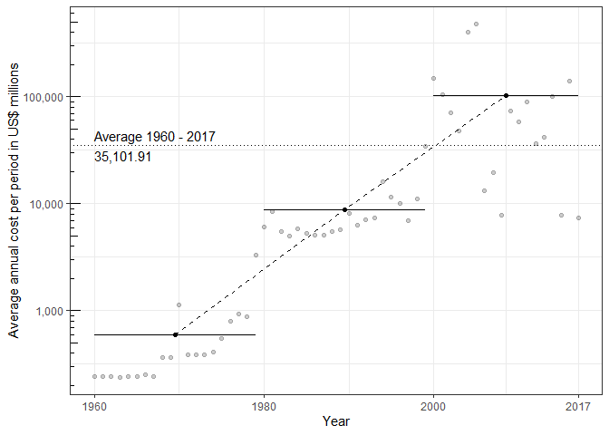
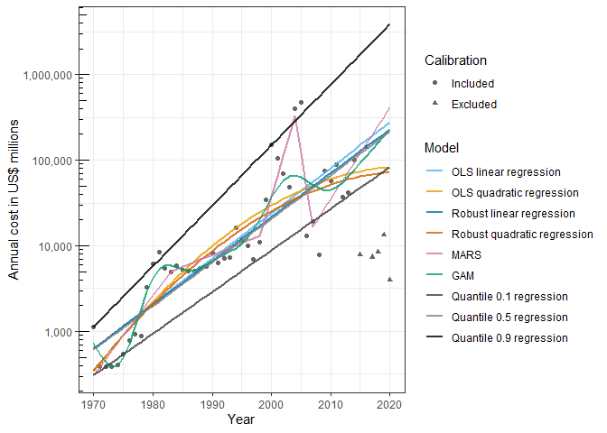
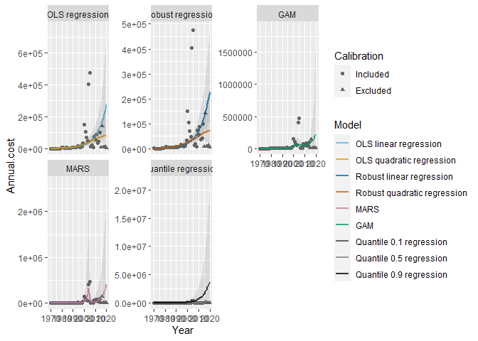

The invacost R Package: Global Costs of Biological Invasions
================
Leroy B, Kramer A, Courchamp C, Kourantidou M, Vaissière AC & Diagne C
04 March, 2022

-   [Introduction](#introduction)
-   [Acknowledgements](#acknowledgements)
-   [Installation](#installation)
-   [Recent changes](#recent-changes)
-   [Basic steps to get started](#basic-steps-to-get-started)
    -   [How to load the data in R?](#how-to-load-the-data-in-r)
    -   [How to distinguish between invacost v1 and subsequent
        versions?](#how-to-distinguish-between-invacost-v1-and-subsequent-versions)
    -   [Where are the monetary values I should
        use?](#where-are-the-monetary-values-i-should-use)
    -   [How do we filter out unreliable
        costs?](#how-do-we-filter-out-unreliable-costs)
    -   [How do I know when costs occurred?](#costtime)
    -   [How complete are our monetary
        data?](#how-complete-are-our-monetary-data)
-   [Approach based on available estimates: cumulative and average costs
    of
    invasions](#approach-based-on-available-estimates-cumulative-and-average-costs-of-invasions)
    -   [Basic usage](#basic-usage)
    -   [Customising parameters](#customising-parameters)
    -   [Customising graphs](#customising-graphs)
-   [Modelling approach: estimating the average annual cost of
    invasions](#modelling-approach-estimating-the-average-annual-cost-of-invasions)
    -   [Correction for data incompleteness due to publication
        lag](#correction-for-data-incompleteness-due-to-publication-lag)
    -   [Assumptions](#assumptions)
    -   [Models included in the ensemble
        modelling](#models-included-in-the-ensemble-modelling)
    -   [Model fitting](#model-fitting)
    -   [Model plotting](#model-plotting)
    -   [Inspecting model outputs](#inspecting-model-outputs)
    -   [How to evaluate models?](#how-to-evaluate-models)
    -   [Including model summary in your
        paper](#including-model-summary-in-your-paper)
    -   [Customising graphs](#customising-graphs-1)
-   [Example on a specific subset: mammals of North
    America](#example-on-a-specific-subset-mammals-of-north-america)
-   [Example on many subsets: all taxa/species in the
    database](#example-on-many-subsets-all-taxaspecies-in-the-database)
-   [Improving the package](#improving-the-package)
-   [Citation](#citation)

# Introduction

The invacost R package provides the InvaCost database in R with several
functions to analyse monetary costs of invasive species.

There are two main methods developed in this package to estimate the
costs associated to biological invasions.

-   *Approach based on available estimates*: the first approach consists
    in using cost estimates, as they appear in the collected materials,
    that occurred over specific intervals of time. From this approach
    you can obtain the cumulative and average annual costs of biological
    invasions for different time intervals.  
    This approach is generalisable to any subset of the InvaCost
    database, regardless of data quantity. However, it does not account
    for the temporal dynamics of costs, and may thus underestimate the
    costs of invasions, especially for recent years for which we likely
    have incomplete data.

-   *Modelling approach*: the second approach consists in **estimating**
    the long-term trend in annual cost values with a statistical
    modelling approach. Because it includes the dynamic nature of cost
    values, it is probably the most robust approach to estimate average
    annual costs. However, it requires more data and for data-poor cases
    it will not work or provide inadequate results. We fit several
    models because the trend of costs over time is not necessarily
    linear. This approach requires decisions about models to keep or
    remove, on the basis of the quality of model fit, and/or of our *a
    priori* assumptions. Note that this modelling approach is not
    designed for extrapolations because there is no certainty that the
    underlying factors of costs will have similar trends in the future.

# Acknowledgements

Thanks a lot to Anna Turbelin for her help in correcting mistakes in
this tutorial, and to Phillip Haubrock for agreeing to be the “Guinea
pig” of various test versions of the invacost R package!

# Installation

**The package requires at least R 4.0.0.**

The package can now be officially installed from CRAN.

``` r
# install.packages("devtools")
# devtools::install_github("Farewe/invacost")
install.packages("invacost")
```

# Recent changes

<details>
<summary>
<b>Click here</b> to see a summary of recent changes
</summary>

*February 2022*

-   Updated to invacost *version 4.1*
-   Added new data integrity tests / checks in the package. These checks
    were used to build invacost version 4.1.

*June 2021*

-   Updated the database version in the package to *version 4.0*.

*December 2020*

-   *The main functions of the package have changed names.*
    `calculateRawAvgCosts` is now `summarizeCosts`, and
    `costTrendOverTime` is now `modelCosts`. Older function names are
    still functional but will throw a warning, and will no longer be
    updated. Please update your scripts accordingly.

-   *Default values in `summarizeCosts` (formerly
    `calculateRawAvgCosts`) and `modelCosts` (formerly
    `costTrendOverTime`) have changed.* First, the last year of analysis
    will, by default, be the last year of your input data. Naturally,
    you can still define it manually. Second, by default, `modelCosts`
    will no longer exclude data from calibration (formerly,
    `costTrendOverTime` excluded by default data from 2015 and above).
    If you wish to keep this threshold as in former versions of the
    packages, you can still alter it by manually setting
    `incomplete.year.threshold = 2015`.

-   A new function is available (`getInvaCostVersion`) to rollback the
    database to former major releases. Current options are: `1.0`,
    `2.0`, `2.1`, `3.0`, `4.0` & `4.1`. This is to ensure
    reproducibility of analyses performed on former versions of the
    database. Naturally, any new analysis should be done on the the
    latest version shipped with the package (`data(invacost)`).

</details>

For more detailed information about version of the invacost R package,
see the file “NEWS” in the package files.

# Basic steps to get started

## How to load the data in R?

``` r
library(invacost)
data(invacost)
```

The database is now loaded in R memory under a very original name:
`invacost`.

``` r
# Number of rows (cost estimates)
nrow(invacost)
```

    ## [1] 13553

``` r
# Number of columns (database descriptors)
ncol(invacost)
```

    ## [1] 66

There are 66 columns in the INVACOST database, and I strongly recommend
you get familiarised with them by inspecting them individually and
reading the \[paper describing the database (and its fields) available
here\] (<https://doi.org/10.1038/s41597-020-00586-z>). The updated
versions of the database (and its fields) are stored in a [figShare
repository accessible
here](https://doi.org/10.6084/m9.figshare.12668570).

## How to distinguish between invacost v1 and subsequent versions?

Since the first official release of InvaCost in 2019, there have been
several major releases, some of which were internal, some of which were
public. To ensure reproducibility of analyses performed on older
releases, we provide a function in the database to fetch older releases.
we expect it will also help to understand how and why results may change
with new additions and corrections to this living database.

As of now, we offer the possibility to roll back to version 1.0, 2.0 and
2.1.

<details>
<summary>
<b>Click here</b> for an example on how to roll back to V1 or V2.1
</summary>

``` r
# # Version 1.0
# invacost_1.0 <- getInvaCostVersion("1.0")
# dim(invacost_1.0)
# 
# # Version 2.1
# invacost_2.1 <- getInvaCostVersion("2.1")
# dim(invacost_2.1)
```

</details>

If you want, the database can be automatically saved on your hard drive
in csv format, by specifying a file name with argument
`destination_file`.

## Where are the monetary values I should use?

There are several columns that contain monetary values (they generally
contain `cost` in their names). We stored raw information from the
papers that is often difficult to compare because of different
currencies, different years and different periods of time over which
costs or expenditure occurred (e.g. 1 year vs 10 years). Therefore, **to
be able to choose which monetary values to use, you need to understand
some of the basic concepts about the conversion of monetary values**
(raw costs or costs per year) into a standard currency (i.e. US$ for the
year 2017). **Hereafter, we explain the process and provide
recommendations on which monetary values to use.**

The conversion is based on two main steps. The first includes conversion
of the cost estimates from local currencies to US$. The second includes
conversion the cost estimate (previously converted to US$) from the year
it was estimated to 2017 US$.

### Step 1: Currency conversion

For the currency conversion step (from local currency to US$), it is
possible to use two conversion factors:

-   [The official market exchange
    rate](https://data.worldbank.org/indicator/PA.NUS.FCRF?end=2017&start=1960).

-   The Purchasing Power Parity (PPP, local currency unit per US$,
    calculated as an annual average), that allows to take into account
    the differences in price levels between countries. We used data
    provided [by the World
    Bank](https://data.worldbank.org/indicator/PA.NUS.PPP?end=2017&start=1990),
    or [by the
    OECD](https://data.oecd.org/conversion/purchasing-power-parities-ppp.htm)
    when information was not retrievable through the World Bank
    database. Occasionally, we had to deal with published costs that
    were expressed in currency that was different from the country where
    the costs were estimated (e.g. published cost in African countries
    expressed in US or Canadian $). Thus, prior to using PPP as a
    conversion index, we had to perform a retro-conversion by
    multiplying the original cost estimate by the official market
    exchange rate (local currency unit per currency unit used). Note
    that, it was not possible to perform the PPP-based standardisation
    for all cost estimates as PPP data do not exist for all countries
    and/or specific periods (we mentioned NA in the database when such
    information was missing).

### Step 2: Conversion of the year of currency

For the **year of currency conversion step (from US$ from a given year
to 2017 US$)**, we use an inflation factor that reflects the evolution
of the value of the US$ since the year of cost estimation. The inflation
factor is computed by dividing the [Consumer Price
Index](https://data.worldbank.org/indicator/FP.CPI.TOTL?end=2017&start=1960)
(CPI, which is a measure of the average change over time in the prices
paid by consumers for a market basket of consumer goods and services) of
the USA for 2017 by the CPI of the USA for the year of the cost
estimation.

The standardization of the cost estimates into 2017 $US is thus a
multi-step procedure for which the following formula is used:
**C<sub>e</sub> = (M<sub>V</sub> /C<sub>F</sub>) x I<sub>F</sub>**

with **C<sub>e</sub>** = Converted cost estimate (to 2017 US dollars
based on exchange rate or Purchase Power Parity), **M<sub>V</sub>** =
Cost estimate (either the `Raw_cost_estimate_original_currency`
extracted from analysed paper or the
`Cost_estimate_per_year_original_currency` transformed by us),
**C<sub>F</sub>** = Conversion factor (either the official market
exchange rate or the purchasing power parity, in US dollars),
**I<sub>F</sub>** = Inflation factor since the year of cost estimation,
calculated as CPI<sub>2017</sub> / CPI<sub>y</sub> with CPI
corresponding to the Consumer Price Index and **y** corresponding to the
year of the cost estimation (`Applicable_year`).

### Choosing monetary values in InvaCost

In InvaCost, we provide several columns with monetary values expressed
in 2017 USD based on the exchange rate or PPP - they contain either
`exchange_rate` or `PPP` in their names.

We recommend you use one of these two standardised cost columns:

-   `Cost_estimate_per_year_2017_USD_exchange_rate`: Cost estimate per
    year expressed in USD 2017 based on exchange rate
-   `Cost_estimate_per_year_2017_USD_PPP`: Cost estimate per year
    expressed in USD 2017 based on purchasing power parity (PPP)

As previously explained, the second method is likely more robust to
provide fair comparisons between costs occurring in different countries,
but PPP was not available for all countries and all years, so oftentimes
it could not be estimated. Therefore, to avoid data exclusion, when
considering global trends, we generally tend to use the exchange rate
since it is available for most countries in InvaCost after 1960.

Therefore, based on the aforementioned reasoning, onwards, in the
sections that follow, we use exclusively the same column:
`Cost_estimate_per_year_2017_USD_exchange_rate`.

There is a small number of costs for which we could not derive these
estimates (e.g. studies that lacked useful information of the periods
over which costs occurred), so we have to exclude them of our analyses.

``` r
if(any(is.na(invacost$Cost_estimate_per_year_2017_USD_exchange_rate)))
{
  invacost <- invacost[-which(is.na(invacost$Cost_estimate_per_year_2017_USD_exchange_rate)), ]
}

# Number of rows (cost estimates)
nrow(invacost)
```

    ## [1] 13344

In addition, there can be costs for which we have **inadequate time
period information**: some studies omitted to provide time periods,
which can cause tremendous biases when analysing the temporal trends of
costs. Sometimes, this is not problematic as we can safely guess when
costs occurred (see section [How do I know when costs
occurred](#costtime)). However, other times, costs spread over 10+ and
sometimes 100+ years can be presented as occurring over a single year or
require highly speculative guesses about when they occurred. As a
general rule, it is much easier and safer to estimate the ending year
than the starting year.

Therefore, it is useful to verify if there are estimates that are known
to occur over more than 1 year with no information on the starting date
whatsoever in your subset of InvaCost. **Note: we have progressively
corrected the database such such entries should no longer occur in
InvaCost version 4.1 and later.**. If you find such estimates, we
recommend to remove them, as it is not possible to safely estimate if
they occurred over a single or multiple years.

The following block of code does all of that automatically, but will do
nothing if there are no such cases ;)

``` r
# Uncertain starting periods
uncertain.starts <- invacost[which(invacost$Time_range == "Period" &
                                     is.na(invacost$Probable_starting_year)), ]
# Number of estimates without adequate information about starting year
nrow(uncertain.starts)
```

    ## [1] 100

``` r
# No info about whether cost was annual or over a period
unknown.periods <- invacost[which(is.na(invacost$Time_range)), ]
# Number of estimates without adequate information about period
nrow(unknown.periods) 
```

    ## [1] 0

``` r
# Applying the filter
if(nrow(uncertain.starts) + nrow(unknown.periods) > 0)
{
  invacost <- invacost[-which(invacost$Cost_ID %in% c(uncertain.starts$Cost_ID,
                                                    unknown.periods$Cost_ID)), ]
}

# Number of rows after filtering
nrow(invacost)
```

    ## [1] 13244

## How do we filter out unreliable costs?

You have to be aware of the limitations of such a database. This
database is the most up-to-date and comprehensive compilation of both
the published and grey literature on the monetary costs of biological
invasions. Therefore, it includes sound estimations of monetary costs of
invasive species, with detailed sources and reproducible methodology;
but it also includes unsourced and irreproducible “*guestimates*”, as
those are reported in the literature. Therefore, we want to apply
filters on the database to avoid as much as possible any such unreliable
cost estimates that can not easily be reproduced or originate from
non-peer reviewed sources. Furthermore, the database also includes
observed and potential costs, so depending on our objectives we may or
may not want to filter out potential costs.

-   **Reliability**: There is a standard field in the database called
    `Method_reliability`, which provides a simple yet objective
    evaluation of the reliability of cost estimates. It uses the
    following decision tree:
    <!-- --> Red means
    categorised as unreliable source, green means categorised as
    reliable source. This `Method_reliability` descriptor has some
    limitations. The most important one is that we decided to not
    evaluate the methodology for peer-reviewed articles and official
    reports, assuming that this was done at an earlier stage (i.e. 
    peer-review, prior to publication). We chose such an objective
    criterion, rather than assessing the reliability of methods during
    the process of filling the database, because we observed divergence
    in reliability decisions during experiments among members of the
    INVACOST team. We also identified that depending on the study
    objective, different decisions about reliability could be made.
    Therefore, this `Method_reliability` descriptor should be considered
    as a first approximation of cost reliability, and you should decide
    whether or not you want to eliminate papers on the basis of the lack
    of reproducibility of their methodologies. To do that, take time to
    investigate the `Details` field (especially for cost values that you
    deem suspiciously high) and potentially go back to the source to
    make your decision. For an example on how to do that, take a look at
    the “Determining cost estimate reproducibility” section in [Bradshaw
    et al. 2016](https://www.nature.com/articles/ncomms12986#Sec8).
    **Important update as of InvaCost version 3.0:** The database now
    also includes a `Method_reliability_refined` descriptor (not
    exhaustive as of now) which includes an expert-based assessment of
    reliability. It can be used as an alternative or as a complementary
    approach to the standard `Method_reliability` descriptor.

``` r
unique(invacost$Method_reliability)
```

    ## [1] "High" "Low"

-   **Observed vs. Potential costs**: The `Implementation` field in the
    database documents whether the costs correspond to *Observed* or
    *Potential* costs. Choosing to keep one or both of them depends on
    your study objectives. In addition, costs can also be based on
    direct *reports* or *estimations*, or can be based on
    *extrapolations*: this is documented in the `Acquisition_method`
    field. Extrapolation does not necessarily mean *potential*: some
    Observed costs may have been extrapolated from a reduced spatial
    extent. Below is a table showing the number of cases of
    *extrapolations* and *reports/estimation* for *Observed* and
    *Potential* costs. As you can see, the majority of Observed costs
    are based on *reports* / *estimations*; yet a few are based on
    *extrapolations.*

``` r
table(invacost$Acquisition_method, invacost$Implementation)
```

    ##                    
    ##                     Observed Potential
    ##   Extrapolation         1065      1353
    ##   Report/Estimation     9754      1072

For the rest of this tutorial, we will be working only on costs
categorised as *High* in `Method_reliability` and “Observed” in
`Implementation`:

``` r
invacost <- invacost[which(invacost$Method_reliability == "High"), ]
invacost <- invacost[which(invacost$Implementation == "Observed"), ]

# Number of rows after filtering
nrow(invacost)
```

    ## [1] 10013

## How do I know when costs occurred?

A crucial aspect in analysing cost values is to know the periods of time
over which costs have occurred. Indeed, knowing the period over which a
cost occurred allows to derive cumulative costs and to estimate average
annual costs; it also enables temporal analyses of costs.  
We have stored information on the periods of time over which cost
occurred in two columns: `Probable_starting_year` and
`Probable_ending_year`.

However, this information was not readily available in a substantial
portion of the papers we compiled in the database: for 1207 out of 10013
papers (12.1 % of papers), this information was not available for at
least one of the two columns.

Therefore, for papers for which it was not available, we made educated
guesses on the probable starting and ending years. These educated
guesses were based on conservative rules (e.g., if no duration
information was provided, then the impact was reported of one year
only). These estimated starting and ending years are available in two
new columns in the database called `Probable_starting_year_adjusted` and
`Probable_ending_year_adjusted`.

As it stands now, each cost has a starting and an ending year, and
schematically it looks like this:

| Cost ID | Species | Annual Cost | Starting year | Ending year |
|---------|:--------|------------:|--------------:|------------:|
| 1       | Sp 1    |         100 |          1998 |        2001 |
| 2       | Sp 2    |          15 |          2005 |        2007 |
| 3       | Sp 3    |           3 |          1981 |        1981 |

However, to properly analyse the temporal trends of costs, we need to
*expand* it, to make it look like this:

| Cost ID | Species | Annual Cost | Year |
|---------|:--------|------------:|-----:|
| 1       | Sp 1    |         100 | 1998 |
| 1       | Sp 1    |         100 | 1999 |
| 1       | Sp 1    |         100 | 2000 |
| 1       | Sp 1    |         100 | 2001 |
| 2       | Sp 2    |          15 | 2005 |
| 2       | Sp 2    |          15 | 2006 |
| 2       | Sp 2    |          15 | 2007 |
| 3       | Sp 3    |           3 | 1981 |

To do this, we use the function `expandYearlyCosts`, to which we provide
the starting and ending year columns. It will store the years over which
monetary costs have occurred in a column named `Impact_year`. In this
example, expanded database is here stored in an object called
`db.over.time`.

``` r
# Expanding and formating the database
db.over.time <- expandYearlyCosts(invacost,
                                  startcolumn = "Probable_starting_year_adjusted",
                                  endcolumn = "Probable_ending_year_adjusted")
# Let's see some columns
head(db.over.time[, c("Cost_ID", "Species",
                      "Cost_estimate_per_year_2017_USD_exchange_rate",
                      "Impact_year")])
```

    ##      Cost_ID               Species
    ## ...1       1         Vulpes vulpes
    ## ...2       2         Vulpes vulpes
    ## ...3       3         Vulpes vulpes
    ## ...4      11 Oryctolagus cuniculus
    ## ...5      17 Oryctolagus cuniculus
    ## ...6      24           Canis lupus
    ##      Cost_estimate_per_year_2017_USD_exchange_rate Impact_year
    ## ...1                                      16701772        2004
    ## ...2                                     181333526        2004
    ## ...3                                      15270192        2000
    ## ...4                                      21855462        2004
    ## ...5                                      84091037        2004
    ## ...6                                      46096891        2004

## How complete are our monetary data?

It is impossible to evaluate the absolute degree of completeness of our
InvaCost datbase - we know that we lack data for many taxonomic groups
and so are data from many places around the globe (most cost data
available in InvaCost are located in North America and Europe and are
cost data primarily available in English and to a lesser extent in other
languages). You have to be aware of these potential biases and remember
them when interpreting data/analyses.

There is, however, a temporal bias that we can at least evaluate.
Indeed, we can expect that there is delay between the timing at which
the economic impact of an invasive species occurs, and the timing at
which people will start estimating the cost of the impact, which will
later be followed by publication in a report or journal.

We can grasp an idea of this delay by looking at the difference between
`Impact_year` and `Publication_year` in the expanded database,
`db.over.time`.

``` r
# Calculating time lag
db.over.time$Publication_lag <- db.over.time$Publication_year - db.over.time$Impact_year

# Make a nice boxplot of the time lag
ggplot(db.over.time,
       aes(y = Publication_lag)) +
  geom_boxplot(outlier.alpha = .2) +
  ylab("Publication lag (in years)") + 
  theme_minimal() +
  theme(panel.grid.major.y = element_blank(),
        panel.grid.minor.y = element_blank(),
        axis.text.y = element_blank(),
        axis.text = element_text(size = 16),
        axis.title = element_text(size = 18)) +
  scale_y_continuous(breaks = c(-25, 0, 25, 50, 75, 100),
                     labels = c(-25, 0, 25, 50, 75, 100)) +
  xlab("") +
  coord_flip()
```

<!-- -->

*Note that the few occurrences of publications before economic impacts
(negative lag) corresponded to planned budgets over specific periods
expanding beyond the publication year.*

Our suggestion is to use the quartiles of publication lag as an
indication of cost data completeness.

The first quartile indicates the delay to reach 25% completeness; the
median indicates the delay to reach 50% completeness; and the third
quartile indicates the delay to reach 75% completeness.

Let’s see these delays in practice:

``` r
quantiles <- quantile(db.over.time$Publication_lag, probs = c(.25, .5, .75))
quantiles
```

    ## 25% 50% 75% 
    ##   1   3   7

The median delay between impact and publication of impact was **3
years**. In other words, **for the last 3 years, we can expect to have
less than 50% of the economic impacts**.

Likewise, we can say it takes approximately 1 year to have 25% of the
cost data for any year, and 7 years to reach at least 75% of cost data.

Hence, any analysis on recent years will be based on incomplete data and
is highly likely to provide an underestimation of actual costs.

It is up to you to determine how you desire to include this information
in your analyses; here, we will provide examples of how we suggest doing
that.

One question that may arise for people working on specific subsets of
the database (e.g., only one taxon or one country) is whether you should
evaluate the time lag on your subset. *I would recommend to avoid that,
because your subset may be too incomplete to provide a decent estimation
of the time lag. **Therefore, we would suggest to evaluate the time lag
only on the global dataset, as we did here.***

Last, note that there may be a correlation between the time lag and the
magnitude of cost estimates. Indeed, direct reports of small costs tend
to be aired earlier than large estimates of invasion impacts. It is an
important issue to consider when investigating the time lag. For
example, the quantiles of time lag for all costs above US$ 1 million
annually are 1, 3, 9 years.

# Approach based on available estimates: cumulative and average costs of invasions

## Basic usage

The first method to analyse monetary costs of invasive species consists
in calculating the observed cumulative and average costs - as they
appear in the collected materials - over a specific period of time, or
at different time intervals.

We implemented this method in the function `summarizeCosts`. It will
calculate the cumulative and average costs for the entire period, as
well as for different time intervals (by default, 10-year intervals).

``` r
obs.costs <- summarizeCosts(db.over.time,
                            maximum.year = 2020)
```

    ## Warning in summarizeCosts(db.over.time, maximum.year = 2020): There are 19 cost values for periods earlier than 1960, which will be removed.

    ## Warning in summarizeCosts(db.over.time, maximum.year = 2020): There are 46 cost values for periods later than 2020 which will be removed.

We can get a summary of the results by typing the name of the object in
the console

``` r
obs.costs
```

    ## 
    ## Average annual cost of invasive species over time periods
    ## 
    ## - Temporal interval of data : [1960, 2020]
    ## - Values transformed in US$ million: Yes
    ## - Number of cost estimates: 10001 (number of individual year values: 21765)
    ## - Cost values in US$ millions:
    ##     o Total cost over the entire period 2,061,625.50
    ##     o Average annual cost over the entire period 33,797.14
    ##     o Average annual cost over each period
    ## 
    ##   initial_year final_year time_span   total_cost annual_cost number_estimates
    ## 1         1960       1969        10     2,675.44      267.54               29
    ## 2         1970       1979        10     9,158.49      915.85               93
    ## 3         1980       1989        10    57,527.22    5,752.72              258
    ## 4         1990       1999        10   118,950.02   11,895.00              794
    ## 5         2000       2009        10 1,366,308.76  136,630.88             2424
    ## 6         2010       2020        11   507,005.58   46,091.42             7192
    ##   number_year_values
    ## 1                170
    ## 2                390
    ## 3                864
    ## 4               2165
    ## 5               5891
    ## 6              12285

And we can have a graphical output with:

``` r
plot(obs.costs)
```

<!-- -->

This graph represents the observed annual costs of biological invasions
over time. Points are total annual costs for every year (i.e., all
individual costs for a specific year are summed). Horizontal bars
represent the average annual cost for a specific interval of time (here,
10-year intervals). Notice how average annual costs can sometimes be
driven by a limited number of high-cost years. The dashed line connects
average annual cost of each time interval at mid-years (black dots). The
horizontal dotted line represents the average cost over the entire
period.

The average annual cost seems to suspiciously drop for the most recent
years - most likely because of the time lag between the occurrence of a
cost and its reporting. Therefore, caution would be required in
interpreting the values of most recent years.

A good way to illustrate this issue would be to look at the number of
estimates per year.

``` r
ggplot(obs.costs$cost.per.year,
       aes(x = year, y = number_estimates)) +
  geom_point() +
  ylab("Number of estimates") +
  xlab("Year") +
  theme_minimal()
```

<!-- -->

We can see that the number of estimates increases exponentially, but
this increase seems to slow down/drop after 2015.

We can refine this graph to add the relationship with annual costs:

``` r
ggplot(obs.costs$cost.per.year,
       aes(x = year, y = number_estimates,
           size = cost)) +
  geom_point() +
  ylab("Number of estimates") +
  xlab("Year") +
  theme_minimal()
```

<!-- -->

**Note, however, that the number of estimates in itself is not a
meaningful index to describe the sampling effort. Indeed, a single
estimate can be a complete synthesis over a country, and thus be
complete in itself, whereas many estimates can be direct reports of
small localized costs from grey litterature, and altogether still
represent an incomplete picture of overall costs.** Notably, recent
years have been characterized by a high number of direct reports from
the grey literature, which can result in a false sense of completeness
when only looking at the number estimates (e.g., [Angulo et
al. 2021](https://doi.org/10.1016/j.scitotenv.2020.144441), [Renault et
al. 2021](https://doi.org/10.3897/neobiota.67.59134)).

Use this information, in combination with the quantiles of completeness
calculated above, to decide how you want to interpret the last years,
and whether or not you want to omit them in further analyses. Remember
that no choice will be objective here, but also that objectivity does
not emerge from the absence of choice (keeping biased data is a choice
in itself). We would recommend a transparently explained choice, along
with e.g. a sensitivity analysis.

We can access the content of the output object with

``` r
str(obs.costs)
```

    ## List of 6
    ##  $ cost.data              :'data.frame': 21765 obs. of  68 variables:
    ##   ..$ Impact_year                                  : int [1:21765] 2004 2004 2000 2004 2004 2004 2004 2004 1996 1993 ...
    ##   ..$ InvaCost_ID                                  : chr [1:21765] "IC_1.0_1" "IC_1.0_2" "IC_1.0_3" "IC_1.0_11" ...
    ##   ..$ Cost_ID                                      : chr [1:21765] "1" "2" "3" "11" ...
    ##   ..$ Repository                                   : chr [1:21765] "TC" "TC" "TC" "TC" ...
    ##   ..$ Reference_ID                                 : chr [1:21765] "2" "2" "2" "559" ...
    ##   ..$ Reference_title                              : chr [1:21765] "Counting the Cost: Impact of Invasive Animals in Australia" "Counting the Cost: Impact of Invasive Animals in Australia" "Counting the Cost: Impact of Invasive Animals in Australia" "The economic benefits of rabbit control in Australian temperate pastures by the introduction of rabbit haemorrhagic disease" ...
    ##   ..$ Authors                                      : chr [1:21765] "McLeod" "McLeod" "McLeod" "Vere et al" ...
    ##   ..$ Abstract                                     : chr [1:21765] NA NA NA NA ...
    ##   ..$ Publication_year                             : num [1:21765] 2004 2004 2004 2004 2004 ...
    ##   ..$ Language                                     : chr [1:21765] "English" "English" "English" "English" ...
    ##   ..$ Type_of_material                             : chr [1:21765] "Official report" "Official report" "Official report" "Peer-reviewed article" ...
    ##   ..$ Previous_materials                           : chr [1:21765] "Rolfe, J., & Windle, J. (2014). Public preferences for controlling an invasive species in public and private sp"| __truncated__ "Rolfe, J., & Windle, J. (2014). Public preferences for controlling an invasive species in public and private sp"| __truncated__ "Rolfe, J., & Windle, J. (2014). Public preferences for controlling an invasive species in public and private sp"| __truncated__ "McLeod, R. (2004). Counting the Cost: Impact of Invasive Animals in Australia, 2004. Canberra. Retrieved from h"| __truncated__ ...
    ##   ..$ Availability                                 : chr [1:21765] "Yes" "Yes" "Yes" "Yes" ...
    ##   ..$ Kingdom                                      : chr [1:21765] "Animalia" "Animalia" "Animalia" "Animalia" ...
    ##   ..$ Phylum                                       : chr [1:21765] "Chordata" "Chordata" "Chordata" "Chordata" ...
    ##   ..$ Class                                        : chr [1:21765] "Mammalia" "Mammalia" "Mammalia" "Mammalia" ...
    ##   ..$ Order                                        : chr [1:21765] "Carnivora" "Carnivora" "Carnivora" "Lagomorpha" ...
    ##   ..$ Family                                       : chr [1:21765] "Canidae" "Canidae" "Canidae" "Leporidae" ...
    ##   ..$ Genus                                        : chr [1:21765] "Vulpes" "Vulpes" "Vulpes" "Oryctolagus" ...
    ##   ..$ Species                                      : chr [1:21765] "Vulpes vulpes" "Vulpes vulpes" "Vulpes vulpes" "Oryctolagus cuniculus" ...
    ##   ..$ Subspecies                                   : chr [1:21765] NA NA NA NA ...
    ##   ..$ Common_name                                  : chr [1:21765] "Red fox" "Red fox" "Red fox" "European (common) rabbit" ...
    ##   ..$ Environment                                  : chr [1:21765] "Terrestrial" "Terrestrial" "Terrestrial" "Terrestrial" ...
    ##   ..$ Environment_IAS                              : chr [1:21765] "Terrestrial" "Terrestrial" "Terrestrial" "Terrestrial" ...
    ##   ..$ HabitatVerbatim                              : chr [1:21765] NA NA NA NA ...
    ##   ..$ Habitat                                      : chr [1:21765] NA NA NA NA ...
    ##   ..$ urbanArea                                    : chr [1:21765] "other" "other" "other" "other" ...
    ##   ..$ protectedArea                                : chr [1:21765] NA NA NA NA ...
    ##   ..$ Island                                       : chr [1:21765] "Y" "Y" "Y" "Y" ...
    ##   ..$ Geographic_region                            : chr [1:21765] "Oceania" "Oceania" "Oceania" "Oceania" ...
    ##   ..$ Official_country                             : chr [1:21765] "Australia" "Australia" "Australia" "Australia" ...
    ##   ..$ State.Province.Administrative_area           : chr [1:21765] NA NA NA NA ...
    ##   ..$ Location                                     : chr [1:21765] "Diverse/Unspecified" "Diverse/Unspecified" "Tasmania" "Diverse/Unspecified" ...
    ##   ..$ Spatial_scale                                : chr [1:21765] "Country" "Country" "Site" "Country" ...
    ##   ..$ Period_of_estimation                         : chr [1:21765] "2004" "2004" "2000" "2004" ...
    ##   ..$ Time_range                                   : chr [1:21765] "Year" "Year" "Year" "Year" ...
    ##   ..$ Probable_starting_year                       : num [1:21765] 2004 2004 2000 2004 2004 ...
    ##   ..$ Probable_ending_year                         : num [1:21765] NA NA NA NA NA NA NA NA NA NA ...
    ##   ..$ Probable_starting_year_adjusted              : num [1:21765] 2004 2004 2000 2004 2004 ...
    ##   ..$ Probable_ending_year_adjusted                : num [1:21765] 2004 2004 2000 2004 2004 ...
    ##   ..$ Occurrence                                   : chr [1:21765] "Potentially ongoing" "Potentially ongoing" "Potentially ongoing" "Potentially ongoing" ...
    ##   ..$ Raw_cost_estimate_original_currency          : num [1:21765] 1.75e+07 1.90e+08 1.60e+07 2.29e+07 8.81e+07 ...
    ##   ..$ Min_Raw_cost_estimate_original_currency      : num [1:21765] NA NA NA 7100000 NA NA NA NA NA NA ...
    ##   ..$ Max_Raw_cost_estimate_original_currency      : chr [1:21765] NA NA NA "38700000" ...
    ##   ..$ Raw_cost_estimate_2017_USD_exchange_rate     : num [1:21765] 1.67e+07 1.81e+08 1.53e+07 2.19e+07 8.41e+07 ...
    ##   ..$ Raw_cost_estimate_2017_USD_PPP               : num [1:21765] 1.66e+07 1.81e+08 1.52e+07 2.18e+07 8.38e+07 ...
    ##   ..$ Cost_estimate_per_year_original_currency     : num [1:21765] 1.75e+07 1.90e+08 1.60e+07 2.29e+07 8.81e+07 ...
    ##   ..$ Cost_estimate_per_year_2017_USD_exchange_rate: num [1:21765] 16.7 181.3 15.3 21.9 84.1 ...
    ##   ..$ Cost_estimate_per_year_2017_USD_PPP          : num [1:21765] 1.66e+07 1.81e+08 1.52e+07 2.18e+07 8.38e+07 ...
    ##   ..$ Currency                                     : chr [1:21765] "AUD" "AUD" "AUD" "AUD" ...
    ##   ..$ Applicable_year                              : num [1:21765] 2004 2004 2004 2004 2004 ...
    ##   ..$ Type_of_applicable_year                      : chr [1:21765] "Publication year" "Publication year" "Publication year" "Publication year" ...
    ##   ..$ Implementation                               : chr [1:21765] "Observed" "Observed" "Observed" "Observed" ...
    ##   ..$ Acquisition_method                           : chr [1:21765] "Report/Estimation" "Report/Estimation" "Report/Estimation" "Report/Estimation" ...
    ##   ..$ Impacted_sector                              : chr [1:21765] "Agriculture" "Environment" "Authorities-Stakeholders" "Agriculture" ...
    ##   ..$ Type_of_cost                                 : chr [1:21765] "Damage-Loss" "Damage-Loss" "Control" "Damage-Loss" ...
    ##   ..$ Type_of_cost_merged                          : chr [1:21765] "Damage" "Damage" "Management" "Damage" ...
    ##   ..$ Management_type                              : chr [1:21765] NA NA "Post-invasion_management" NA ...
    ##   ..$ Method_reliability                           : chr [1:21765] "High" "High" "High" "High" ...
    ##   ..$ Method_reliability_refined                   : chr [1:21765] NA NA NA NA ...
    ##   ..$ Method_reliability_Explanation               : chr [1:21765] NA NA NA NA ...
    ##   ..$ Method_reliability_Expert_Name               : chr [1:21765] NA NA NA NA ...
    ##   ..$ Overlap                                      : chr [1:21765] NA NA NA NA ...
    ##   ..$ Benefit_value.s.                             : chr [1:21765] "no" "no" "no" "no" ...
    ##   ..$ Details                                      : chr [1:21765] "Key loss is lamb predation. ABARE (2003) estimate 35 million lambs marked per year. Assumed 2% of all lambs mar"| __truncated__ "Following the methodology in Pimentel et al. (2000), the impact of fox predation on the bird population in Aust"| __truncated__ "Fox control expenditure in Tasmania of $9 million per year is also included (Tasmanian Dept. of Primary Industr"| __truncated__ "Prior to the release of RHDV : Rabbits impose annual costs on wool producers in the temperate pasture areas of "| __truncated__ ...
    ##   ..$ Initial.contributors_names                   : chr [1:21765] "Christophe Diagne/Claire Assailly/Lise Nuninger" "Christophe Diagne/Claire Assailly/Lise Nuninger" "Christophe Diagne/Claire Assailly/Lise Nuninger" "Christophe Diagne/Claire Assailly/Lise Nuninger" ...
    ##   ..$ Double.checking                              : chr [1:21765] "Yes" "Yes" "Yes" "Yes" ...
    ##   ..$ Publication_lag                              : num [1:21765] 0 0 4 0 0 0 0 0 0 3 ...
    ##  $ parameters             :List of 7
    ##   ..$ cost.column          : chr "Cost_estimate_per_year_2017_USD_exchange_rate"
    ##   ..$ year.column          : chr "Impact_year"
    ##   ..$ in.millions          : logi TRUE
    ##   ..$ minimum.year         : num 1960
    ##   ..$ maximum.year         : num 2020
    ##   ..$ number.of.estimates  : int 10001
    ##   ..$ number.of.year.values: int 21765
    ##  $ year.breaks            : num [1:7] 1960 1970 1980 1990 2000 2010 2020
    ##  $ cost.per.year          :'data.frame': 61 obs. of  3 variables:
    ##   ..$ year            : int [1:61] 1960 1961 1962 1963 1964 1965 1966 1967 1968 1969 ...
    ##   ..$ cost            : num [1:61] 242 243 243 240 240 ...
    ##   ..$ number_estimates: int [1:61] 13 14 15 13 14 17 20 19 23 22 ...
    ##  $ average.total.cost     :'data.frame': 1 obs. of  7 variables:
    ##   ..$ initial_year      : num 1960
    ##   ..$ final_year        : num 2020
    ##   ..$ time_span         : int 61
    ##   ..$ total_cost        : num 2061625
    ##   ..$ annual_cost       : num 33797
    ##   ..$ number_estimates  : int 10001
    ##   ..$ number_year_values: int 21765
    ##  $ average.cost.per.period:'data.frame': 6 obs. of  7 variables:
    ##   ..$ initial_year      : num [1:6] 1960 1970 1980 1990 2000 2010
    ##   ..$ final_year        : num [1:6] 1969 1979 1989 1999 2009 ...
    ##   ..$ time_span         : int [1:6] 10 10 10 10 10 11
    ##   ..$ total_cost        : num [1:6] 2675 9158 57527 118950 1366309 ...
    ##   ..$ annual_cost       : num [1:6] 268 916 5753 11895 136631 ...
    ##   ..$ number_estimates  : int [1:6] 29 93 258 794 2424 7192
    ##   ..$ number_year_values: int [1:6] 170 390 864 2165 5891 12285
    ##  - attr(*, "class")= chr [1:2] "invacost.costsummary" "list"

Notice that the expanded database used to calculate costs has been
stored in the object, in a slot called `cost.data`. This is especially
important for reproducibility: in case you decide to publish your work,
you can provide this R object which has the exact copy of your specific
version/filters of the database.

There are also some other important elements in this object:

-   `parameters`: provides arguments you chose and basic information
    about your dataset
-   `year.breaks`: your time intervals
-   `cost.per.year`: costs for every year in the data with number of
    estimates
-   `average.total.cost`: contains cumulative and average annual costs
    for the entire time period
-   `average.cost.per.period`: contains cumulative and average annual
    costs for each time interval

You can access each element with the `$` sign; for example for the costs
for all time intervals:

``` r
obs.costs$average.cost.per.period
```

    ##   initial_year final_year time_span  total_cost annual_cost number_estimates
    ## 1         1960       1969        10    2675.436    267.5436               29
    ## 2         1970       1979        10    9158.488    915.8488               93
    ## 3         1980       1989        10   57527.218   5752.7218              258
    ## 4         1990       1999        10  118950.019  11895.0019              794
    ## 5         2000       2009        10 1366308.760 136630.8760             2424
    ## 6         2010       2020        11  507005.578  46091.4162             7192
    ##   number_year_values
    ## 1                170
    ## 2                390
    ## 3                864
    ## 4               2165
    ## 5               5891
    ## 6              12285

## Customising parameters

There are two main parameters to customize:

-   **beginning** (`minimum.year`) and **ending year** (`maximum.year`)
    of the entire time period. For example in our analyses for the
    Nature paper ([Diagne et
    al. 2021](https://doi.org/10.1038/s41586-021-03405-6)) we chose to
    start in 1970, because data for the 1960s are scarce and uncertain.

``` r
obs.costs2 <- summarizeCosts(db.over.time,
                             minimum.year = 1970,
                             maximum.year = 2017)
```

    ## Warning in summarizeCosts(db.over.time, minimum.year = 1970, maximum.year = 2017): There are 36 cost values for periods earlier than 1970, which will be removed.

    ## Warning in summarizeCosts(db.over.time, minimum.year = 1970, maximum.year = 2017): There are 1133 cost values for periods later than 2017 which will be removed.

``` r
obs.costs2
```

    ## 
    ## Average annual cost of invasive species over time periods
    ## 
    ## - Temporal interval of data : [1970, 2017]
    ## - Values transformed in US$ million: Yes
    ## - Number of cost estimates: 9138 (number of individual year values: 20238)
    ## - Cost values in US$ millions:
    ##     o Total cost over the entire period 2,033,235.51
    ##     o Average annual cost over the entire period 42,359.07
    ##     o Average annual cost over each period
    ## 
    ##   initial_year final_year time_span   total_cost annual_cost number_estimates
    ## 1         1970       1979        10     9,158.49      915.85               93
    ## 2         1980       1989        10    57,527.22    5,752.72              258
    ## 3         1990       1999        10   118,950.02   11,895.00              794
    ## 4         2000       2009        10 1,366,308.76  136,630.88             2424
    ## 5         2010       2017         8   481,291.02   60,161.38             6337
    ##   number_year_values
    ## 1                390
    ## 2                864
    ## 3               2165
    ## 4               5891
    ## 5              10928

The function tells you how many values were removed from the dataset
because they were outside the 1970-2017 time periods.

-   **time intervals**: set them with the arguments `year.breaks`, where
    you specify the starting year of each interval. For example, if your
    specify `year.breaks = c(1970, 1980, 1990, 2000, 2010, 2017)`, then
    intervals will be \[1970-1979\], \[1980-1989\], \[1990-1999\],
    \[2000-2009\], \[2010-2017\]

``` r
# let's plot 20-year intervals
obs.costs3 <- summarizeCosts(db.over.time,
                                  minimum.year = 1960,
                                  maximum.year = 2017,
                                  year.breaks = seq(1960, 2017, by = 20))
```

    ## Warning in summarizeCosts(db.over.time, minimum.year = 1960, maximum.year = 2017, : There are 19 cost values for periods earlier than 1960, which will be removed.

    ## Warning in summarizeCosts(db.over.time, minimum.year = 1960, maximum.year = 2017, : There are 1133 cost values for periods later than 2017 which will be removed.

``` r
plot(obs.costs3)
```

<!-- -->

## Customising graphs

There are two methods to customise graphs.

-   The first one is to use the standard ggplot produced by the package
    and adding things or changing parameters. This method is easy to
    implement but you cannot change everything (e.g. adjust the
    colors/shapes of points is not possible). This is what we will see
    here. See the help here: `?plot.invacost.costsummary`

-   The second one is to make your own ggplot from the output object. It
    is more difficult to implement if you are not familiar with graphs
    in R - but it will be fully customisable. [Take a look at the
    scripts from our main
    paper](http://borisleroy.com/invacost/global_invasion_costs_scripts.html)
    to see how to that.

There are two base plots provided with the package; you have already
seen the default, and here is another one:

``` r
plot(obs.costs,
     plot.type = "bars")
```

<!-- -->

You can also remove the log10 scale:

``` r
plot(obs.costs,
     plot.type = "bars",
     cost.transf = NULL)
```

<!-- -->

To customise parameters using the standard ggplot produced by the
package, you will have to set the argument
`graphical.parameters = "manual"`.

``` r
# Store the plot in object p1 to customize it afterwards
p1 <- plot(obs.costs,
           graphical.parameters = "manual")

# Show the graph in its initial state
p1
```

<!-- -->

You see that when we specify `graphical.parameters = "manual"`, all the
cosmetic choices we made in the function are removed. You can now choose
them by yourself; here is a starting point:

``` r
# Customize p1 now
p1 <- p1 +
  xlab("Year") + 
  ylab("Average annual cost of invasions in US$ millions") +
  scale_x_continuous(breaks = obs.costs$year.breaks) + # X axis breaks
  theme_bw() + # Minimal theme
  scale_y_log10(breaks = 10^(-15:15), # y axis in log 10 with pretty labels
                labels = scales::comma) +
  annotation_logticks(sides = "l") # log10 tick marks on y axis

# Let's see how it goes
p1
```

<!-- -->

Your turn to play with graphs now!

# Modelling approach: estimating the average annual cost of invasions

The second method we provide in the package consists in estimating the
long-term trend in annual cost with different modelling techniques. In
other words, we fit a model to predict costs as a function of years.
Then, we can inspect the different models and the shapes of cost trends
over time, and grasp an idea of dynamics of invasion costs.

This approach requires more data than the approach based on available
estimates and for data-poor cases it will not work or provide inadequate
results.

## Correction for data incompleteness due to publication lag

Because the average annual monetary cost of invasive species will be
determined by the trend over time, we should consider applying a
correction to ‘incomplete’ years.

This is no simple decision and your choice will have to be justified.

There are two different methods we can apply here, either independently
or in combination.

-   The first method consists in applying a threshold of incompleteness
    to remove the most incomplete years. For example, remove from
    calibration all years with \< 75% of data; threshold = 7 years.

-   Another possibility includes weighting incomplete years to reduce
    their importance in the estimation of average annual costs of
    invasions. This approach can be justified if we do not want to
    underestimate the average annual cost of invasions. However, be
    advised that reviewers may disagree with your choices of weights, so
    justify them carefully, and consider analysing the difference with /
    without weights.

### Example of a vector of incompleteness weights

An example to reduce the negative impact of the incompleteness of recent
years would be to apply weights proportional to their degree of
incompleteness. For example, apply the following set of rules: •
completeness ≤ 25%: exclusion • 25% \< completeness ≤ 50%: weight = 0.25
• 50% \< completeness ≤ 75%: weight = 0.50 • completeness \> 75%: weight
= 1

Remember that we stored quantiles in the beginning of this tutorial, so
we can access them now to know to what years they correspond:

``` r
quantiles
```

    ## 25% 50% 75% 
    ##   1   3   7

In the next lines of code we will create a vector of weights for each
year, which we can provide to the function later on.

``` r
# Creating the vector of weights
year_weights <- rep(1, length(1960:2017))
names(year_weights) <- 1960:2017

# Assigning weights
# Below 25% the weight does not matter because years will be removed
year_weights[names(year_weights) >= (2017 - quantiles["25%"])] <- 0
# Between 25 and 50%, assigning 0.25 weight
year_weights[names(year_weights) >= (2017 - quantiles["50%"]) &
               names(year_weights) < (2017 - quantiles["25%"])] <- .25
# Between 50 and 75%, assigning 0.5 weight
year_weights[names(year_weights) >= (2017 - quantiles["75%"]) &
               names(year_weights) < (2017 - quantiles["50%"])] <- .5

# Let's look at it
year_weights
```

    ## 1960 1961 1962 1963 1964 1965 1966 1967 1968 1969 1970 1971 1972 1973 1974 1975 
    ## 1.00 1.00 1.00 1.00 1.00 1.00 1.00 1.00 1.00 1.00 1.00 1.00 1.00 1.00 1.00 1.00 
    ## 1976 1977 1978 1979 1980 1981 1982 1983 1984 1985 1986 1987 1988 1989 1990 1991 
    ## 1.00 1.00 1.00 1.00 1.00 1.00 1.00 1.00 1.00 1.00 1.00 1.00 1.00 1.00 1.00 1.00 
    ## 1992 1993 1994 1995 1996 1997 1998 1999 2000 2001 2002 2003 2004 2005 2006 2007 
    ## 1.00 1.00 1.00 1.00 1.00 1.00 1.00 1.00 1.00 1.00 1.00 1.00 1.00 1.00 1.00 1.00 
    ## 2008 2009 2010 2011 2012 2013 2014 2015 2016 2017 
    ## 1.00 1.00 0.50 0.50 0.50 0.50 0.25 0.25 0.00 0.00

## Assumptions

As we fit several models based on different techniques, we suggest to
define rules for deciding which model(s) should be finally considered.

Here are examples of rules:

-   statistical information about the quality of the fit: adequate error
    estimations for models, sensitivity to outliers, the Root Mean
    Square Error (RMSE - lower is generally better but it may also be
    indicative of model overfitting), inspection of model terms and
    residuals

-   simplicity: for models with similar performance, we prefer the
    models with less assumptions

-   a qualitative rationale on the probable shape of trends over time:
    because of the exponential increase in the number of invasive
    species globally (Seebens et al. 2017), we expect the long-term
    temporal trend over time to be either increasing or stabilising, but
    not decreasing. Hence, we assume that a model describing a
    decreasing trend in recent years (i.e., for years lower than the 75%
    completeness threshold) would indicate an effect of the lack of data
    for recent years.

## Models included in the ensemble modelling

There are several models included in the function. All models are
calibrated with cost data as the response variable and time as
predictive variable. Note that the monetary data have statistical issues
typical to *econometric* data: heteroskedasticity, temporal
autocorrelation and outliers. Therefore, our choice of modelling methods
was driven by methods relatively robust to such issues.

**Note: when using the package, please cite the individual model
packages. Update citations with your package versions! To do that type
for example `citation("earth")` in R**

-   **Ordinary least square regressions** (hereafter called OLS, R
    package `stats`, function `lm`). OLS regressions are the classical
    regression methods used in statistics. Coefficient estimates should
    be relatively robust to heteroscedasticity & temporal
    autocorrelation but not to outliers. However, error estimates need
    to be corrected, so we used the Heteroskedasticity and
    Autocorrelation Consistent covariance matrix estimations from the R
    package `sandwich` (Andrews 1991, Zeileis 2004), and we used the
    function `coeftest` from package `lmtest` (Zeileis & Hothorn 2004)
    to test for the significance of estimates upon this corrected
    variance covariance matrix. We implemented two OLS methods:
    -   **linear OLS regressions**
    -   **quadratic OLS regressions**
-   **Robust regressions** (R package `robustbase`, function `lmrob`,
    Maechler et al. 2020). We implemented MM-type regressions (hereafter
    called robust regressions) based on iteratively reweighted least
    squares since these types of regressions are less sensitive to
    outliers than ordinary least square regressions (and we do have
    outliers in InvaCost!) (Yohai 1987, Koller and Stahel 2011). In
    addition, this method estimates standard errors robust to
    heteroskedasticity and autocorrelation as described in Croux et
    al. 2003. *Thanks Andrew Kramer for this addition*. Likewise to OLS
    regressions, we implemented two methods:
    -   **linear robust regressions**
    -   **quadratic robust regressions**
-   **Multivariate adaptive regression splines** (Multivariate Adaptive
    Regression Splines, MARS, R package `earth`, function `earth`,
    Milborrow 2018). The MARS model is a non-parametric regression
    method which automatically models nonlinearities, using Generalized
    Cross-Validation to avoid overfitting (Friedman 1991, Hastie et
    al. 2009). The default parameters are implemented in order to follow
    Friedman’s default, as described in [Milborrow
    (2019a).](http://www.milbo.org/doc/earth-notes.pdf) We account for
    heteroskedasticity by fitting a linear model on the residuals. This
    linear model is fitted by Iteratively Reweighting Least Squares.
    Note, however, that we have enough data to only approximately model
    variance, as explained in [Milborrow
    (2019b)](http://www.milbo.org/doc/earth-varmod.pdf). Therefore, MARS
    models will have more uncertainty in the prediction intervals than
    in the predictions themselves.
-   **Generalized additive models** (Generalized Additive Models, GAM, R
    package `mgcv`, function `gam`, Wood et al. 2016). GAM models are
    automatic flexible statistical methods used to identify and
    characterize nonlinear regression effects (Hastie et al. 2009). The
    GAM model will also show non-linear patterns in cost trends over
    time. To account for heteroskedasticity, we used a location-scale
    method which consists in fitting two GAMs, one for the average trend
    and one for the standard deviation. We used a simple Gaussian
    location scale family because, likewise to GAMs, we have enough data
    to only approximately model variance.
-   **Quantile regressions** (R package `quantreg`, Koenker et
    al. 2020). Contrary to previous models, quantile regressions do not
    try to estimate the average value, they estimate a specific
    quantile. In the package we chose quantiles 0.1 (lower boundary of
    annual costs), 0.5 (median cost value) and 0.9 (upper boundary of
    annual costs).

**References:**

Andrews DWK (1991), Heteroskedasticity and Autocorrelation Consistent
Covariance Matrix Estimation. *Econometrica*, *59*, 817–858.

Croux, C., Dhaene, G. and Hoorelbeke, D. (2003) Robust standard errors
for robust estimators, *Discussion Papers Series 03.16*, K.U. Leuven,
CES.

Friedman, J. H. (1991). “Multivariate Adaptive Regression Splines”. *The
Annals of Statistics.* *19* (1): 1–67.

Hastie T, Tibshirani R, Friedman J. (2009) The elements of statistical
learning: data mining, inference, and prediction. Springer, New York
City, USA

Koenker, R. quantreg: Quantile Regression. R package version 5.61.
Available at <http://CRAN.R-project.org/package=quantreg> (2020).

Koller, M. and Stahel, W.A. (2011) Sharpening Wald-type inference in
robust regression for small samples. Computational *Statistics & Data
Analysis* *55*(8), 2504–2515

Maechler M, Rousseeuw P, Croux C, Todorov V, Ruckstuhl A,
Salibian-Barrera M, Verbeke T, Koller M, Eduardo LT, Conceicao and di
Palma MA (2020). robustbase: Basic Robust Statistics R package version
0.93-6. URL <http://CRAN.R-project.org/package=robustbase>

Milborrow, S. earth: Multivariate Adaptive regression Splines, R package
version 4.6. 3 (2018).

Milborrow S. (2019a) Notes on earth package. Vignettes of the R package
‘earth’, <http://www.milbo.org/doc/earth-notes.pdf>

Milborrow S. (2019b) Variance models in earth. Vignettes of the R
package ‘earth’, <http://www.milbo.org/doc/earth-varmod.pdf>

Wood, S.N., N. Pya and B. Saefken (2016), Smoothing parameter and model
selection for general smooth models. *Journal of the American
Statistical Association* *111*, 1548-1575

Yohai, V., Stahel, W.A. and Zamar, R. (1991) A procedure for robust
estimation and inference in linear regression; in Stahel and Weisberg
(eds), *Directions in Robust Statistics and Diagnostics, Part II*,
Springer, New York, 365–374

Zeileis A (2004). “Econometric Computing with HC and HAC Covariance
Matrix Estimators.” *Journal of Statistical Software*, *11*(10), 1-17.

Zeileis A, Hothorn T (2002). Diagnostic Checking in Regression
Relationships. *R News* *2*(3), 7-10. URL
<https://CRAN.R-project.org/doc/Rnews/>

**A few remarks:**

Paying attention to the statistical robustness of the model is
important. However, remember that even if we had found a model that has
an ideal fit to the data, with no statistical violations whatsoever, we
should absolutely not consider the predictions as accurate values of the
annual costs of IAS, because of the assumption that there is a
substantial part of costs that have not been estimated or reported in
InvaCost The usefulness of these models is to investigate whether the
costs are increasing, stabilizing, or decreasing, and how these trends
changed over time, and to have an idea of the order of magnitude of
annual IAS costs depending on time.

Therefore, remember that the major uncertainty we have on estimated cost
values does not necessarily come from statistical robustness but rather
from the unknown missing part of data.

It may not seem critical at this stage to have perfect statistics as
long as the different methods do converge in their results. This is the
general philosophy of fitting multiple models here, which is called an
ensemble modelling procedure: compare if different methods converge in
their results, so we have confidence that the result we observe is not a
statistical artifact.

Notwithstanding, we suggest to take time to carefully inspect your
models, as we illustrate in the following sections.

## Model fitting

The function called `modelCosts` will fit all models automatically. We
can also provide several parameters such as

-   starting year (`minimum.year`): defaults to 1960
-   ending year (`maximum.year`): defaults to last year of the input
    data
-   cost transformation (`cost.transf`): by default, a log10
    transformation will be applied
-   costs in millions (`in.millions`): by default, costs are transformed
    in millions so numbers are easier to read
-   threshold (`incomplete.year.threshold`) and/or weights
    (`incomplete.year.weights`) for incomplete years (nothing by
    default)
-   number of parameters for GAM (dimension basis `gam.k`) and MARS
    (number of model terms `mars.nprune`). **We suggest you should not
    alter these parameters, except if you have good reasons to change
    them.** Notably, in some very rare cases, GAM models can compute
    forever, in which case, try to define a small value for gam.k
    (e.g. start from 10 and reduce until the GAM fits).
-   the function will conveniently print the annual cost value estimated
    by all models for a single year, usually the last year. You can
    change this by defining `final.year` (defaults to last year of the
    input data). Do not worry, values are estimated for all years, this
    is mostly to provide a summary inspection in the console.

In following example we have decided to exclude the five most recent
years because they are likely to be the least complete years and they
also contain obvious outliers as you will see on the graphs. You could
also decide to manually exclude specific outliers by setting their
weights to zero.

Here is an example in action:

``` r
global.trend <- modelCosts(
  db.over.time, # The EXPANDED database
  minimum.year = 1970, 
  maximum.year = 2020,
  incomplete.year.threshold = 2015)
```

    ## Warning in modelCosts(db.over.time, minimum.year = 1970, maximum.year = 2020, : There are 36 cost values for periods earlier than 1970, which will be removed.

    ## Warning in modelCosts(db.over.time, minimum.year = 1970, maximum.year = 2020, : There are cost values for periods later than 2020: 46 different cost estimate(s).
    ## Their values later than 2020 will be removed.

    ## 6 years will not be included in model calibrations because
    ## they occurred later than incomplete.year.threshold (2015)

    ## 
    ##  --- Computing OLS regressions

    ## 
    ##  --- Computing robust regressions

    ## 
    ##  --- Computing MARS

    ## 
    ##  --- Computing GAM

    ## 
    ##  --- Computing quantile regressions

    ## 
    ##  --- Preparing the output objects

``` r
# Let's see the results in the console
global.trend
```

    ## 
    ## Estimation of annual cost values of invasive alien species over time
    ## 
    ## - Temporal interval of data: [1970, 2020]
    ## - Temporal interval used for model calibration: [1970, 2014]
    ## - Cost transformation: log10
    ## - Values transformed in US$ million: Yes
    ## - Estimated average annual cost of invasive alien species in 2020:
    ## 
    ##    o Linear regression: 
    ##      . Linear: US$ million 274,237.73
    ##      . Quadratic: US$ million 82,229.81
    ##    o Robust regression: 
    ##      . Linear: US$ million 228,816.28
    ##      . Quadratic: US$ million 73,186.53
    ##    o Multiple Adapative Regression Splines: US$ million 415,446.75
    ##    o Generalized Additive Model: US$ million 230,593.98
    ##    o Quantile regression: 
    ##      . Quantile 0.1: US$ million 82,896.00
    ##      . Quantile 0.5: US$ million 215,526.24
    ##      . Quantile 0.9: US$ million 3,873,207.53
    ## 
    ## You can inspect the summary of each fitted model with summary(object)

## Model plotting

We can now look at the shape of each model with the `plot` function,
which uses ggplot2 internally in the invacost R package:

``` r
plot(global.trend)
```

    ## Note that MARS error bands are prediction intervals and not confidence interval (see ?plot.invacost.costmodel)

<!-- -->

We can see that all models generally converged in their predictions,
suggesting that the global costs of biological invasions have increased
over the past 50 years. Different models suggest different patterns, as
illustrated by the linear vs. quadratic models, the GAM and MARS models.
The trend illustrated by the MARS model is non-monotonous, suggesting a
decrease between 2000 and 2010. This apparent decrease provides insight
into our data. It may either indicate an actual decrease pattern in
global invasion costs, an illustration of the high dispersion of costs
after 2000, or the incompleteness of data after 2000. Given our prior
assumptions, we may hypothesise that the two latter hypotheses are more
probable than the former one.

**Important.** Note that error bands for MARS are 95% prediction
intervals, whereas for all other models they are 95% confidence
intervals. Indeed, we cannot estimate confidence intervals for MARS
models.

Quantile regressions indicate a median (quantile 0.5) lower than the
linear regression, suggesting that most years have a lower-than-average
cost of invasions, and a few years have very high costs. The 0.1 and 0.9
quantiles have diverging trends, suggesting that the amplitude of costs
increases over time (more discrepancy between high-cost and low-cost
years).

Remember to check your model summaries before going into more
interpretations. Some models may not be significant.

## Inspecting model outputs

We can access the content of the output object with

``` r
str(global.trend)
```

    ## List of 9
    ##  $ cost.data             : tibble [51 x 4] (S3: tbl_df/tbl/data.frame)
    ##  $ parameters            :List of 8
    ##   ..$ cost.transformation      : chr "log10"
    ##   ..$ incomplete.year.threshold: num 2015
    ##   ..$ in.millions              : logi TRUE
    ##   ..$ confidence.interval      : num 0.95
    ##   ..$ minimum.year             : int 1970
    ##   ..$ maximum.year             : int 2020
    ##   ..$ final.year               : int 2020
    ##   ..$ gam.k                    : num -1
    ##  $ calibration.data      : tibble [45 x 4] (S3: tbl_df/tbl/data.frame)
    ##  $ fitted.models         :List of 7
    ##   ..$ ols.linear      :List of 12
    ##   .. ..- attr(*, "class")= chr "lm"
    ##   ..$ ols.quadratic   :List of 12
    ##   .. ..- attr(*, "class")= chr "lm"
    ##   ..$ robust.linear   :List of 22
    ##   .. ..- attr(*, "class")= chr "lmrob"
    ##   ..$ robust.quadratic:List of 22
    ##   .. ..- attr(*, "class")= chr "lmrob"
    ##   ..$ mars            :List of 39
    ##   .. ..- attr(*, "class")= chr "earth"
    ##   ..$ gam             :List of 54
    ##   .. ..- attr(*, "class")= chr [1:3] "gam" "glm" "lm"
    ##   ..$ quantile        :List of 3
    ##  $ estimated.annual.costs:'data.frame':  459 obs. of  6 variables:
    ##   ..$ model  : chr [1:459] "OLS regression" "OLS regression" "OLS regression" "OLS regression" ...
    ##   ..$ Year   : int [1:459] 1970 1971 1972 1973 1974 1975 1976 1977 1978 1979 ...
    ##   ..$ Details: chr [1:459] "Linear" "Linear" "Linear" "Linear" ...
    ##   ..$ fit    : num [1:459] 631 712 804 908 1025 ...
    ##   ..$ lwr    : num [1:459] 284 330 384 446 518 ...
    ##   ..$ upr    : num [1:459] 1359 1435 1524 1628 1752 ...
    ##  $ gam.predicted.variance:'data.frame':  51 obs. of  3 variables:
    ##   ..$ fit: num [1:51] -2.09 -2.13 -2.17 -2.18 -2.17 ...
    ##   ..$ lwr: num [1:51] -2.99 -2.89 -2.86 -2.87 -2.86 ...
    ##   ..$ upr: num [1:51] -1.18 -1.37 -1.47 -1.5 -1.48 ...
    ##  $ model.summary         :List of 9
    ##   ..$ ols.linear      :List of 3
    ##   ..$ ols.quadratic   :List of 3
    ##   ..$ robust.linear   :List of 16
    ##   .. ..- attr(*, "class")= chr "summary.lmrob"
    ##   ..$ robust.quadratic:List of 16
    ##   .. ..- attr(*, "class")= chr "summary.lmrob"
    ##   ..$ mars            :List of 43
    ##   .. ..- attr(*, "class")= chr [1:2] "summary.earth" "earth"
    ##   ..$ gam             :List of 28
    ##   .. ..- attr(*, "class")= chr "summary.gam"
    ##   ..$ qt0.1           :List of 6
    ##   .. ..- attr(*, "class")= chr "summary.rq"
    ##   ..$ qt0.5           :List of 6
    ##   .. ..- attr(*, "class")= chr "summary.rq"
    ##   ..$ qt0.9           :List of 6
    ##   .. ..- attr(*, "class")= chr "summary.rq"
    ##   ..- attr(*, "class")= chr [1:2] "invacost.modelsummary" "list"
    ##  $ RMSE                  : num [1:9, 1:2] 0.394 0.372 0.396 0.376 0.269 ...
    ##   ..- attr(*, "dimnames")=List of 2
    ##  $ final.year.cost       : Named num [1:9] 274238 82230 228816 73187 415447 ...
    ##   ..- attr(*, "names")= chr [1:9] "ols.linear" "ols.quadratic" "robust.linear" "robust.quadratic" ...
    ##  - attr(*, "class")= chr [1:2] "invacost.costmodel" "list"

There are several elements in the output object:

-   `cost.data` contains total annual costs per year, upon which models
    were fitted
-   `parameters` contains the parameters used to run the function
-   `fitted.models` contains all the objects of the fitted models. You
    can access models individually from here, look at the parameters,
    etc.
-   `estimated.annual.costs` contains cost values predicted by all
    models for each year, with confidence intervals
-   `gam.predicted.variance` contains the predicted variance values for
    the location-scale GAM model
-   `model.summary` contains useful statistical information about
    models: r-squared, adjusted r-squared, terms, significance, errors,
    etc.
-   `RMSE` contains the root mean square error of all models, both for
    the calibration data only and for all data points
-   `final.year.cost` is the cost value predicted by models for
    `final.year`

## How to evaluate models?

We provide an example here where we rely on the different assumptions
stated above.

First, we can look at model RMSE:

``` r
global.trend$RMSE
```

    ##                  RMSE.calibration RMSE.alldata
    ## ols.linear              0.3936606    0.5869709
    ## ols.quadratic           0.3722174    0.4770978
    ## robust.linear           0.3955730    0.5701254
    ## robust.quadratic        0.3757975    0.4690974
    ## mars                    0.2689602    0.5405056
    ## gam                     0.2928017    0.4987493
    ## qt0.1                   0.5656510    0.6121590
    ## qt0.5                   0.3977902    0.5655434
    ## qt0.9                   0.7944101    1.1073635

Overall, the MARS model provided a closer fit to data points than other
models. **Remember that RMSE is irrelevant for quantile regression
because it does not seek to fit the average trend.**

Hence, purely from a statistical point of view, we would tend to
prioritize MARS models over other models. However, remember that the
MARS model illustrated the uncertain behaviour of our data after 2000,
and we may decide that, based on our a-priori assumptions, this is not
the most adequate model, and we will also include the other models (who
all have similar RMSE) in our predictions.

Now, some models may seem to have good fit but may not be significant.
This is highly critical especially for data-poor subsets of InvaCost To
verify this, inspect the model summaries:

<details>
<summary>
<b> Click here to see the model summary</b>
</summary>

``` r
global.trend$model.summary
```

    ## 
    ## ~~~~~~~~~~~~~~~~~~~~~~~~~~~~~~~~~~~~~~~~~~ Summary of model fits ~~~~~~~~~~~~~~~~~~~~~~~~~~~~~~~~~~~~~~~~~~
    ## 
    ## 
    ## ______________________________     Ordinary Least Square regression models  _______________________________
    ## 
    ## 
    ## >>>>>>>>       Linear regression
    ## 
    ## R squared:  0.7518869  - Adjusted R squared:  0.7518869
    ## t test of coefficients:
    ## 
    ##                Estimate  Std. Error t value  Pr(>|t|)    
    ## (Intercept) -1.0115e+02  1.5179e+01 -6.6638 3.956e-08 ***
    ## Year         5.2767e-02  7.6312e-03  6.9146 1.711e-08 ***
    ## ---
    ## Signif. codes:  0 '***' 0.001 '**' 0.01 '*' 0.05 '.' 0.1 ' ' 1
    ## 
    ## ------------------------------------------------------------------------------------------------------------
    ## 
    ## 
    ## 
    ## >>>>>>>>       Quadratic regression
    ## 
    ## R squared:  0.7781808  - Adjusted R squared:  0.7781808
    ## t test of coefficients:
    ## 
    ##                Estimate  Std. Error t value Pr(>|t|)  
    ## (Intercept) -3.4743e+03  1.4330e+03 -2.4245  0.01971 *
    ## Year         3.4396e+00  1.4371e+00  2.3934  0.02124 *
    ## I(Year^2)   -8.5010e-04  3.6029e-04 -2.3595  0.02302 *
    ## ---
    ## Signif. codes:  0 '***' 0.001 '**' 0.01 '*' 0.05 '.' 0.1 ' ' 1
    ## 
    ## ------------------------------------------------------------------------------------------------------------
    ## 
    ## ______________________________           Robust regression models           _______________________________
    ## 
    ## 
    ## >>>>>>>>       Linear regression
    ## 
    ## 
    ## Call:
    ## robustbase::lmrob(formula = transf.cost ~ Year, data = yearly.cost.calibration, 
    ##     weights = incomplete.year.weights)
    ##  \--> method = "MM"
    ## Residuals:
    ##     Min      1Q  Median      3Q     Max 
    ## -0.8566 -0.2665 -0.0185  0.2476  1.0846 
    ## 
    ## Coefficients:
    ##               Estimate Std. Error t value Pr(>|t|)    
    ## (Intercept) -97.892418   9.175962  -10.67 1.17e-13 ***
    ## Year          0.051115   0.004617   11.07 3.59e-14 ***
    ## ---
    ## Signif. codes:  0 '***' 0.001 '**' 0.01 '*' 0.05 '.' 0.1 ' ' 1
    ## 
    ## Robust residual standard error: 0.3569 
    ## Multiple R-squared:  0.7663, Adjusted R-squared:  0.7609 
    ## Convergence in 12 IRWLS iterations
    ## 
    ## Robustness weights: 
    ##  4 weights are ~= 1. The remaining 41 ones are summarized as
    ##    Min. 1st Qu.  Median    Mean 3rd Qu.    Max. 
    ##  0.3355  0.8909  0.9537  0.8906  0.9840  0.9982 
    ## Algorithmic parameters: 
    ##        tuning.chi                bb        tuning.psi        refine.tol 
    ##         1.548e+00         5.000e-01         4.685e+00         1.000e-07 
    ##           rel.tol         scale.tol         solve.tol       eps.outlier 
    ##         1.000e-07         1.000e-10         1.000e-07         2.222e-03 
    ##             eps.x warn.limit.reject warn.limit.meanrw 
    ##         3.663e-09         5.000e-01         5.000e-01 
    ##      nResample         max.it       best.r.s       k.fast.s          k.max 
    ##            500             50              2              1            200 
    ##    maxit.scale      trace.lev            mts     compute.rd fast.s.large.n 
    ##            200              0           1000              0           2000 
    ##                   psi           subsampling                   cov 
    ##            "bisquare"         "nonsingular"         ".vcov.avar1" 
    ## compute.outlier.stats 
    ##                  "SM" 
    ## seed : int(0) 
    ## ------------------------------------------------------------------------------------------------------------
    ## 
    ## 
    ## 
    ## >>>>>>>>       Quadratic regression
    ## 
    ## 
    ## Call:
    ## robustbase::lmrob(formula = transf.cost ~ Year + I(Year^2), data = yearly.cost.calibration, 
    ##     weights = incomplete.year.weights, cov = ".vcov.w")
    ##  \--> method = "MM"
    ## Residuals:
    ##      Min       1Q   Median       3Q      Max 
    ## -0.77392 -0.19862 -0.04852  0.20730  1.09917 
    ## 
    ## Coefficients:
    ##               Estimate Std. Error t value Pr(>|t|)  
    ## (Intercept) -3.184e+03  1.363e+03  -2.336   0.0244 *
    ## Year         3.150e+00  1.369e+00   2.301   0.0264 *
    ## I(Year^2)   -7.779e-04  3.435e-04  -2.264   0.0288 *
    ## ---
    ## Signif. codes:  0 '***' 0.001 '**' 0.01 '*' 0.05 '.' 0.1 ' ' 1
    ## 
    ## Robust residual standard error: 0.3085 
    ## Multiple R-squared:  0.8107, Adjusted R-squared:  0.8017 
    ## Convergence in 12 IRWLS iterations
    ## 
    ## Robustness weights: 
    ##  2 weights are ~= 1. The remaining 43 ones are summarized as
    ##    Min. 1st Qu.  Median    Mean 3rd Qu.    Max. 
    ##  0.1777  0.8803  0.9573  0.8794  0.9795  0.9977 
    ## Algorithmic parameters: 
    ##        tuning.chi                bb        tuning.psi        refine.tol 
    ##         1.548e+00         5.000e-01         4.685e+00         1.000e-07 
    ##           rel.tol         scale.tol         solve.tol       eps.outlier 
    ##         1.000e-07         1.000e-10         1.000e-07         2.222e-03 
    ##             eps.x warn.limit.reject warn.limit.meanrw 
    ##         7.378e-06         5.000e-01         5.000e-01 
    ##      nResample         max.it       best.r.s       k.fast.s          k.max 
    ##            500             50              2              1            200 
    ##    maxit.scale      trace.lev            mts     compute.rd fast.s.large.n 
    ##            200              0           1000              0           2000 
    ##                   psi           subsampling                   cov 
    ##            "bisquare"         "nonsingular"             ".vcov.w" 
    ## compute.outlier.stats 
    ##                  "SM" 
    ## seed : int(0) 
    ## ------------------------------------------------------------------------------------------------------------
    ## 
    ## ______________________________          Generalized Additive Models          _______________________________
    ## 
    ## 
    ## 
    ## Family: gaulss 
    ## Link function: identity logb 
    ## 
    ## Formula:
    ## transf.cost ~ s(Year, k = gam.k)
    ## <environment: 0x000000002244db88>
    ## ~s(Year, k = gam.k)
    ## <environment: 0x000000002244db88>
    ## 
    ## Parametric coefficients:
    ##               Estimate Std. Error z value Pr(>|z|)    
    ## (Intercept)    3.94611    0.04233   93.21   <2e-16 ***
    ## (Intercept).1 -1.91377    0.12501  -15.31   <2e-16 ***
    ## ---
    ## Signif. codes:  0 '***' 0.001 '**' 0.01 '*' 0.05 '.' 0.1 ' ' 1
    ## 
    ## Approximate significance of smooth terms:
    ##             edf Ref.df Chi.sq p-value    
    ## s(Year)   7.736  8.395  709.8  <2e-16 ***
    ## s.1(Year) 4.940  5.772   44.9  <2e-16 ***
    ## ---
    ## Signif. codes:  0 '***' 0.001 '**' 0.01 '*' 0.05 '.' 0.1 ' ' 1
    ## 
    ## Deviance explained =   96%
    ## -REML = 15.803  Scale est. = 1         n = 45
    ## ------------------------------------------------------------------------------------------------------------
    ## 
    ## ______________________________     Multiple Adaptive Regression Splines      _______________________________
    ## 
    ## 
    ## Call: earth(formula=transf.cost~Year, data=yearly.cost.calibration,
    ##             weights=incomplete.year.weights, pmethod="backward",
    ##             nprune=mars.nprune, nfold=5, ncross=30, varmod.method="lm")
    ## 
    ##              coefficients
    ## (Intercept)     5.6512692
    ## h(Year-1983)   -0.0652015
    ## h(Year-1998)    0.2057625
    ## h(2004-Year)   -0.0930233
    ## h(Year-2004)   -0.5719825
    ## h(Year-2007)    0.5388190
    ## 
    ## Selected 6 of 7 terms, and 1 of 1 predictors
    ## Termination condition: RSq changed by less than 0.001 at 7 terms
    ## Importance: Year
    ## Number of terms at each degree of interaction: 1 5 (additive model)
    ## GCV 0.1267195  RSS 3.255282  GRSq 0.8060323  RSq 0.8841804  CVRSq 0.688831
    ## 
    ## Note: the cross-validation sd's below are standard deviations across folds
    ## 
    ## Cross validation:   nterms 2.72 sd 1.28    nvars 1.00 sd 0.00
    ## 
    ##      CVRSq    sd     MaxErr    sd
    ##      0.689 0.181       1.34 0.818
    ## 
    ## varmod: method "lm"    min.sd 0.0342    iter.rsq 0.021
    ## 
    ## stddev of predictions:
    ##             coefficients iter.stderr iter.stderr%
    ## (Intercept)   0.16355825    0.182468          112
    ## transf.cost   0.04511133   0.0469654          104
    ## 
    ##                               mean   smallest    largest      ratio
    ## 95% prediction interval   1.341513   1.081182   1.616656   1.495268
    ## 
    ##                                          68%    80%    90%    95% 
    ## response values in prediction interval   80     87     98     98  
    ## ------------------------------------------------------------------------------------------------------------
    ## 
    ## ______________________________            Quantile regressions               _______________________________
    ## 
    ## 
    ## >>>>>>>>       0.1 quantile 
    ## 
    ## 
    ## Call: quantreg::rq(formula = transf.cost ~ Year, tau = 0.1, data = yearly.cost.calibration, 
    ##     weights = incomplete.year.weights)
    ## 
    ## tau: [1] 0.1
    ## 
    ## Coefficients:
    ##             coefficients lower bd  upper bd 
    ## (Intercept) -93.22592    -97.95745 -85.80363
    ## Year          0.04859      0.04482   0.05095
    ## ------------------------------------------------------------------------------------------------------------
    ## 
    ## >>>>>>>>       0.5 quantile 
    ## 
    ## 
    ## Call: quantreg::rq(formula = transf.cost ~ Year, tau = 0.5, data = yearly.cost.calibration, 
    ##     weights = incomplete.year.weights)
    ## 
    ## tau: [1] 0.5
    ## 
    ## Coefficients:
    ##             coefficients lower bd   upper bd  
    ## (Intercept)  -97.43024   -126.11850  -70.75627
    ## Year           0.05087      0.03748    0.06538
    ## ------------------------------------------------------------------------------------------------------------
    ## 
    ## >>>>>>>>       0.9 quantile 
    ## 
    ## 
    ## Call: quantreg::rq(formula = transf.cost ~ Year, tau = 0.9, data = yearly.cost.calibration, 
    ##     weights = incomplete.year.weights)
    ## 
    ## tau: [1] 0.9
    ## 
    ## Coefficients:
    ##             coefficients lower bd   upper bd  
    ## (Intercept) -136.07790   -161.02637  -88.52102
    ## Year           0.07063      0.04678    0.08315
    ## ------------------------------------------------------------------------------------------------------------

</details>

This is quite long because of the many models we fitted! Inspecting
these outputs requires some statistical knowledge, so do not hesitate to
read the help files and papers mentioned in the **Models included**
section.

If we start reading from the top, we can see that for OLS regressions,
coefficients of the linear model are significant, but coefficients of
the quadratic model are not! So we should exclude this model from
further analysis.

Looking at robust regressions, coefficients seem significant for linear
terms, whereas they could not be calculated for quadratic terms in our
example. The model outputs also indicate us that some outliers were
found in both cases (their weight was set to zero). This is useful if
your dataset has a lot of outliers!

The GAM output states that both the mean and sd model were significant.
It is more difficult to interpret GAMs solely based on this output, and
you should probably inspect model residuals visually etc. However,
remember that we probably do not have enough data to fit adequate GAMs,
so be cautious with the interpretation.

The MARS output illustrates the different hinge functions. We can see
the years that serve as “breaking” point in the model, as well as the
coefficients of slopes after these years. It also shows the coefficients
used to measure model performance, such as the Generalized
Cross-Validation (GCV) which is the residual sum of squares penalized by
the effective number of model parameters, or the GRSq, which is the R²
normalizing the GCV (i.e., the higher the GRSq, the better it is, and if
you have a negative GRSq, it is very bad news). For more information,
see sections 13.6 and 13.11 in the [earth
notes](http://www.milbo.org/doc/earth-notes.pdf).

## Including model summary in your paper

It may be difficult to report these vastly different model summaries in
your paper, so we have made a convenient function to summarize the
important aspects of model summaries into a single table. You can then
write this table as a CSV file for example, and format it to include in
your paper.

<details>
<summary>
<b> Click here to see the pretty summary</b>
</summary>

``` r
summarized.summary <- prettySummary(global.trend)

summarized.summary
```

    ##                                               1                           2
    ## 1     Ordinary Least Square regression - Linear                            
    ## 2                                                                  Estimate
    ## 3                                     Intercept           -101.150308960208
    ## 4                                          Year          0.0527665525610601
    ## 5                                                                          
    ## 6                                                               Adjusted R²
    ## 7                                                         0.746116829908515
    ## 8                             _________________           _________________
    ## 9  Ordinary Least Square regression - Quadratic                            
    ## 10                                                                 Estimate
    ## 11                                    Intercept           -3474.27788494414
    ## 12                                         Year            3.43958478585112
    ## 13                                                                         
    ## 14                                                              Adjusted R²
    ## 15                                                        0.767617998463832
    ## 16                            _________________           _________________
    ## 17                   Robust regression - Linear                            
    ## 18                                                                 Estimate
    ## 19                                    Intercept           -97.8924183372332
    ## 20                                         Year          0.0511148045828304
    ## 21                                                                         
    ## 22                                                              Adjusted R²
    ## 23                                                        0.760853846899685
    ## 24                                                                         
    ## 25                     Summary of model weights                            
    ## 26                                                                      Min
    ## 27                                                        0.335498458617593
    ## 28                                                       Number of outliers
    ## 29                                                                        0
    ## 30                            _________________           _________________
    ## 31                Robust regression - Quadratic                            
    ## 32                                                                 Estimate
    ## 33                                    Intercept           -3184.16168300262
    ## 34                                         Year            3.15003560720469
    ## 35                                                                         
    ## 36                                                              Adjusted R²
    ## 37                                                        0.801667181892389
    ## 38                                                                         
    ## 39                     Summary of model weights                            
    ## 40                                                                      Min
    ## 41                                                        0.177658971484977
    ## 42                                                       Number of outliers
    ## 43                                                                        0
    ## 44                            _________________           _________________
    ## 45     Multivariate Adaptive Regression Splines                            
    ## 46                                                                         
    ## 47                                                              (Intercept)
    ## 48                                                             h(Year-2004)
    ## 49                                                             h(2004-Year)
    ## 50                                                             h(Year-2007)
    ## 51                                                             h(Year-1998)
    ## 52                                                             h(Year-1983)
    ## 53                                                                         
    ## 54                                                           Generalized R²
    ## 55                                                        0.806032280438797
    ## 56                                                                         
    ## 57                               Variance model                            
    ## 58                                                                 Estimate
    ## 59                                    Intercept           0.163558245615466
    ## 60                                    Intercept          0.0451113252764222
    ## 61                                                                         
    ## 62                                                    R² for last iteration
    ## 63                                                       0.0210051644339175
    ## 64                            _________________           _________________
    ## 65                  Generalized Additive Models                            
    ## 66                      Parametric coefficients                            
    ## 67                                                                 Estimate
    ## 68                             Intercept (mean)            3.94611226991465
    ## 69                               Intercept (sd)           -1.91376979204197
    ## 70                                                                         
    ## 71                                 Smooth terms                            
    ## 72                                              Estimated degree of freedom
    ## 73                                smooth (mean)            7.73639911704014
    ## 74                                  smooth (sd)            4.93963852655101
    ## 75                                                                         
    ## 76                                                   Explained deviance (%)
    ## 77                                                         96.0104294126214
    ## 78                            _________________           _________________
    ## 79                          Quantile regression                            
    ## 80                                                Coefficients quantile 0.1
    ## 81                                    Intercept            -93.225917163601
    ## 82                                         Year          0.0485863617529972
    ## 83                            _________________           _________________
    ##                                  3                            4
    ## 1                                                              
    ## 2                   Standard error                      t value
    ## 3                 15.1791457916757            -6.66376819541971
    ## 4              0.00763118007061347             6.91459932445523
    ## 5                                                              
    ## 6                               R²                             
    ## 7                0.751886901956048                             
    ## 8                _________________            _________________
    ## 9                                                              
    ## 10                  Standard error                      t value
    ## 11                1433.00281302652            -2.42447387636764
    ## 12                1.43712087030103             2.39338587096759
    ## 13                                                             
    ## 14                              R²                             
    ## 15               0.778180816715476                             
    ## 16               _________________            _________________
    ## 17                                                             
    ## 18                  Standard error                      t value
    ## 19                9.17596176980086            -10.6683550774381
    ## 20             0.00461677015526334             11.0715506433772
    ## 21                                                             
    ## 22                              R²                             
    ## 23               0.766288986742874                             
    ## 24                                                             
    ## 25                                                             
    ## 26                             25%                          50%
    ## 27               0.895670373377707            0.956019636074724
    ## 28                                                             
    ## 29                                                             
    ## 30               _________________            _________________
    ## 31                                                             
    ## 32                  Standard error                      t value
    ## 33                 1363.2736296768            -2.33567320139355
    ## 34                1.36871457133968             2.30145544817389
    ## 35                                                             
    ## 36                              R²                             
    ## 37               0.810682309988189                             
    ## 38                                                             
    ## 39                                                             
    ## 40                             25%                          50%
    ## 41               0.886348162657816            0.959271810598456
    ## 42                                                             
    ## 43                                                             
    ## 44               _________________            _________________
    ## 45                                                             
    ## 46                     log10(cost)                             
    ## 47                5.65126924403362                             
    ## 48              -0.571982482897516                             
    ## 49              -0.093023338690205                             
    ## 50               0.538819002464273                             
    ## 51               0.205762521670089                             
    ## 52             -0.0652015313579102                             
    ## 53                                                             
    ## 54                              R² Generalized Cross-Validation
    ## 55               0.884180431914902            0.126719461656006
    ## 56                                                             
    ## 57                                                             
    ## 58 Standard error (last iteration) Standard error/coefficient %
    ## 59               0.182467732824653             111.561316971842
    ## 60              0.0469654530107381             104.110115858833
    ## 61                                                             
    ## 62                                                             
    ## 63                                                             
    ## 64               _________________            _________________
    ## 65                                                             
    ## 66                                                             
    ## 67                  Standard error                      z value
    ## 68               0.042334399829109             93.2129021751553
    ## 69               0.125012322835387            -15.3086491686261
    ## 70                                                             
    ## 71                                                             
    ## 72      Residual degree of freedom                         Chi²
    ## 73                8.39487487405296             709.757524777521
    ## 74                5.77179891754032             44.9023870768103
    ## 75                                                             
    ## 76                                                             
    ## 77                                                             
    ## 78               _________________            _________________
    ## 79                                                             
    ## 80       Coefficients quantile 0.5    Coefficients quantile 0.9
    ## 81               -97.4302440051591            -136.077903611359
    ## 82              0.0508731406728786           0.0706267199892667
    ## 83               _________________            _________________
    ##                       5                 6
    ## 1                                        
    ## 2               p-value                  
    ## 3  3.95619697838276e-08                  
    ## 4  1.71083633805238e-08                  
    ## 5                                        
    ## 6                                        
    ## 7                                        
    ## 8     _________________ _________________
    ## 9                                        
    ## 10              p-value                  
    ## 11   0.0197132375501187                  
    ## 12   0.0212394090704008                  
    ## 13                                       
    ## 14                                       
    ## 15                                       
    ## 16    _________________ _________________
    ## 17                                       
    ## 18              p-value                  
    ## 19 1.16817886708963e-13                  
    ## 20 3.59415017921318e-14                  
    ## 21                                       
    ## 22                                       
    ## 23                                       
    ## 24                                       
    ## 25                                       
    ## 26                  75%               Max
    ## 27    0.994641723534304 0.999854194997377
    ## 28                                       
    ## 29                                       
    ## 30    _________________ _________________
    ## 31                                       
    ## 32              p-value                  
    ## 33   0.0243578366703332                  
    ## 34   0.0263953063867756                  
    ## 35                                       
    ## 36                                       
    ## 37                                       
    ## 38                                       
    ## 39                                       
    ## 40                  75%               Max
    ## 41    0.982954510421784 0.999977209656318
    ## 42                                       
    ## 43                                       
    ## 44    _________________ _________________
    ## 45                                       
    ## 46                                       
    ## 47                                       
    ## 48                                       
    ## 49                                       
    ## 50                                       
    ## 51                                       
    ## 52                                       
    ## 53                                       
    ## 54  Root Sum of Squares                  
    ## 55     3.25528217054095                  
    ## 56                                       
    ## 57                                       
    ## 58                                       
    ## 59                                       
    ## 60                                       
    ## 61                                       
    ## 62                                       
    ## 63                                       
    ## 64    _________________ _________________
    ## 65                                       
    ## 66                                       
    ## 67              p-value                  
    ## 68                    0                  
    ## 69 6.69397903974661e-53                  
    ## 70                                       
    ## 71                                       
    ## 72              p-value                  
    ## 73                    0                  
    ## 74                    0                  
    ## 75                                       
    ## 76                                       
    ## 77                                       
    ## 78    _________________ _________________
    ## 79                                       
    ## 80                                       
    ## 81                                       
    ## 82                                       
    ## 83    _________________ _________________

</details>

## Customising graphs

Customising plots for the modelling approach similar to the approach
based on available estimates: there are two options.

-   The first one is to use the standard ggplot produced by the package
    and adding things or changing parameters. This method is easy to
    implement but you cannot change everything (e.g. adjust the
    colors/shapes of points is not possible). This is what we will see
    here. See the help here: `?plot.invacost.costmodel`

-   The second one is to make your own ggplot from the output object. It
    is more difficult to implement if you are not familiar with graphs
    in R - but it will be fully customisable. [Take a look at the
    scripts from our main
    paper](http://borisleroy.com/invacost/global_invasion_costs_scripts.html)
    to see how to that.

### Simple customisation

There are two base plots provided with the package; you have already
seen the default, and here is another one where all models are on a
single facet:

``` r
plot(global.trend,
     plot.type = "single")
```

<!-- -->

Remember that we found that the quadratic models were not significant or
not working properly in our examples?

We can exclude them from model outputs:

``` r
plot(global.trend,
     models = c("ols.linear", "robust.linear", "gam",
    "mars", "quantile"))
```

    ## Note that MARS error bands are prediction intervals and not confidence interval (see ?plot.invacost.costmodel)

<!-- -->

### Complex customisation

Likewise to the approach based on available estimates, if you want to
customise ggplot parameters, you have to set
`graphical.parameters = "manual"`.

``` r
# Store the plot in object p2 to customize it afterwards
p2 <- plot(global.trend,
           graphical.parameters = "manual")
```

    ## Note that MARS error bands are prediction intervals and not confidence interval (see ?plot.invacost.costmodel)

``` r
# Show the graph in its initial state
p2
```

<!-- -->

Ugly isn’t it? That’s mostly because the y scale is not in log10 scale.

You can now set all parameters by yourself; here is a starting point:

``` r
# Customize p2 now
p2 <- p2 +
  xlab("Year") + 
  ylab("Average annual cost of invasions in US$ millions") +
  scale_x_continuous(breaks = obs.costs$year.breaks) + # X axis breaks - notice I used the breaks from obs.costs
  theme_bw() + # Minimal theme
  scale_y_log10(breaks = 10^(-15:15), # y axis in log 10 with pretty labels
                labels = scales::comma) +
  annotation_logticks(sides = "l") # log10 tick marks on y axis

# Let's see how it goes
p2
```

<!-- -->

Tadaaam!

# Example on a specific subset: mammals of North America

This is just an illustration to show you how to make it work on a subset
of the database. We are not going to analyse it in details.

We assume here that you have run the code on the first sections of this
tutorial: database filtering and completeness.

First, let’s inspect the geographic regions of InvaCost:

``` r
unique(invacost$Geographic_region)
```

    ##  [1] "Oceania"                                    
    ##  [2] "Europe"                                     
    ##  [3] "North America"                              
    ##  [4] "Central America"                            
    ##  [5] "Diverse/Unspecified"                        
    ##  [6] "South America"                              
    ##  [7] "Africa"                                     
    ##  [8] "Pacific Islands"                            
    ##  [9] "Asia"                                       
    ## [10] "Oceania/Pacific Islands"                    
    ## [11] "Central America/Pacific islands"            
    ## [12] "Oceania/South America"                      
    ## [13] "Africa/Asia/Europe"                         
    ## [14] "Central America/North America"              
    ## [15] "Europe/North America"                       
    ## [16] "Asia/Europe"                                
    ## [17] "Central America/South America"              
    ## [18] "Central America/North America/South America"
    ## [19] "Europe/South America"                       
    ## [20] "Antarctic-Subantarctic"                     
    ## [21] "Central America/Oceania/Pacific Islands"

There are seven different regions in INVACOST, and sometimes cost are
spread over different regions. Indeed, cost estimates in publications
and reports often correspond to data aggregated over several regions,
several taxa, several types of cost etc. Most of the time, it is not
possible to split these costs into their respective subsets. Therefore,
we have to omit them if we want to focus on a single region. Here, we
focus on North America only:

``` r
invacost.NA <- invacost[which(invacost$Geographic_region == "North America"), ]

# Number of rows
nrow(invacost.NA)
```

    ## [1] 955

We have 955 lines in the North America subset of InvaCost

``` r
# Let's see the content of the Class column
unique(invacost.NA$Class)
```

    ##  [1] "Mammalia"            "Gastropoda"          "Reptilia"           
    ##  [4] "Amphibia/Reptilia"   "Aves"                "Diverse/Unspecified"
    ##  [7] "Insecta"             "Arachnida"           "Magnoliopsida"      
    ## [10] "Liliopsida"          "Bivalvia"            "Ulvophyceae"        
    ## [13] "Cephalaspidomorphi"  "Actinopterygii"      "Amphibia"           
    ## [16] "Alphaproteobacteria" "Gammaproteobacteria" "Pinopsida"          
    ## [19] "Polypodiopsida"      "Ascidiacea"          "Peronosporea"       
    ## [22] "Malacostraca"        "Chytridiomycetes"    "Osteichthyes"       
    ## [25] "Pucciniomycetes"     "Leotiomycetes"       NA                   
    ## [28] "Polychaeta"          "Stelpaviricetes"

``` r
# Subset the NA InvaCost database
invacost.NA.mammals <- invacost.NA[which(invacost.NA$Class == "Mammalia"), ]

# Number of rows
nrow(invacost.NA.mammals)
```

    ## [1] 95

Once again, there are studies involving multiple taxa, and here we focus
only on mammals.

There are only 63 rows in this subset, which may not be sufficient to
run the modelling approach. Let’s confirm this by starting with the
approach based on available estimates:

``` r
# Expand the subset
NAmammals.over.time <- expandYearlyCosts(invacost.NA.mammals,
                                         startcolumn = "Probable_starting_year_adjusted",
                                         endcolumn = "Probable_ending_year_adjusted")


obs.NAmammals <- summarizeCosts(NAmammals.over.time,
                                    minimum.year = 1970)

obs.NAmammals
```

    ## 
    ## Average annual cost of invasive species over time periods
    ## 
    ## - Temporal interval of data : [1970, 2019]
    ## - Values transformed in US$ million: Yes
    ## - Number of cost estimates: 95 (number of individual year values: 244)
    ## - Cost values in US$ millions:
    ##     o Total cost over the entire period 231,149.21
    ##     o Average annual cost over the entire period 4,622.98
    ##     o Average annual cost over each period
    ## 
    ##   initial_year final_year time_span total_cost annual_cost number_estimates
    ## 1         1970       1979        10   2,301.62      230.16                3
    ## 2         1980       1989        10      15.09        1.51                2
    ## 3         1990       1999        10      36.43        3.64               10
    ## 4         2000       2009        10 227,453.78   22,745.38               46
    ## 5         2010       2019        10   1,342.29      134.23               46
    ##   number_year_values
    ## 1                  5
    ## 2                 18
    ## 3                 66
    ## 4                 85
    ## 5                 70

``` r
plot(obs.NAmammals)
```

<!-- -->

Indeed, looking at the graph it would be ill-advised to calibrate models
on this subset of InvaCost (feel free to try it!). We should rather
focus on the cumulative cost over time, which in our case amounts to US$
231,149 millions for the 1970-2017 time period.

# Example on many subsets: all taxa/species in the database

This is a more complex situation where we want to derive a single
estimate for all species/taxon in the database.

First, we need to inspect the taxonomic columns of the database to
decide whether we want to apply changes before running the script.

``` r
# Here we just show the first 25
unique(invacost$Species)[1:25]
```

    ##  [1] "Vulpes vulpes"                                                          
    ##  [2] "Oryctolagus cuniculus"                                                  
    ##  [3] "Canis lupus"                                                            
    ##  [4] "Mus musculus"                                                           
    ##  [5] "Capra hircus"                                                           
    ##  [6] "Equus caballus"                                                         
    ##  [7] "Camelus dromedarius"                                                    
    ##  [8] "Rattus rattus"                                                          
    ##  [9] "Myocastor coypus"                                                       
    ## [10] "Sus scrofa"                                                             
    ## [11] "Erythrocebus patas/Macaca mulatta"                                      
    ## [12] "Capra hircus/Sus scrofa"                                                
    ## [13] "Felis catus/Oryctolagus cuniculus/Vulpes vulpes"                        
    ## [14] "Capra hircus/Felis catus/Oryctolagus cuniculus/Sus scrofa/Vulpes vulpes"
    ## [15] "Felis catus"                                                            
    ## [16] "Cervus sp."                                                             
    ## [17] "Trichosurus vulpecula"                                                  
    ## [18] "Rattus norvegicus"                                                      
    ## [19] "Rattus exulans"                                                         
    ## [20] "Rattus exulans/Rattus norvegicus"                                       
    ## [21] "Rattus exulans/Rattus norvegicus/Rattus rattus"                         
    ## [22] "Diverse/Unspecified"                                                    
    ## [23] "Mustela erminea"                                                        
    ## [24] "Mustela erminea/Trichosurus vulpecula"                                  
    ## [25] "Mus musculus/Oryctolagus cuniculus/Rattus rattus"

As you can see, there are many cases where multiple species are studied
together. These cases will be difficult to implement/analyse, but we can
decide to merge some of them together. For example, rats (genus
*Rattus*) are often not identified at the species level, or multiple
species were reported concomitantly. Therefore, we can decide to merge
them together:

``` r
# If we modify species we change them in a new column called sp.list
invacost$sp.list <- invacost$Species
# If we modify genera we change them in a new column called genus.list
invacost$genus.list <- invacost$Genus

# There are many species of Rattus which are sometimes together, sometimes not, 
# and oftentimes not identified to the species level. Therefore, we can decide
# to merge them together in a single species complex
# Species column
invacost$sp.list[which(invacost$Genus == "Rattus")] <- "Rattus sp."
```

We can also do that for other taxa; here are the changes we applied for
the Nature paper ([Diagne et
al. 2021](https://doi.org/10.1038/s41586-021-03405-6)):

``` r
invacost$sp.list[which(invacost$Genus == "Aedes")] <- "Aedes spp."
invacost$sp.list[which(invacost$Genus == "Canis")] <- "Canis lupus spp."
```

Note that there are many other taxonomic peculiarities that would need
*ad hoc* corrections. Ensure that you have analysed your list of species
(`unique(invacost$Species)`) and genera (`unique(invacost$Genus)`)
before you proceed with the rest of the analysis.

Now that our taxon group list is set up, we still need to create a
unique identifier for each taxon group. Indeed, if we use directly the
`Species` column, then all taxa that have the generic name
*Diverse/Unspecified* will be considered in the same group. However,
even if species names were unspecified, we still have information at
high taxonomic levels (e.g., mammals, plants, etc.). Therefore, we will
use all the taxonomic information to make sure that we do not mix costs
from e.g. plants with costs of mammals even when the species is marked
as *Diverse/Unspecified*.

So we will create a unique identifier which integrates taxonomic data to
avoid mixing together different kingdoms/phyla/classes etc.

``` r
# Unique identifier
invacost$unique.sp.id <- do.call("paste", invacost[, c("Kingdom", "Phylum", "Class", "Family", "genus.list", "sp.list")])
```

Finally, we will write a loop that will cycle through all these unique
groups, and for each group, calculate the cumulative cost and average
annual cost for the 1970-2017 time period.

``` r
# First we expand the database
db.over.time <- expandYearlyCosts(invacost,
                                  startcolumn = "Probable_starting_year_adjusted",
                                  endcolumn = "Probable_ending_year_adjusted")

# We subset this data to the 1970 - 2020 time period
db.over.time <- db.over.time[which(db.over.time$Impact_year >= 1970 &
                                     db.over.time$Impact_year <= 2020), ]


# Then we prepare a data.frame in which we will store our results
species.summary <- data.frame()
# We will cycle the loop through all unique identifiers
for(sp in unique(db.over.time$unique.sp.id))
{
  # We subset the database for our current species
  cur.db <- db.over.time[which(db.over.time$unique.sp.id %in% sp), ]
  
  # We apply the raw cost function
  cur.raw <- summarizeCosts(cur.db)
  
  
  # And from the cur.raw object we extract the specific information we are looking for
  species.summary <- rbind.data.frame(species.summary,
                                      data.frame(
                                        Kingdom = cur.db$Kingdom[1],
                                        Phylum = cur.db$Phylum[1],
                                        Class = cur.db$Class[1],
                                        Family = cur.db$Family[1],
                                        Genus = cur.db$Genus[1],
                                        Species = cur.db$sp.list[1],
                                        Average.annual.cost = cur.raw$average.total.cost$annual_cost,
                                        Cumulated.cost = cur.raw$average.total.cost$total_cost,
                                        Number.estimates = cur.raw$average.total.cost$number_estimates,
                                        Number.year.values = cur.raw$average.total.cost$number_year_values
                                      ))
}

# To make the summary dataframe nicer, we can sort by cost to have the highest groups first
species.summary <- species.summary[order(species.summary$Cumulated.cost, decreasing = TRUE), ]


# Have a look at the first groups
species.summary[1:10, ]
```

    ##                 Kingdom              Phylum               Class
    ## 68  Diverse/Unspecified Diverse/Unspecified Diverse/Unspecified
    ## 932                <NA>                <NA>                <NA>
    ## 8              Animalia            Chordata            Mammalia
    ## 115            Animalia          Arthropoda             Insecta
    ## 100            Animalia          Arthropoda             Insecta
    ## 185             Plantae Diverse/Unspecified Diverse/Unspecified
    ## 58             Animalia            Nematoda         Chromadorea
    ## 772            Animalia          Arthropoda             Insecta
    ## 15             Animalia            Chordata            Mammalia
    ## 112            Animalia          Arthropoda             Insecta
    ##                  Family               Genus                    Species
    ## 68  Diverse/Unspecified Diverse/Unspecified        Diverse/Unspecified
    ## 932                <NA>                <NA>     Coptotermes formosanus
    ## 8               Muridae              Rattus                 Rattus sp.
    ## 115           Culicidae               Aedes                 Aedes spp.
    ## 100 Diverse/Unspecified Diverse/Unspecified        Diverse/Unspecified
    ## 185 Diverse/Unspecified Diverse/Unspecified        Diverse/Unspecified
    ## 58     Aphelenchoididae     Bursaphelenchus Bursaphelenchus mucronatus
    ## 772     Rhinotermitidae Diverse/Unspecified        Diverse/Unspecified
    ## 15              Felidae               Felis                Felis catus
    ## 112     Rhinotermitidae         Coptotermes     Coptotermes formosanus
    ##     Average.annual.cost Cumulated.cost Number.estimates Number.year.values
    ## 68           11529.7832      703316.78              558               1063
    ## 932           4133.2907      252130.73               37                 80
    ## 8             3765.8952      225953.71              145                177
    ## 115           2532.6968      149429.11              287                932
    ## 100           2443.9288      144191.80               21                 40
    ## 185           2100.3257      128119.87              385                824
    ## 58            1657.9454       97818.78              172                411
    ## 772           1256.0262       64057.34                2                  2
    ## 15             790.9831       47458.99               90                144
    ## 112            444.5492       20449.26               12                 12

Of course, many lines in this table are not interesting because they
correspond to all studies covering multiple taxa.

[For a more detailed example, please look at the scripts we provided
with the main paper here - note however that these were performed on an
earlier version of the database, and corrections happened
since.](http://borisleroy.com/invacost/global_invasion_costs_scripts.html).

# Improving the package

If something is not clear, or missing, or if you would like to request a
feature, please open an issue on [our GitHub
repository](https://github.com/Farewe/invacost/issues).

However, remember that we need to find a good balance between
generalisability and specificity: not enough parameters and users are
not happy; too many parameters and users are lost in the function usage.
Therefore, if you have a very specific request that will not be useful
to other users, do not hesitate to duplicate the source code and adapt
the function to your needs. On the contrary, if you think of a new thing
that could be beneficial to many users, please do not hesitate and
become an official contributor to the package!

# Citation

If you found the package and/or the tutorial useful, please do not
hesitate to cite the package (in addition to the papers) as an
acknowledgement for the time spent in writing the package and this
tutorial. Like all R packages, to know how to cite it, type:

``` r
citation("invacost")
```

    ## 
    ## To cite invacost in publications use:
    ## 
    ##   Leroy Boris, Kramer Andrew M, Vaissière Anne-Charlotte, Courchamp
    ##   Franck & Diagne Christophe (2020). Analysing global economic costs of
    ##   invasive alien species with the invacost R package. biorXiv.
    ##   https://doi.org/10.1101/2020.12.10.419432
    ## 
    ## Une entrée BibTeX pour les utilisateurs LaTeX est
    ## 
    ##   @Article{,
    ##     title = {Analysing global economic costs of invasive alien species with the invacost R package.},
    ##     author = {Boris Leroy and Andrew M Kramer and Anne-Charlotte Vaissière and Franck Courchamp and Christophe Diagne},
    ##     journal = {biorXiv},
    ##     year = {2020},
    ##     url = {https://doi.org/10.1101/2020.12.10.419432},
    ##   }
